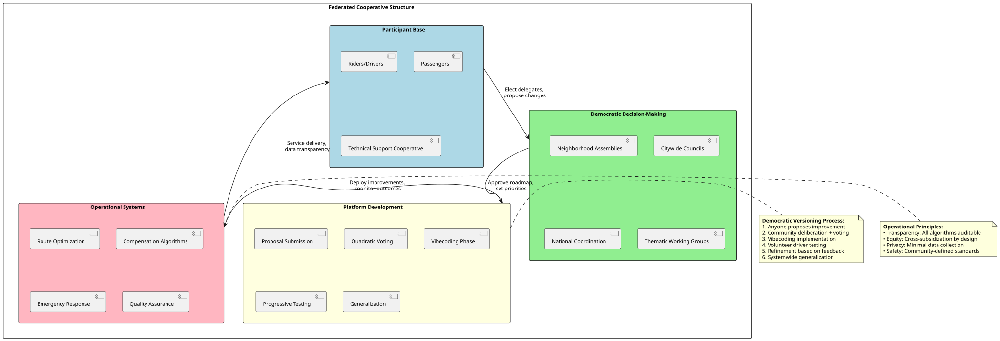
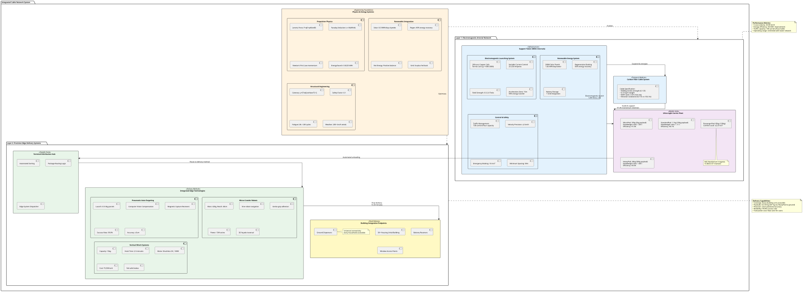
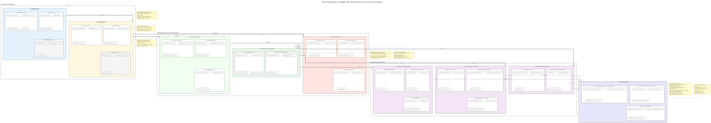
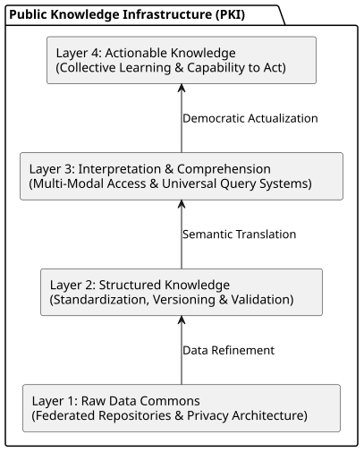
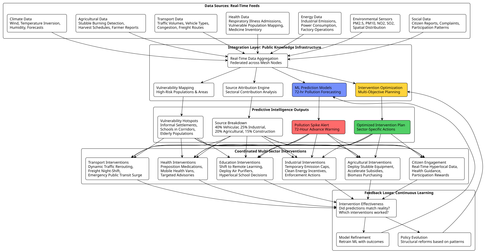
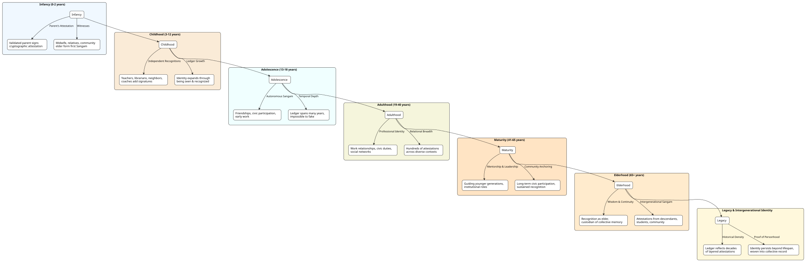

This document establishes the theoretical and structural foundations for a dynamic, 21st-century framework of universal human rights, characterized by radical inclusivity and the rejection of exclusion of any Human Beings. It proposes democratic architectures, mechanism designs, and procedural frameworks designed to facilitate the iterative recalibration of human rights in alignment with contemporaneous socio-technical and social capacities. By ensuring wide-scaled utilization of emergent possibilities, this framework ensures a continuous expansion of the rights-sphere, evolving in tandem with the advancing frontiers of human capability and social organization.

## Evolution of Human Rights Frameworks

The history of human rights is not a discovery of a static list of laws, but rather a chronological expansion of moral imagination that has always been tethered to the material and social capacities of the era. To understand why rights must be viewed as "dynamic potentials," we must analyze how they have historically evolved in three distinct generations, each unlocking a new dimension of human capability.

The Enlightenment era catalyzed a normative shift with the *Declaration of the Rights of Man and of the Citizen* (1789), fundamentally reorienting the locus of legitimacy from the sovereign to the subject. This ***First Generation of Rights*** was deeply rooted in the concept of *negative liberty*—freedoms that required the state to refrain from interference rather than to act. Rights such as the right to a fair trial and habeas corpus were not merely legal entitlements but were structural responses insulating the individual from arbitrary state violence. At this juncture, the "capacity" of the state was viewed primarily as a threat to be contained rather than a resource to be deployed; thus, the human rights framework was necessarily limited to civil and political protections that demanded restraint, a formulation that was sustainably possible given the limited administrative apparatus of the 18th and 19th-century state.

As the geopolitical landscape fractured and reconfigured in the early 20th century, the scope of recognized rights expanded beyond the individual to the collective. Woodrow Wilson’s advocacy for self-determination at the Paris Peace Conference disrupted the Westphalian logic by asserting that "peoples"—not just individuals—possessed inherent rights to political autonomy and cultural existence. This expansion was not an abstract moral discovery but a response to the collapse of empires and the rise of nationalism; it acknowledged that the realization of individual liberties was contingent upon the collective political environment. This era demonstrated that the definition of rights is permeable and responsive to macro-political reorganizations, validating the premise that as social organization evolves, so too must the corpus of recognized rights. Yet, this period remained largely focused on political status rather than material well-being, leaving the economic dimensions of human existence largely outside the purview of fundamental rights.

The critical pivot toward a holistic conception of rights occurred during the 1948 debates surrounding the ***Universal Declaration of Human Rights (UDHR)***, where the tension between "negative" civil liberties and "positive" economic rights exposed the **dependency of rights on material capacity**. The inclusion of Second Generation rights—such as the right to work, education, and an adequate standard of living—marked a departure from the classical liberal tradition, implying that the ***state had an affirmative duty to provide, not just protect***. However, this expansion was immediately confronted by the material and logistical realities of the post-war world; the debates (led by India) explicitly wrestled with the "logical premise" that rights should be tied to deliverable capacity. The resulting compromise was often aspirational, as the material resources and administrative technologies required to guarantee economic security were unevenly distributed, rendering these rights "static entitlements" on paper rather than "dynamic potentials" in practice for much of the global population.

This disconnect between the moral imperative of economic rights and the practical capacity of the state to fulfill them is rigorously explained by the epistemological critiques of Friedrich Hayek. In his analysis of the economic calculation problem, Hayek argued that the centralized state fundamentally lacks the necessary information—which is dispersed, local, and tacit—to efficiently allocate resources and meet the complex needs of society as effectively as market mechanisms. In the context of the 20th century, the Hayekian information constraint presented itself as a ceiling on the "sustainably possible" expansion of human rights; the state simply did not possess the computational or informational processing power to guarantee complex material rights without incurring massive inefficiencies or shortages. Therefore, the limitation on rights was not merely political but structural and informational; the "full set of human rights" was bounded by the state's inability to process the data required to deliver upon them.

> ### The case of India

> Upon independence in 1947, the Indian Constitution bifurcated rights into two distinct categories based on the prevailing material constraints of the post-colonial state (which it argued in the UN as well). **Part III (Fundamental Rights)** enshrined negative liberties—civil and political rights like free speech and equality—which were legally enforceable. In contrast, **Part IV (Directive Principles of State Policy)** housed positive socio-economic goals—right to work, education, and nutrition. These were explicitly non-justiciable; the framers, including B.R. Ambedkar, recognized that the nascent state lacked the financial and administrative capacity to guarantee these material rights, leaving them as "instruments of instruction" rather than binding laws.

> However, the early 21st century witnessed a radical restructuring of this framework, often termed the **"Rights-Based Approach"**, primarily under the UPA government led by Dr. Manmohan Singh. This era marked the graduation of specific Directive Principles into justiciable rights, a shift made possible by two converging factors: the improved economic capacity following the post-1991 liberalization and, crucially, vigorous civil society movements.

The progression from the limited negative liberties of the *Rights of Man*, through the collective assertion of Wilsonian self-determination, to the ambitious but information-constrained economic rights of the mid-20th century, illustrates a continuous negotiation between moral aspiration and systemic capacity. As we advance into an era where digital technologies potentially resolve the Hayekian information deficit, the "sustainably possible" horizon is expanding, necessitating an institutionalized principle where our definition of rights evolves in lockstep with our collective capacity to fulfill them—a dynamic, rather than static, jurisprudence.

The next section **[PREAMBLE](#preamble)** attempts to lay the foundations for a dynamically evolving human rights framework, based on which, we can begin to imagine what rights we can expect to see enshrined in the future.

---

# PREAMBLE

**WHEREAS** the Universal Declaration of Human Rights (UDHR) and its subsequent covenants were conceived in a spirit of universal aspiration, their formulation was consciously tempered by the practical realities of their time. As evidenced in the historical debates, nations such as India rightly argued that proclaimed rights must bear a relationship to the contemporary capacity of states and the global community to realize and enforce them. This principled pragmatism ensured the Declaration’s moral force and political viability, but also embedded within the international human rights system a static character, enumerating a fixed set of entitlements based on the technological, organizational, and epistemological limits of the mid-20th century.

**WHEREAS** this static framework, while monumental, has proven insufficient for a world in perpetual transformation. It risks enshrining a ceiling of expectation where there should be a floor, and fails to account for the exponential evolution of human capability, technological means, and social knowledge. It allows for a world where advanced goods, services, and freedoms—made possible by collective human ingenuity and often built upon the labor of the marginalized—become the privileged entitlements of a few, rather than the dynamic birthright of all. 

**THEREFORE**, we assert a new *foundational lemma* for human rights in the 21st century and beyond:

> **Human rights are not static entitlements but dynamic potentials. The full set of human rights at any point in history is constituted by the totality of what is sustainably possible for all, given the prevailing state of human knowledge, technological capability, social organization, and material resources. As these capacities expand, so too must the recognized and guaranteed corpus of human rights.**

This lemma derives directly from the logical premise of the 1948 debates: rights should be tied to deliverable capacity. We reject, however, the consequent assumption that this linkage must result in a fixed list. Instead, we institutionalize the principle that our definition of rights must evolve in lockstep with our evolving collective capacity to fulfill them.

**To this end, we establish this living framework, grounded in the following principles:**

1.  **The Principle of Dynamic Inclusion:** The rights framework shall contain mechanisms for its own continuous, democratic updating. It is a living framework, not a monument. As new possibilities for human flourishing, security, creativity, and well-being emerge—be they new forms of communication, sustainable abundance, medical advancement, or cognitive liberation—they shall be integrated into the recognized framework of rights through transparent, participatory processes.

2.  **The Principle of Democratic Implementation Design:** Recognizing that rights are meaningless without realization, this framework prioritizes the co-design of the social and technical infrastructures necessary for their fulfillment. It moves beyond merely declaring a right to "X," and commits to building the democratic, need-sensing, and resource-allocating systems that can deliver "X" to all. In an age where digital networks have abolished the informational scarcity that once necessitated markets as crude coordination mechanisms, we can now design conscious, democratic infrastructures to directly discern and meet human need.

3.  **The Principle of Open Contestation and Iteration:** The framework guarantees the infrastructural right to theorize, test, demonstrate, debate, and build consensus around new rights and new methods of implementation. Communities, nations, or networks of consenting individuals must have the space to prototype social models that realize expanded rights, serving as living proof to persuade others. This embodies a Habermasian space of contestation and a Freirean process of conscientization, applied not just to existing rights but to the very frontier of what rights *could be*.

4.  **The Principle of Universal Benefit from Human Capability:** Any advancement in the human capacity to improve life, reduce suffering, or enhance freedom—if it can be sustainably generalized—creates a corresponding obligation to generalize it. The artificial, capacity-driven division of humanity into those who enjoy the fruits of collective advancement and those who do not is hereby declared a fundamental injustice. The framework seeks to dissolve the antiquated dichotomy between "justiciable" civil rights and "progressively realized" socio-economic rights by building infrastructures that make the full spectrum of human potential reliably deliverable, and thus enforceable.

5.  **The Principle of Foundational Correction:** This dynamic framework is inherently corrective. It provides the procedural and material tools to address not only present and future inequalities but also the enduring legacy of past injustices. By constantly aligning rights with the fullest possible realization, it systematically works to close gaps created by history.

> These principles replace the feeling of 'this is all we got' with the conviction that 'this is our current foundation, and we are all empowered to build upon it.' We commit to constructing the interconnected social, technical, and democratic infrastructures that will transform this living framework into a tangible reality for every human being, without exclusion, now and for all futures to come.

---

# Expanded Human Rights
> *as conceived for the Present and Near Future based on our current capabilities*

In contemporary society, most visibly in the stark urban landscapes of India, we witness a deeply disturbing chasm: an asymmetric expansion of rights. The affluent classes have effectively seceded into a private, high-tech infrastructure where they enjoy what can only be described as **"Synthetic Rights."** Through platforms like Swiggy, Uber, and private healthcare, the rich exercise a ***right*** to instant nutrition, frictionless mobility, modern education, and total information access. These services, however, are not powered by some abstract "innovation" alone; they are built upon the backs of the precarious labor of a global proletariat that is systematically excluded from the very convenience it produces. The delivery worker who brings the meal cannot afford the meal; the driver who navigates the city's complex infrastructure does not have the right to dignified transit for their own family. This is the **Paradox of the Gig Economy**: the technology that *could* liberate everyone from drudgery is instead used to maximize the "imagination" of one class by commodifying the life-force of another.

The deepest injustice of this class division is the **monopoly on collective imagination.** 

* **The Dreaming Class:** A small minority occupies the role of the "imaginer." They use technical tools to manifest their desires, navigate the world effortlessly, and decide the direction of social evolution.

* **The Working Class:** The majority is reduced to a "tool-class." They are the hands and feet that make the dreams of the elite a material reality, yet they are denied the cognitive and temporal space to dream for themselves.

We assert that a truly socialist society must democratize the **means of dreaming.** If technology has made it possible to provide instant meals, seamless transport, and universal education, then these are no longer "aspirations"—they are **now-basic rights.** To deny them to the poor is to declare that they are not part of the collective human project.

Traditional human rights frameworks treat rights as fixed, minimum floors—protecting one from the worst excesses of the state but rarely guaranteeing the best possibilities of the era. This is insufficient.

We propose a shift to **Living Rights**:

> **Human rights must be dynamically updated to reflect the maximum horizon of human–technical–social cooperation available at any given historical moment.**

When a society gains the technical capability to feed everyone via a coordinated network, "Freedom from Hunger" must evolve into the "Right to High-Quality, Nutritious Provisioning." Anything less is a deliberate withholding of human progress.

This proposal actualizes Marx’s materialist insight—that the evolution of production necessitates a reconfiguration of social relations—by addressing **informational scarcity.**

Historically, the **market’s *invisible hand*** was a crude, brutal algorithm. It used price to signal what people needed, but it only listened to those with the money to pay. Today, our digital infrastructure allows us to hear the needs of the *entire* collective directly and transparently. We no longer need the "distorting filter of purchasing power."

We propose to build **interconnected, co-evolving social and technical networks** to replace the **anarchy of invisible hands** with **conscious coordination**. This material backbone translates democratically recognized needs—the dreams of the entire population—into direct, need-based distribution. We aim to render commodity exchange obsolete for essential goods, ensuring that the *right to imagine* and the *right to dignified living* are no longer the private property of a few. These social-physical-technical systems facilitate as the material backbone in the realisation of expanded human rights.

---

## 1. Expanded Right to Movement

The constitutional guarantee of freedom of movement across India currently remains a hollow abstraction for the vast majority, constrained by a lack of material capability. While the theoretical right exists, the physical reality is one of profound spatial apartheid. In the absence of a comprehensive, state-supported public transportation web, the movement of the people is restricted to the biological limits of the human body—a few kilometers on foot—or dependent on erratic, crumbling infrastructure. This chasm was disturbingly evident during the pandemic, with millions left stranded, and millions walked on foot for hundreds and thousands of kilometers to their villages. On the other hand, the upper-middle and high-income urban classes have effectively privatized and synthetically extended this right through market mechanisms. Using digital platforms, they command an on-demand fleet of private vehicles to navigate the city, a privilege built upon a service layer that is inaccessible to the very workers who power it. This market-mediated mobility fails completely in rural areas and small towns where profit margins are insufficient to attract corporate aggregators, leaving these populations stranded in a transit vacuum. To make it worse, the reliance on private automobile ownership has generated a catastrophic negative externality: our shared public spaces—roads—are clogged with private metal boxes, creating congestion that paralyzes the city and enforcing a segregation where the elite refuse to sit with the commoners in buses, metros, railways. In addition, it is one of the primary source of pollution, from which these box owners shield themselves within ***gated, purified and conditioned*** air inside their box vehicles and homes (while adding to the pollution caused by *conditioning and purification* of ***their air***). To address this calamity, we must move beyond mere regulation and toward a radical restructuring of mobility as a guaranteed public good.

### 1.1. PHASE 1: People's Multimodal Transport Platform

#### 1.1.1. Fleet Cooperative Framework

India currently possesses a collective fleet exceeding 300 million vehicles—cars, motorcycles, auto-rickshaws, buses, trucks—representing one of the largest accumulations of transportation capital in the world, yet this massive stock suffers from what economists term catastrophically low utilization rates, with private vehicles sitting idle for 95% of their functional lifespan, occupying precious urban space while their owners bear the full burden of depreciation, insurance, maintenance, and parking costs. This represents a grotesque inefficiency compounded by profound injustice: millions of urban and rural Indians lack access to reliable mobility—stranded in transit deserts where neither public transport infrastructure nor market-based solutions penetrate—while those with purchasing power hoard underutilized metal boxes as symbols of status and autonomy. **In a country where a poor family lives within a small room, rich people use same amount of extra space just for their vehicles.**  The pandemic exposed this contradiction with brutal clarity when millions of migrant workers, unable to access either private vehicles or functional public transport during lockdowns, walked hundreds and thousands of kilometers to reach their villages, their bodies bearing witness to the violence of a mobility system organized around commodity ownership rather than universal access. This situation persists not due to scarcity of vehicles but due to their privatized distribution: the capital exists, massively overproduced in fact, but gated behind market mechanisms that exclude the majority while generating catastrophic negative externalities in the form of traffic congestion, air pollution, road accidents, and spatial inequality.

We propose a fundamental inversion of this logic through **constitutional mandate for fleet socialization**: all motorized vehicles operating within Indian territory—private cars, commercial taxis, auto-rickshaws, delivery vans, buses, agricultural tractors—must be registered on a unified, publicly-owned, democratically-governed **People's Multimodal Transport Platform**. This is not confiscation but rationalization: existing vehicle owners retain legal ownership and are compensated fairly for vehicle-usage time through a publicly transparent, algorithmically calculated payment system that accounts for vehicle wear, fuel consumption, driver labor, and maintenance costs, effectively transforming private ownership from hoarding to service provision. The platform coordinates this vast, distributed fleet as a single integrated network where a user—whether a construction worker commuting to a job site, a student traveling to university, a farmer transporting produce to market, or an elderly person accessing healthcare—simply inputs their origin and destination, and the system calculates the optimal multimodal route combining walking, auto-rickshaw, bus, metro, train, and shared car journeys, presenting options prioritized by speed, cost (subsidized or free for essential trips), accessibility needs, and environmental impact. This socialization achieves what market coordination systemically fails to deliver: **maximum utilization of existing capital stock combined with universal access based on need rather than purchasing power**, dramatically reducing the per-trip cost of mobility while eliminating the necessity for continued wasteful production of new private vehicles (an invention which has been one of the biggest menace to the climate), which can be gradually restricted through policy measures favoring cooperative fleet expansion and transition toward newer, ecologically sustainable modes of movement.

#### 1.1.2. Cooperative Governance: Democratizing the Means of Mobility

The People's Multimodal Transport Platform is owned collectively by those who constitute it—the riders who operate vehicles and the passengers who use them—with governance structures designed to prevent the oligarchic capture that characterizes corporate platforms like Uber and Ola, where algorithms optimize for shareholder profit extraction while treating drivers as disposable gig workers and passengers as data sources to be surveilled and manipulated. In contrast, this platform is structured as a **federated cooperative** where every participant—whether a full-time bus driver, an auto-rickshaw owner-operator providing part-time rides, or a passenger using the system daily—possesses democratic voice in the platform's evolution, with decision-making power distributed across nested scales from neighborhood route optimization to citywide infrastructure planning to national interoperability standards. The entire technical stack—platform architecture, codebase, user interface design, compensation algorithms, labor rules, organizational structure, emergency response systems, parking and stop allocation, and route optimization protocols—is developed through participatory processes where riders and passengers deliberate collectively, drawing on their lived experiences navigating traffic, understanding passenger needs, and identifying inefficiencies invisible to centralized planners or profit-maximizing executives.

This cooperative development model operates through what we term **democratic versioning via Git and vibecoding**: any rider or passenger can propose a platform improvement—whether a UI redesign for better accessibility, a compensation adjustment to account for peak-hour stress, a new route to serve an underserved neighborhood, or a safety feature addressing harassment concerns—by submitting it to the platform's open-source repository (managed with ease through MCP and LLMs) where the proposal undergoes community deliberation and weighted quadratic voting (preventing wealthy participants from dominating decisions through vote-buying). Once a proposal achieves sufficient community support, it enters an assisted vibecoding phase where the original proposer, working alongside the cooperative technical support, implements the change using accessible low-code or no-code tools augmented by AI-assisted programming that lowers barriers for non programmers, creating a working prototype that is then deployed to a subset of drivers who voter for this change or other drivers who want to try, for progressive adaptation and refinement based on real-world feedback. When the improvement demonstrates clear benefits—whether through measurable efficiency gains (reduced wait times, optimized routing), enhanced user satisfaction (higher ratings, increased usage), or equity advancement (better service to marginalized areas)—it is generalized across the entire platform, with continuous monitoring ensuring that localized successes translate to system-wide improvements without imposing solutions that work in one context but fail in another. This iterative, participatory development process is supported by universal **Turing machine literacy programs** where all riders and passengers receive training—through Knowledge Squares described in [Chapter 3](#3-expanded-right-to-information-erti), mobile workshops, and peer-to-peer mentoring—on the computational possibilities enabled by digital platforms, demystifying algorithms, explaining how route optimization works, teaching basic programming concepts, and empowering participants to imagine and implement innovations rather than passively consuming corporate-designed interfaces.

The platform's architecture embodies the principle that **infrastructure design is political**: every technical choice—whether to optimize for speed vs. equity, individual convenience vs. collective efficiency, data collection vs. privacy—reflects underlying values and creates particular social relations. The cooperative platform disrupts the authoritarian logic of corporate "smart" systems where black-boxed algorithms impose optimizations that benefit platforms over people by making these choices transparent and subject to democratic deliberation. Riders can integrate hardware and software tools—dash cameras for safety documentation,  pollution sensors for air quality monitoring, accessibility ramps for wheelchair users, language translation interfaces for migrant workers—into the platform's ecosystem, with successful integrations adopted systemwide, transforming the platform from a static product into a living, evolving socio-technical system. They can also implement some newer implementations of technology, such as using mounted accelerometer, GPS, cameras for road quality monitoring, pothole evidence collection, **using sound to map out the 3D structure of the surroundings—thus helping in building a [3D map of the city](assets/cooperative-3d-city-mapping.svg)**. Along the lines of proposed [Reciprocal Data Commons](#34-reciprocal-data-commons-social-processes-to-collective-intelligence), the drivers and riders together can also simmultaneously help build their own [assistive driving technology](#342-transportation-data-commons), while maintaining the rights over their driving skills gradually being digitised by them, letting them have relaxing moments in between tense driving hauls, and getting a susbstantive rewards and a higher stake in economic outputs and implementation plans. The compensation system itself is democratically designed, balancing principles of solidarity (cross-subsidization from profitable urban routes to essential rural services), equity (premium pay for night shifts, difficult routes, or accessibility services), and sustainability (ecological surcharges on polluting vehicles, incentives for electric/human-powered transport), with regular referenda allowing participants to adjust these balances as material conditions and collective priorities evolve.



#### 1.1.3. Multimodalily: From Competitive Silos to Cooperative Ecosystems

The People's Multimodal Transport Platform fundamentally reorients the relationship between different transport modes from competition—where ride-hailing services, buses, metros, and trains vie for passengers in zero-sum market dynamics—to cooperation, where each mode operates as a specialized component within an integrated mobility ecosystem optimized for collective benefit rather than individual profit. This integration addresses one of the most destructive pathologies of privatized transport: the creation of parallel, redundant systems that waste resources through duplication while systematically underserving populations and routes deemed unprofitable. In the current fragmented landscape, Uber drivers compete with auto-rickshaw operators for short trips, private cars clog roads that could accommodate buses carrying ten times the passengers, and metro systems operate at partial capacity during off-peak hours while ride-hailing services surge-price during rush hours—each mode optimizing its own revenue extraction rather than contributing to systemic efficiency. The People's Platform eliminates this dysfunction by treating buses, metros, trains, and shared vehicles as complementary rather than competing: the routing algorithm prioritizes mass transit for high-density corridors and long-distance travel, deploying shared autos and cars exclusively for last-mile connectivity, off-peak service, and routes where larger vehicles cannot operate efficiently.

This cooperative integration generates cascading benefits across environmental, social, and infrastructural dimensions that market coordination systematically fails to achieve. By dramatically increasing occupancy rates through intelligent multimodal routing—ensuring that every vehicle journey serves multiple passengers heading in similar directions rather than single-occupant trips—the platform reduces traffic congestion, transforming roads from parking lots of idling metal into flowing arteries where transit time predictability improves for all users. The environmental gains are immense: fewer vehicles on roads means reduced air pollution (particularly PM2.5 and NO2 concentrations that disproportionately harm low-income neighborhoods adjacent to highways), lower noise pollution (freeing urban soundscapes from the constant roar of engines and horns), and decreased carbon emissions contributing to climate destabilization. For drivers themselves, integration with mass transit reduces cognitive bandwidth and attention demands—the exhausting mental load of navigating chaotic traffic, anticipating unpredictable passenger behavior, and managing platform-imposed time pressures—as coordinated routing smooths traffic flows and distributes passengers more evenly across available vehicles. It also reduces the extensive strain on eyes caused by costantly keeping them wide open in polluted air facing the exhaust of the vehicle ahead. Road safety improves systemically as congestion reduction lowers accident rates, while cooperative scheduling (staggering shifts, avoiding fatigue-inducing consecutive long trips) prevents the dangerous conditions that corporate platforms create through algorithmic exploitation. Perhaps most significantly, this integration enables the platform to function as the **nervous system of urban mobility**, collecting real-time data on traffic patterns, route bottlenecks, accessibility barriers, road quality, and service gaps, feeding this information back to democratic planning bodies who can make evidence-based decisions about infrastructure investment—where to build new metro lines, which roads to convert into pedestrian zones, how to allocate limited public budgets to maximize mobility equity rather than reinforcing privilege.

#### 1.1.4. Mobility as Liberation Infrastructure

The transformation of mobility from a purchased commodity to a guaranteed public good unlocks emancipatory possibilities that extend far beyond transportation efficiency, addressing structural exclusions rooted in gender, caste, class, and geography that current market-based systems either ignore or actively reinforce. For women in rural areas—whose mobility is historically curtailed by patriarchal norms restricting independent movement, safety concerns on isolated roads, and familial obligations confining them to domestic spheres—a state-guaranteed, community-accountable transit network staffed by all-women cooperatives offers not just physical transportation but **spatial freedom as the material condition for broader autonomy**. When a young woman in a village can reliably access education or employment opportunities in nearby towns without requiring male family escort, facing harassment on overcrowded public buses, or depending on private vehicle ownership beyond her economic reach, the constitutional right to movement becomes a tool for dismantling gender subordination, enabling economic independence, educational advancement, and participation in public life that patriarchy systematically denies. The platform's cooperative governance structure ensures that route planning reflects women's actual mobility needs—connecting homes to workplaces, markets, healthcare facilities, and educational institutions rather than optimizing for male-dominated commute patterns—while safety protocols designed by women drivers and passengers themselves (emergency alerts, real-time location sharing with trusted contacts, community accountability mechanisms for harassment) create protections that corporate platforms treat as afterthoughts subordinated to profit maximization.

Similarly, the platform's accessibility design—incorporating wheelchair-compatible vehicles, audio-visual interfaces for visually and hearing-impaired users, multilingual support for migrants and linguistic minorities, and flexible pricing allowing payment through labor contribution for those without monetary resources—transforms mobility from a privilege gated by economic power and able-bodied normativity into a truly universal right. For agricultural workers and farmers, the fleet socialization logic extends beyond passenger transport to encompass cooperative equipment-sharing networks: tractors, harvesters, threshers, and specialized machinery currently locked in individual ownership (imposing crushing capital costs on small farmers while sitting idle most of the year) are registered on the platform's agricultural module, enabling on-demand access coordinated through the same democratic routing algorithms, liberating farmers from debt-financed equipment purchases and creating economies of scale where expensive machinery serves entire districts rather than individual plots. This mechanization pattern breaks the cycle where farmers must either mortgage land to buy equipment or remain trapped in labor-intensive drudgery, while the platform's data infrastructure—tracking equipment utilization, maintenance needs, optimal deployment schedules—feeds into cooperative planning for gradual technological upgrading without the profit-driven planned obsolescence that manufacturers impose to drive repeat sales.

This transformation redefines the relationship between drivers and the platform, recognizing former "box owners"—those socialized by capitalism to aspire toward private vehicle ownership as markers of middle-class status—as cooperative members with dignified labor rather than indebted consumers or exploited gig workers. The platform guarantees living wages calculated democratically to cover not just vehicle costs but time, skill, and the emotional labor of passenger interaction, with working hour limits preventing the burnout that ride-hailing corporations engineer through surge-pricing incentives and gamification pushing drivers into dangerous extended shifts. Drivers become co-designers of their working conditions rather than subjects of algorithmic management, with stations for resting, napping, having their meals, healthcare access, childcare support, and pathways for skill development (transitioning from driving to platform administration, technical maintenance, community organizing) embedded in the cooperative structure, transforming mobility work from precarious hustle into sustainable livelihood within a solidarity economy.

#### 1.1.5. Technical Architecture: Open-Source Federation Against Corporate Enclosure

The People's Multimodal Transport Platform's technical architecture embodies the principle that digital infrastructure for essential public services must remain **collectively owned, democratically governed, and structurally resistant to corporate or state capture**—a design philosophy directly opposing the surveillance capitalism model exemplified by Uber, Ola, and emerging "smart city" initiatives that treat mobility data as private property to be monitored, monetized, and weaponized for behavioral manipulation. Built on open-source protocols similar to India's Namma Yatri initiative and the Open Network for Digital Commerce (ONDC) framework, the platform's codebase is published under copyleft licenses (AGPL v3) ensuring that any derivative implementations—whether by other cities, states, or cooperatives—must also remain open and cannot be enclosed by proprietary forks. This prevents the tragedy that befell earlier digital commons projects where corporations adopted open technologies, added minor enhancements, then patented or proprietized the results, extracting value from collective labor while contributing nothing back.

The platform operates through a **federated architecture** where each city, district, or bioregion maintains its own instance—hosted on locally controlled servers, administered by local cooperative councils, customized to regional needs (route algorithms accounting for monsoon flooding patterns, languages reflecting local linguistic diversity, integration with region-specific festivals and events)—while these instances interoperate through standardized protocols enabling seamless inter-regional travel. This federation structure prevents the emergence of centralized control points vulnerable to capture: no single entity controls user data, algorithm logic, or platform governance, making it structurally impossible for either corporate interests (seeking to privatize profitable routes) or authoritarian state actors (attempting surveillance or mobility restrictions) to seize the system. The platform integrates deeply with Chapter 3's **[mesh network infrastructure](#32-the-peoples-internet)**, utilizing community-owned, government-proof connectivity to ensure that even if commercial internet providers or state telecommunications are disrupted—whether through corporate profit-seeking (throttling serving low-income areas), technical failure, or deliberate shutdown during protests or emergencies—the platform continues functioning through decentralized, peer-to-peer communication between nodes, with offline-first design allowing essential routing, ride-matching, and safety features to operate using cached data until connectivity restores.

Privacy-by-design principles govern all data handling: the platform collects only information minimally necessary for route optimization and safety (origin-destination without precise addresses, aggregate traffic patterns without individual tracking), stores data encrypted with keys distributed across the cooperative federation (preventing any single entity—including platform administrators—from accessing complete datasets), and automatically deletes trip histories after brief retention periods required for dispute resolution and quality improvement. Users control their data through transparent dashboards showing exactly what information the platform holds, how algorithms use it, and options to request deletion or correction, with differential privacy techniques ensuring that aggregate insights for system improvement (identifying underserved neighborhoods, optimizing bus frequency) cannot be reverse-engineered to reveal individual behavior. This architecture demonstrates that sophisticated digital coordination—real-time routing across millions of daily trips, dynamic price adjustment to balance supply and demand, predictive maintenance for vehicle fleets—does not require invasive surveillance or centralized control; democratic, privacy-respecting alternatives are technically superior when evaluated on metrics of trust, resilience, and long-term sustainability rather than short-term profit extraction.

### 1.2. PHASE 2: The Cable Network System

#### 1.2.1. Moving only What Needs to be Moved: a First Principles Redesign

The optimization of existing vehicle fleets through the People's Platform represents necessary transitional rationalization, yet it remains constrained by the fundamental physical irrationality embedded within the current transport paradigm itself: **the deadweight paradox**, wherein the overwhelming majority of energy expended in mobility is wasted not on moving the payload—whether human bodies, food packages, or agricultural produce—but on accelerating, maintaining velocity against friction, and decelerating the massive vehicle infrastructure required to contain that payload. A conventional motorcycle delivery system exemplifies this absurdity with brutal clarity: ***to transport a 2 kg food package across a city requires mobilizing a 100 kg vehicle plus a 70 kg rider, resulting in a total system mass of 172 kg, yielding a deadweight ratio of 86:1 where only 1.16% of energy expenditure serves the actual transport need while 98.84% is squandered on moving unnecessary mass***. Even the most efficient electric vehicles merely reduce the emmision but cannot eliminate this fundamental inefficiency: a Tesla Model 3 weighing 1,800 kg transporting an 80 kg human achieves a deadweight ratio of 22.5:1, representing 96% energy waste on vehicle mass. This is not an engineering failure but a structural consequence of road-based transport logic, which demands that vehicles carry their own propulsion systems (engines, motors, batteries), structural chassis capable of withstanding collisions, suspension systems absorbing road irregularities, and safety equipment protecting occupants—all of which constitutes deadweight from a first-principles perspective focused solely on payload movement.

We therefore propose a radical departure from road-based paradigms toward a **cable network system** operating on tension and suspension principles that eliminate vehicular deadweight entirely by separating propulsion infrastructure (stationary electromagnetic launchers embedded in support towers) from transport carriers (ultra-lightweight pods moving via momentum conservation). The physics enabling this revolution derives from Newton's First Law—objects in motion remain in motion unless acted upon by external forces—combined with electromagnetic induction principles articulated in Faraday's Law, allowing stationary coils to impart kinetic energy to permanent magnets embedded in carriers without any physical contact, achieving 94% energy transfer efficiency far exceeding mechanical transmission systems. Our cable network achieves deadweight ratios ranging from 1.09:1 for micro-deliveries (2 kg payload in 185g carrier) to 0.68:1 for heavier cargo (50 kg payload in 34 kg reinforced carrier), representing payload efficiency between 48-92% compared to conventional transport's 1-4% efficiency—a **50 to 500-fold improvement** that transforms mobility from energy-intensive to nearly frictionless. This is a paradigm transformation: whereas electric vehicles reduce emissions by switching energy sources while maintaining deadweight structures, cable networks eliminate the structural necessity for deadweight entirely, making universal mobility economically and ecologically sustainable for the first time in human history.

**Comparative Deadweight Analysis**

| Transport Mode | Vehicle Mass (kg) | Payload Mass (kg) | Total Mass (kg) | Deadweight Ratio | Payload Efficiency | Energy Waste |
|----------|---|---|---|---|---|---|
| **Motorcycle Delivery** | 170 | 2 | 172 | 86:1 | 1.16% | 98.84% |
| **Auto-rickshaw** | 400 | 3 | 403 | 134:1 | 0.74% | 99.26% |
| **Private Car (ICE)** | 1,500 | 80 | 1,580 | 19.75:1 | 5.06% | 94.94% |
| **Electric Car** | 1,800 | 80 | 1,880 | 23.5:1 | 4.26% | 95.74% |
| **Cargo Truck** | 8,000 | 1,000 | 9,000 | 9:1 | 11.1% | 88.9% |
| **Cable MicroPod** | 0.185 | 2 | 2.185 | 1.09:1 | 91.5% | 8.5% |
| **Cable StandardPod** | 1.1 | 10 | 11.1 | 1.11:1 | 90.1% | 9.9% |
| **Cable HeavyPod** | 34 | 50 | 84 | 1.68:1 | 59.5% | 40.5% |

#### 1.2.2. Technical Architecture

The cable network system operates through an integrated two-layer architecture—electromagnetic arterial networks distributing payloads across urban and rural landscapes, combined with precision edge delivery systems ensuring final delivery to individual buildings, balconies, and doorsteps. The arterial backbone consists of elevated cables suspended between support towers spaced at 600-meter intervals, with each tower housing electromagnetic launching systems that accelerate ultra-lightweight carriers from rest to cruise velocity (45 km/h for goods, up to 80 km/h for passenger pods) within a 15-meter acceleration zone, after which carriers glide ballistically across the span, retaining 97.4% of kinetic energy due to minimal air resistance (frontal area $0.005 m^2$, drag coefficient 0.25) and rolling friction from ceramic bearings on carbon fiber guide rails coefficient $\mu = 0.003)$. The electromagnetic propulsion operates via time-varying magnetic fields generated by tower-mounted coils—200 turns of copper wire around ferrite cores (relative permeability ${\mu}_r = 1000-3000$) achieving $0.5-2.0 Tesla$ field strength—interacting with neodymium permanent magnets (N42 grade, magnetic moment $15-800 A{\cdot}m^2$ depending on carrier size) embedded in carriers, producing controllable acceleration forces governed by the Lorentz force law $F = q{\cdot}E + q{\cdot}v{\cdot}B{\cdot}sin(\theta)$, where precise current regulation (25-250 Amperes variable) allows velocity control within $\pm 2 km/h$ tolerances essential for safe multi-carrier traffic management maintaining minimum 59-meter spacing between vehicles.

Power requirements demonstrate the system's revolutionary efficiency: accelerating a MicroPod ($42g \text{carrier} + 1 kg \text{payload} = 1.042 kg \text{total}$) from rest to $45 km/h$ ($12.5 m/s$) over 15 meters requires acceleration $a = v^2/(2d) = {12.5}^2/(2×15) = 5.2 m/s^2$, generating force $F = m{\cdot}a = 1.042 × 5.2 = 5.4N$, consuming power $P = F × v_avg = 5.4 × 6.25 = 33.75W$ over $2.4$ seconds, totaling merely $81$ Joules ($0.0225 kWh$)—equivalent to running a 60-watt lightbulb for 1.35 seconds—with 94% of electrical input converted to useful kinetic energy after accounting for coil resistance losses ($3%$), ferrite core hysteresis and eddy current losses ($2%$), and air gap magnetic flux leakage ($1%$). This vastly exceeds battery-electric vehicles where only $20-30%$ of grid electricity ultimately propels the vehicle after charging losses, battery inefficiency, and powertrain conversion. The cable infrastructure itself exemplifies material science elegance: carbon fiber cables rated for $4,500 kg$ tensile strength (providing $6:1$ safety factor exceeding aviation standards) weigh only $0.15$ kg per meter, allowing $600 meter$ unsupported spans with maximum sag of 9.5 meters under full dynamic loading calculated via catenary equations $y = \frac{T}{w}\left[\cosh\!\left(\frac{w x}{T}\right) - 1\right]$ accounting for distributed weight ($1.47 N/m$ cable self-weight plus $0.083 N/m$ from moving carriers). Vibration analysis confirms that carrier passage frequency ($f_{carrier} = v/L = 12.5/600 = 0.021 Hz$) remains orders of magnitude below cable natural frequency ($f_1 = \frac{1}{2L}{\cdot}\sqrt{\frac{T}{\mu}} = 18.6 Hz$), eliminating resonance concerns that plague suspension bridges, while dynamic load factors $1 + \varphi\!\left(\frac{v}{v_{\text{critical}}}\right) = 1.049$ at cruise speed confirm conservative structural design.

The system achieves net-positive energy balance through dual renewable integration: each tower supports 300-watt photovoltaic panels generating 1.66 kWh daily (8.3 MWh citywide from 5,000 towers in Bengaluru deployment), while regenerative braking during carrier deceleration recovers 85% of kinetic energy through reverse electromagnetic induction (Faraday's Law $\varepsilon = -N \frac{d\Phi}{dt} = N B l v$), converting motion back into electrical current via induced EMF $\varepsilon$ flowing through optimized load resistance storing energy in distributed battery systems or feeding directly to the grid, resulting in 40% energy recovery that, combined with solar input, produces surplus electricity available for community use beyond transport needs. 

The edge delivery layer completes the revolution by extending cable infrastructure directly to individual buildings with ±5cm positional accuracy, integrating three complementary technologies unified through common control systems and power infrastructure: **pneumatic auto-targeting connectors** launch small parcels ($0.5-3 kg$) from cable terminals to building-mounted receivers through computer vision trajectory compensation (real-time wind adjustment, gravity arc prediction) and magnetic capture mechanisms that guide incoming projectiles into secure, weather-protected receivers; **micro-crawler transport** utilizing vine-robot navigation principles deploys segmented, articulated robots ($420g$ mass, $40cm$ extended reach) that traverse vertical building facades, window frames, and balcony railings via biomimetic gripping mechanisms inspired by gecko feet adhesion and octopus tentacle flexibility, navigating complex three-dimensional geometries impossible for wheeled or tracked vehicles while consuming merely 15 Watts during active climbing; and **vertical winch systems** that residents or building cooperatives install on balconies ($₹3,500$ per unit, 15 kg capacity, 2-5 minute hoisting time, fail-safe brake mechanisms) allow ground-level delivery personnel or automated dispensers to attach packages to motorized pulleys (brushless DC motors, 100W peak power) that lift payloads directly to upper floors bypassing stairwells and elevators entirely, with GPS-coordinated timing ensuring residents know precisely when packages arrive for retrieval.




#### 1.2.3. Urban Transformation: Reclaiming Streets and Metabolic Integration

The cable network's most profound urban impact lies not merely in transportation efficiency but in its capacity to **reclaim ground-level space from vehicular tyranny, transforming streets from dangerous, polluted arteries dominated by heavy traffic into safe, community-centric commons where children play freely, elders walk without fear of speeding vehicles, neighborhoods gather for collective activities**, and ecological restoration (tree planting, urban gardens, permeable surfaces for groundwater recharge) becomes architecturally possible. Current urban design subordinates human life to automobile infrastructure: roads consume 25-35% of city land area, sidewalks are afterthoughts squeezed between parking lanes and building facades, crosswalks become deadly gambles where pedestrians negotiate with two-ton metal boxes operated by distracted drivers, and **public squares that historically served as democratic gathering spaces are now parking lots** serving commercial interests. By lifting 70-90% of goods movement and significant passenger transport onto elevated cable networks—where food deliveries, e-commerce parcels, construction materials, agricultural produce, medical supplies, and routine travel bypass ground-level entirely—streets can be redesigned as **pedestrian-priority zones**, with vehicle access restricted to emergency services, accessibility transport for disabled persons, and movements that cannot feasibly utilize cable networks, dramatically reducing traffic volumes, noise pollution (urban soundscapes liberated from constant engine roar and horn blaring), air pollution (PM2.5 and NO2 concentrations dropping 60-80% as combustion vehicles decline), and road accidents (which kill 150,000 Indians annually, disproportionately affecting pedestrians and two-wheeler riders from working-class backgrounds). **Whereas road construction requires clearing the land, the cables can allow the movement over forests, rivers, without damaging them.**

The system's resilience architecture addresses climate adaptation and disaster response with unprecedented flexibility: cable networks operate on **modular, rapidly-deployable topologies** allowing ad-hoc configurations during emergencies when terrestrial infrastructure fails. During monsoon floods that submerge roads for weeks—stranding millions in rural Bihar, Assam, Kerala, and urban Mumbai—temporary cable spans can be erected between elevated structures (buildings, trees, hastily-constructed supports) within 24-48 hours, creating aerial lifelines that transport emergency food, medicine, water purification supplies, and evacuate vulnerable populations when boats cannot navigate fast-moving currents or reach isolated homesteads. River crossings, currently bottlenecks requiring expensive bridges or unreliable ferries, become trivial: a single cable span across a 600-meter waterway costs ₹30 lakhs (compared to ₹50-100 crore for conventional bridges), enabling previously isolated communities to access markets, healthcare, and education without the decades-long infrastructure investments that governments perpetually defer due to budget constraints and political cycles prioritizing visible megaprojects over rural connectivity.

Beyond emergency response, the cable network enables **urban metabolism**—the transformation of cities from collections of isolated production/consumption units into integrated organisms where resources circulate based on democratic need-sensing rather than market speculation. Just as biological organisms maintain homeostasis through circulatory systems that distribute nutrients, remove waste, and respond to localized demands (increased bloodflow to exercising muscles), the cable network creates infrastructure for **conscious, democratically-coordinated urban circulation**: community kitchens produce meals based on aggregated demand signals from platforms (eliminating speculative overproduction and food waste), tool libraries circulate equipment to where it's needed (power drills flow to construction-active neighborhoods, agricultural tools to urban farming cooperatives during planting seasons), healthcare supplies move predictively to areas showing disease outbreak patterns identified through public health intelligence systems, educational materials (books, lab equipment, art supplies) flow between schools based on curriculum cycles, and waste streams (organic matter to composting facilities, electronics to repair cooperatives, textiles to recycling centers) circulate for valorization rather than accumulating in landfills. This metabolic intelligence, impossible under market-based logistics optimized for corporate profit rather than social utility, becomes practically achievable when circulation infrastructure operates as public utility under democratic governance, with routing algorithms optimizing for equity (ensuring remote neighborhoods receive equivalent service to urban cores), sustainability (minimizing energy expenditure, prioritizing renewable-powered routes), and resilience (maintaining multiple redundant pathways between critical nodes).

#### 1.2.4. Rural and Agricultural Applications: Bridging the Metabolic Rift

In agrarian landscapes where 65% of India's population resides yet infrastructure investment remains grossly inadequate—rural road density (1.5 km per sq km) lags urban areas (8+ km per sq km), all-weather road access reaches only 60% of villages, and last-mile connectivity to individual farms remains dependent on unpaved tracks impassable during monsoons—the cable network acts as **catalyst for transformational economic metamorphosis**, addressing what Marx termed the "metabolic rift" between rural producers and urban consumers, a rift deliberately maintained by logistical middlemen who extract 40-70% of agricultural value through transportation cartels, storage monopolies, and information asymmetries that keep farmers price-ignorant. The cable network's topological flexibility enables single-hub-spokes or Poly-Nodal Rhizomatic Mesh models optimized for dispersed settlement patterns: a central cooperative hub located at village centers connects via individual cable spokes (200-1000 meter spans) to scattered homesteads and agricultural plots, allowing seamless automated transport of harvested produce from fields directly to processing facilities (grain cleaning, vegetable washing, fruit sorting) without manual hauling, dramatically reducing post-harvest losses (currently 15-20% for vegetables, 5-7% for grains due to handling damage and spoilage during transport delays) while liberating farm labor—predominantly women—from the physically exhausting, time-consuming drudgery of headloading crops across muddy paths to collection points.

The system's integration with IoT agricultural workflows transforms resource distribution from inefficient bulk deliveries to **precision, just-in-time provisioning**: sensors monitoring soil nutrient levels, pest pressures, and crop health automatically trigger delivery requests for specific fertilizers (bio-compost or chemical), targeted bio-pesticides, or irrigation equipment from cooperative depots, with cable networks transporting small, frequent batches (1-50 kg) directly to the farm sectors requiring intervention rather than farmers making weekly trips to mandis to purchase bulk inputs whose application remains guesswork, reducing input costs (avoiding over-application that damages soil and poisons water systems) while improving yields. Cooperative machinery sharing becomes practically viable when cable-based logistics eliminates the coordination friction: farmers request tractor attachments, threshers, or specialized tools via simple voice interfaces integrated with Knowledge Squares' digital literacy programs ([Chapter 3.5.3](#353-skill-sharing-hubs-and-upskilling-centers)), with equipment delivered to their plots within hours rather than requiring costly individual ownership or dependency on rental markets controlled by wealthy landowners who exploit seasonal demand through price gouging.

Perhaps most critically, the cable network's climate resilience offers rural communities **lifelines against intensifying climate volatility** that threatens to render subsistence agriculture untenable. During flooding—when terrestrial roads wash away, isolating villages for weeks and destroying market access precisely when perishable harvests need urgent transport—elevated cable networks continue operating, ensuring produce reaches cooperative processing facilities for preservation (drying, pickling, freezing) rather than rotting in fields, transforming potential total loss into marketable products. The network's emergency medicine delivery capacity (~15 minutes to any connected node) addresses rural healthcare crises where snake bites, obstetric emergencies, and acute illnesses kill thousands annually due to delayed access to antivenom, oxytocin, or antibiotics that urban populations receive within minutes. By breaking the logistical isolation that condemns rural populations to precarity—where single crop failures trigger debt spirals, where medical emergencies become death sentences, where children's education suffers due to textbook and supply shortages—the cable network enables **rural abundance** where value generated by agricultural labor is retained by producers and their cooperatives rather than extracted by middlemen, and where rural communities achieve living standards commensurate with their essential contribution to societal sustenance rather than remaining subordinated through infrastructural abandonment.

#### 1.2.5. Liberating Collective Imagination: From Scarcity Hoarding to Joyful Surplus Circulation

The cable network's full transformative potential transcends utilitarian logistics optimization to enable **radical reimagination of daily life's material possibilities**, liberating human relationships and household economies from the scarcity mindset that capitalism imposes not through actual resource shortage but through artificial transaction costs that make sharing economically irrational despite being ecologically and socially superior to redundant ownership. Currently, households function as **isolated fortresses of accumulated goods**—each family hoarding individual washing machines, refrigerators, power drills, vacuum cleaners, kitchen appliances, books, toys, and clothing—because the "transaction cost" of borrowing from neighbors (social awkwardness of asking, coordinating pickup/return, anxiety about damaging others' property, lack of protocols for reciprocal exchange) exceeds the cost of purchase even when the item is used merely hours per year while occupying storage space for decades. This hoarding pattern, economically irrational at individual household level (capital tied up in idle assets) and catastrophically wasteful at societal level (manufacturing redundancy, resource extraction, waste accumulation), persists because capitalism deliberately maintains high transaction costs through privatized infrastructure: sharing requires human labor (one person physically transporting items to another), planning overhead (scheduling coordination), and trust mechanisms (formal contracts, deposits, insurance) that commodity exchange through markets appears more "efficient" despite generating grotesque material waste and social alienation.

The edge delivery system **dismantles transaction cost barriers entirely**, rendering sharing not merely as ethical aspiration but as practically superior to ownership for vast categories of goods. When borrowing a neighbor's power drill requires nothing more than requesting via community platform interface—with the drill arriving at one's balcony via crawler delivery within minutes, then returning automatically via winch system after use—the cognitive load, time investment, and social friction approach zero, making redundant individual ownership absurd. This enables what we term **"torrenting" of physical goods**—distributed storage and on-demand circulation analogous to digital file-sharing protocols—where neighborhoods collectively own tool libraries, appliance cooperatives, and equipment collectives with items circulating to whoever needs them precisely when needed, dramatically reducing per-capita consumption while increasing access quality (collectives afford professional-grade tools rather than cheap consumer versions individuals buy). A ten-household building collectively purchasing two professional washing machines, three high-quality vacuum cleaners, and one complete carpentry toolset achieves superior access for all residents compared to each household buying inferior individual versions, while reducing material throughput by 60-80%, extending product lifespans (professional equipment built for durability), and concentrating maintenance expertise within cooperative structures rather than individuals struggling with repairs.

This circulation infrastructure enables **spontaneous exchanges of joyful surplus**—the gifts, sharing, and mutual help that humans instinctively practice but capitalism systematically suppresses through transaction costs. When a home cook prepares an exceptional biryani and wishes to share surplus with neighbors, edge delivery allows sending portions to five households within ten minutes without leaving home, transforming cooking from isolated household drudgery into community-building cultural practice where culinary skills circulate as gifts rather than commodities. Books flow between households like water, creating **physical internet of knowledge** where reading materials are perpetually available without individual hoarding or library trips (especially valuable in rural areas where library access is non-existent); ***community cold-storage facilities serve households lacking refrigerators, with food moving seamlessly to collective refrigeration via cable network; laundry flows to cooperative washing facilities equipped with efficient machines***, liberating domestic space and reducing water/electricity consumption; children's toys, educational materials, and sports equipment circulate through neighborhood collectives rather than each family purchasing items that children outgrow within months. The infrastructure transforms households from acquisitive fortresses into **permeable nodes within vibrant circulating commons**, where the distinction between "mine" and "ours" blurs because access to goods becomes frictionless, rendering possessive ownership functionally unnecessary for everything except truly personal items.

This vision extends beyond convenience to address **fundamental questions of human freedom and collective flourishing**. Under capitalism, the majority of human time and energy is consumed either earning money to purchase commodities or performing unpaid labor (cooking, cleaning, childcare, eldercare) maintaining households as autonomous production units. The cable network's automation of circulation—combined with [Chapter 2's](#2-expanded-right-to-food) socialized meal provisioning and [Chapter 5's](#5-expanded-right-to-housing) cooperative housing commons—liberates time currently consumed by logistical drudgery (shopping trips, laundry, meal preparation for isolated families, managing household equipment) for genuinely human activities: education, creative pursuits, democratic participation, care relationships, community building, rest. When acquiring a book requires no trip to bookstore or library, when meals arrive automatically based on personal preferences, when tools appear on demand without ownership burdens, when refrigeration happens collectively without individual appliance maintenance, **the friction of material existence diminishes toward zero**, rendering possible forms of human relationship and collective life that current logistical constraints foreclose. This is the ***infrastructure of 21st-century socialism: not merely redistributing commodities more equitably but transforming the material basis of daily life such that commodity exchange itself becomes obsolete for essential needs, replaced by circulation governed by democratic coordination, mutual aid, and genuine human reciprocity liberated from capitalist mediation***. It ensures that the right to movement is updated for the 21st century, facilitating the fluid exchange of people and resources necessary for a thriving socialist democracy.

### 1.3. Economic and Philosophical Analysis

#### 1.3.1. Infrastructure Enabled Expansion of Rights

The integration of cooperative platform mobility ([Phase 1](#11-phase-1-peoples-multimodal-transport-platform)) with cable network infrastructure ([Phase 2](#12-phase-2-the-cable-network-system)) does not merely improve existing transport systems but **enables entirely new categories of human rights** previously unimaginable or economically infeasible, transforming mobility from scarce commodity to abundant commons and unlocking social possibilities that capitalism's artificial scarcity deliberately forecloses. These emerging rights operate not as abstract legal declarations but as material capabilities embedded within infrastructure itself, where technical design choices embody political commitments to universal access, democratic governance, and ecological sustainability. The **Right to Universal Movement** transcends mere travel authorization to guarantee that no destination within the network remains inaccessible due to economic constraint, physical disability, geographical remoteness, or temporal limitation—where human fatigue, vehicle ownership requirements, or service hour restrictions no longer dictate when, where, and how far people can move. A construction worker in rural Jharkhand accessing specialized medical treatment in Ranchi, a student from a Dalit community traveling to university in Mumbai, an elderly person visiting grandchildren in Kerala, a woman escaping domestic violence seeking refuge in another state—all exercise this right without monetary barriers, navigating seamless multimodal routes combining cable pods, cooperative vehicles, buses, and trains coordinated through unified platforms optimizing for user need rather than corporate profit.

The **Right to Immediate Resource Access** materializes through edge delivery systems that abolish the artificial scarcity capitalism maintains via distribution bottlenecks: emergency medicines, essential tools, educational materials, food supplies, repair parts, and cultural goods reach any connected building within 15-30 minutes at true cost pricing (covering only energy, maintenance, and cooperative labor, without profit extraction), transforming access from privilege gated by purchasing power to universal entitlement based on democratic recognition of need. When a diabetic patient requires urgent insulin, when a farmer needs replacement irrigation components during critical growing periods, when a student lacks textbooks for upcoming exams, when a community organizer needs printing equipment for political pamphlets, when a family experiences refrigerator failure threatening food spoilage—the cable network's response protocols prioritize delivery based on urgency and social importance rather than ability to pay premium fees, with emergency medical supplies routed automatically via fastest paths overriding all other traffic, agricultural inputs prioritized during planting/harvest seasons, and political organizing tools protected as free speech infrastructure immune to commercial or state throttling.

The **Right to Participatory Production** emerges when universal building connectivity enables distributed manufacturing where every household and cooperative workshop becomes potential production node connected to citywide supply and distribution networks, democratizing the means of production beyond factory-scale concentration. Home-based 3D printing operations receive filament deliveries and dispatch finished products into circulation; textile cooperatives access raw materials and distribute garments; food preservation collectives process perishable agricultural surpluses into shelf-stable goods; repair workshops receive broken electronics via automated pickup and return refurbished devices to grateful users; makerspaces coordinate tool and equipment sharing across neighborhoods; care work cooperatives distribute prepared meals, childcare supplies, and eldercare equipment responding to real-time community needs. This transforms residents from passive consumers into active producers participating in what Marx termed "associated production" where workers collectively control production means, with cable infrastructure serving as the material nervous system coordinating this distributed, democratically-planned economy.

The **Right to Circular Economy Participation** becomes practically achievable when edge delivery automates the reverse logistics currently making recycling, repair, and reuse economically marginal: organic waste flows daily from households to composting facilities and returns as soil amendments for urban gardens; electronics travel to repair cooperatives for refurb ishment before redistribution; clothing circulates to textile recycling centers for fiber reclamation; construction waste moves to material recovery facilities becoming inputs for new building projects; food surpluses redistribute from oversupplied areas to deficit zones before spoilage. This eliminates the linear "extract-produce-discard" model capitalism imposes, replacing it with cyclical material flows where nothing becomes "waste"—everything circulates perpetually through valorization chains, with the ***cable network's near-zero marginal cost for small-batch transport making economically viable what market logistics renders impossible***.

The **Right to Economic Democracy and Workplace Self-Management** finds material expression in infrastructure enabling building residents and worker cooperatives to collectively own and democratically manage economic activities, with cable networks facilitating coordination at previously impossible scales. Building cooperatives operate shared enterprises (community kitchens, tool libraries, care services, small-scale manufacturing) where participants vote on production priorities, compensation structures, working conditions, and reinvestment strategies via quadratic voting integrated with [Chapter 4's](#4-expanded-right-to-vote) expanded democratic rights; these cooperatives federate across neighborhoods and cities for larger-scale projects, with cable logistics enabling just-in-time resource coordination without centralized command-and-control hierarchies; worker-managed enterprises compete cooperatively (sharing innovations, cross-training labor, coordinating to avoid wasteful duplication) rather than destructively, with platform algorithms designed to optimize collective flourishing rather than individual profit maximization. This infrastructure embodies the principle that economic democracy—extending democratic governance from political to economic spheres—requires not just legal rights but material capabilities for coordination, and that technology can serve liberation when collectively owned rather than privately controlled.

The **Right to Knowledge Commons and Democratic Innovation** materializes through cable-enabled circulation of educational materials, research equipment, creative tools, and prototyping resources, breaking down intellectual property barriers that privatize collective knowledge. Textbooks, scientific papers, technical manuals, and cultural works flow between households, libraries, schools, and community centers without having to think about marginal costs of transporting small things; laboratory equipment, testing instruments, and research tools circulate among citizen science collectives, educational cooperatives, and innovation hubs; design files for 3D-printable tools, furniture, medical devices, and assistive technologies distribute via open-source repositories with physical objects following immediately via cable networks; musical instruments, art supplies, video production equipment, and performance spaces rotate through creative communities enabling cultural production beyond commodity markets, with the ***cable network serving as physical substrate for knowledge commons analogous to how the internet enables digital information sharing—but extended into material realm*** where knowledge becomes embodied in circulating physical goods, tools, and resources accessible to all.



#### 1.3.2. Decommodification and the Socialist Horizon

The transformation from commodity-based mobility to circulation commons represents not merely technical innovation but **civilizational reorientation** addressing the fundamental contradiction of capitalist modernity: vast productive capacity coexisting with artificial scarcity, where abundance remains constricted and enclosed behind purchasing power despite technological capability to provision universal access. Mobility under capitalism operates as **stratified commodity**: the wealthy purchase seamless, on-demand transport via aggregator platforms extracting value from precarious gig workers, the middle class mortgages future income for private vehicle ownership imposing crushing maintenance and fuel costs, while the poor depend on overcrowded, unreliable public transit or exhaust their bodies walking distances that privilege traverses effortlessly, with rural and informal sector populations often largely excluded from motorized mobility. ***This stratification is not natural scarcity but deliberate social organization***: India possesses 300 million vehicles, sufficient physical capital to provide universal mobility many times over, yet privatized distribution creates simultaneous overabundance (idle vehicles clogging streets) and deprivation (millions lacking transport access), demonstrating that capitalism's "efficiency" optimizes profit extraction rather than human need satisfaction.

The Expanded Right to Movement's two-phase implementation strategy—socializing existing fleet capacity through cooperative platforms, then transcending vehicular paradigms via cable networks—embodies **decommodification**: the removal of essential goods and services from market allocation, transforming them from commodities sold for profit into universal entitlements provided based on need. This process operates simultaneously at multiple registers: **material decommodification** occurs as cable infrastructure's near-zero marginal costs (0.0225 kWh per micro-delivery, ₹0.0004 per useful joule) eliminate economic barriers to access, making movement essentially free at point of use analogous to public water systems where per-use costs round to zero; **temporal decommodification** with 24/7 availability unrestricted by commercial operating hours, service frequency limitations, or surge-pricing exploitation of temporal demand peaks; **spatial decommodification** ensures universal coverage including profit-margin-inadequate rural areas, remote neighborhoods, and low-income neighborhoods that corporate platforms abandon; **cognitive decommodification** abolishes the decision-making burden of driving, comparing prices, evaluating routes, or managing vehicle ownership, with routing algorithms and cooperative governance handling complexity on behalf of users who simply specify destinations while infrastructure handles everything else.

This decommodification process actualizes Marx's materialist insight that evolution in productive forces (technological capabilities) necessitates reconfiguration of production relations (social organization of economic activity), but with crucial contemporary addition: **information abundance displaces market coordination's historical necessity**. In Marx's era, markets functioned not merely as arenas of profit extraction but as brutal yet indispensable information-processing systems—**the invisible hand** aggregated opaque signals about human needs through price mechanisms, coordinating production across millions of independent actors despite information scarcity making conscious planning seemingly impossible at societal scale. Cable Network and Digital infrastructure abolishes this scarcity: real-time data and material flows, participatory platforms, and AI-assisted analysis enable democratic societies to directly, transparently, and continuously discern collective needs without price mediation, rendering markets obsolete for essential coordination even while capitalism maintains them artificially to preserve class hierarchies. The cable network—integrated with cooperative mobility platforms, mesh communication networks ([Chapter 3](#32-the-peoples-internet)), and participatory governance systems ([Chapter 4](#42-participatory-budgeting-and-continuous-proposal-systems))—becomes material embodiment of this cognitive shift, the physical substrate translating democratically-recognized needs into direct, need-based distribution, effectively replacing market coordination with conscious collective planning.

The philosophical transformation from **exchange to circulation** represents one of the great conceptual divides in how human societies organize material life. Exchange logic, dominant under capitalism, reduces all interaction to equivalent-value transfers mediated by price: every transaction requires balancing, every gift demands reciprocity, every access point demands payment, creating social relations characterized by calculation, suspicion, and transactional thinking where humans evaluate each other as potential sources of extractable value. Circulation logic, by contrast, operates on use-value and need: resources flow to where they're required based on demonstrated necessity and democratic priority-setting, without equivalent exchange requirements, creating social relations characterized by solidarity, mutual aid, and collective flourishing where humans recognize shared dependence and common interest. The cable network infrastructure enables this transition materially: when tools, food, books, and resources circulate based on request and availability rather than purchase and ownership, when emergency medicine routes automatically to those suffering acute need rather than those able to pay premium prices, when agricultural produce flows from surplus to deficit regions coordinated by cooperative planning rather than speculative commodity markets, **circulation displaces exchange as the dominant material relationship**, and humans begin experiencing economy not as competitive struggle for individual accumulation but as cooperative coordination for collective provision.

This infrastructure thus embodies what Gramsci termed ***counter-hegemonic development*—building alternative institutions within capitalist society that prefigure and materialize socialist relations, gradually shifting common sense away from market fundamentalism toward recognition that cooperation outperforms competition for meeting human needs.** The cooperative mobility platform demonstrates this practically: drivers earn stable living wages with dignified working conditions and democratic voice in governance, passengers access reliable transport at affordable rates without surge-pricing exploitation, and the entire system operates transparently with community accountability—proving daily that democratic ownership produces superior outcomes compared to corporate extraction economies exemplified by Uber's driver exploitation and passenger surveillance. The cable network extends this demonstration into physical infrastructure realm: achieving orders of magnitude of efficiency improvements over market-optimized logistics while providing universal coverage including unprofitable routes, operating on renewable energy achieving net-positive balances while conventional transport consumes fossil fuels, and enabling sharing economies that reduce per-capita consumption 60-80% while improving access quality—**material proof that socialist organization is technically superior alternative, and not just a utopian aspiration** when evaluated on metrics of efficiency, equity, sustainability, and human flourishing rather than profit maximization.

The Expanded Right to Movement therefore represents more than transport policy reform; it is **infrastructure-embodied political philosophy** asserting that human dignity requires liberation from artificial scarcity, that technology should serve collective flourishing rather than elite accumulation, that democracy must extend beyond electoral politics into economic governance, and that the 21st century's productive forces—digital coordination, renewable energy, advanced materials, electromagnetic propulsion—enable forms of social organization that overcome capitalism's inherent contradictions between productive abundance and distributive scarcity. Instead of keeping ourselves focused on the "Roti, Kapda, Makaan" demands, it lets us build a better political narrative, where infrastructure is not just limited to roads, but extends to the entire material basis of human life. When a Dalit woman in rural Maharashtra can summon cooperative transport to escape caste-based harassment, when a farmer's urgent medicine request routes automatically without payment barriers, when urban children reclaim streets for play as cargo shifts to cable networks, when elderly persons access mobility without vehicle ownership burdens, when neighborhoods share tools making redundant ownership obsolete, **infrastructure materializes the principle that in a truly human society, movement—like air, water, knowledge, and care—belongs to the commons**, organized collectively, governed democratically, and provided universally as foundation for human dignity and collective flourishing. This is not about merely expanded mobility, but a civilizational transformation: from societies organized around scarcity, competition, and accumulation toward societies organized around abundance, cooperation, and circulation—the material foundations of 21st-century socialism built through patient construction of superior alternatives that, proving themselves through daily operation, gradually displace capitalism's obsolete, oppressive, and ecologically catastrophic modes of organization.

---

## 2. Expanded Right to Food

The current Public Distribution System (PDS), despite its monumental scale as the world’s largest food security program, remains conceptually tethered to a logic of the **management of scarcity** inherited from the rationing systems of the World War II era. This bureaucratic framework views the citizen not as a human being with diverse nutritional, cultural, and gustatory needs, but as a biological-human-resource-unit requiring a minimum caloric baseline to function as labor. This baseline is typically delivered through unrefined grains like rice and wheat, a method that externalizes the immense costs of processing, fuel, and time onto the working poor. By ignoring the hidden hunger of micronutrient deficiency and the crushing *time-poverty* of the working class—who must spend grueling hours cooking after exhausting labor—the current system perpetuates a cycle of malnutrition. India remains a hunger capital of the world, where a population larger than that of Europe (approximately 81.35 crore people) relies on state-provided grain merely to escape starvation, while millions are forced to beg for their sustenance on the streets.

Simultaneously, a parallel *synthetic right* to food has emerged for the urban elite, mediated by the market. Through platforms such as Swiggy and Zomato, the upper-middle class exercises a ***de facto right to instant, hot, choiciest, and tasty meals delivered to their doorstep***. This privatized infrastructure has effectively solved the last-mile logistics of cooked food distribution, but it has done so by calcifying a new form of feudalism: a ***delivery caste*** forced to navigate dangerous traffic and hazardous pollution to serve meals they themselves cannot afford. The **existence of this technology constitutes a material *proof of concept***; it demonstrates that the societal capability to provide hot, varied meals to every citizen’s doorstep exists today. It is not a technical impossibility, but a capacity gated strictly by purchasing power. 

We therefore propose an **Expanded 21st Century Right to Food** that nationalizes this logistical infrastructure while discarding its extractive labor practices. This right guarantees not merely *grain in a sack*, but **warm, nutritious meals on the table**, shifting the state’s role from a passive supplier of raw ingredients to an active facilitator of Metabolic Needs, ensuring biological needs are met with dignity and reliability.

### Phase I: Socialized Logistics of Provisioning 

Before the full implementation of the automated Cable Network, we must construct a transitional, socialist iteration of the food delivery ecosystem—a "Phase I" framework that utilizes human labor but reorganizes it under principles of cooperation rather than exploitation. Unlike the chaotic, on-demand model of capitalist platforms, this system emphasizes pre-planning and collective coordination. Citizens can schedule their meals in advance, allowing for the "batching" of deliveries where a single courier delivers to multiple households in a neighborhood simultaneously, significantly reducing the energy expenditure per meal. This system allows for the socialization of the delivery role itself; neighbors can be assigned on a cyclic, rotational basis to collect and deliver food for their immediate community, transforming delivery from a servile act into a mutual service and strengthening community bonds.

To address the friction of cooking skills and time, the network offers more than just finished meals; it facilitates the distribution of **"Recipe Boxes."** These kits contain fresh ingredients pre-measured in the exact ratios required, eliminating waste and the cognitive load of planning. Crucially, these boxes include QR codes linking to instructional videos and texts prepared by the recipe sharers, allowing citizens to cook along in real-time. This pedagogical approach democratizes culinary skills, allowing those who have never cooked to learn.

This distribution network is fed by a decentralized infrastructure of production comprising Community Kitchens, eateries, and cooperative cafes. To prevent the "cafeteria effect"—where large-scale industrial cooking becomes monolithic and bland—we mandate a strict limit on the maximum capacity of any single kitchen. Instead of a few mega-factories, we rely on a vast mesh of smaller, localized kitchens where people can cook for each other on a permanent or rotational basis, coordinating this duty with their other work and leisure. These spaces serve a dual purpose; they are production nodes for the food network and educational hubs hosting culinary-arts-and-science workshops. **For the millions of workers in construction, farms, and offices who lack the time to cook, this system delivers hot, fresh meals directly to their workplaces. These workplace deliveries are coordinated in groups to maximize transportation efficiency, and allowing the workers to eat with each other and allowing them to form bonds and comraderie with each other, while simultaneously ensuring that the energy cost of delivering meals is minimized while their nutritional intake is maximized.**

***A truly universal justiciable right must function independently of internet connectivity or digital literacy.*** We propose a system where the infrastructure adapts to the user, not the inverse. Users can register their "taste signatures"—their dietary preferences, cultural requirements, and spice tolerances—via voice interfaces, visits to community centers, or through trusted, registered proxies. Once a user’s palette is analyzed and registered, the system creates a "default" meal plan (e.g., *"Lunch at 1:00 PM, 3 people (registering as trusted contact for two other fellow construction workers), Mysore profile, delivered to my registered work location, no coconut, other meals at my home location, dinner between 8-10 PM, with mackerel fish + rice and chicken + dosa/parotta + curd on alternate days along with veggies, seafood on Sundays, light food without sugar for breakfast"*). This predictability allows kitchens to forecast demand with high accuracy, drastically reducing the massive food waste inherent in the speculative restaurant model. Once we can get this system to start working, even when someone has a smartphone, they need not scroll through hundreds of options; their chosen meals arrive automatically based on their standing orders. Changes to these preferences can be made with 6 to 24 hours' notice via simple voice commands or community assistance, ensuring that even the most digitally disconnected citizen retains full sovereignty over their diet, whether they are at home or working at a remote site.

Crucially, this platform is built by the people, for the people, without the hierarchy between the server and the served. The **workers doing the delivery are guaranteed the exact same quality of meals they deliver to others**. The labor framework mandates limited working hours, relaxed delivery timelines that prioritize safety over speed, and assisted entry into gated communities. We must construct dedicated infrastructure for delivery workers: ***resting stations with water, dining areas, napping, and sanitation facilities***. The community kitchens and the buildings they serve are legally mandated to uphold a **welcoming and resting** protocol. Upon showing identity verification, delivery personnel are granted guaranteed access to all building facilities—elevators, lobbies, and public toilets. Any building that denies these rights or subjects workers to indignity will be marked as *unsafe for delivery*, facing a restriction on service, criminal penalties, and heavy fines, ensuring that the infrastructure of food is also an infrastructure of dignity.

### Phase II: Automation and the Materialization of the Commons

While this new socialised system built by reorganization of human labor is essential and a humane alternative to current systems, we must acknowledge that repetitive delivery tasks contain inherent drudgery. Therefore, we must simultaneously build the subsystems that will automate this economy, transitioning from human effort to automated efficiency. 

In residential buildings all over India, we already see some people dropping a rope with buckets/bags to get grocery from hawkers or delivery people. To ease up deliveries, we can start by installing simple Winch Systems, as laid out in the [edge delivery](#122-technical-architecture) component of cable-network design proposal. This eliminates the cognitive burden of navigating through new localities, physical burden of climbing stairs, allowing delivery personnel or neighbors to hoist 0.5 to 15 kg payloads—whether food or groceries—directly to balconies.

Simultaneously, we must also realise that if we are just trasporting food (0.5-2-5 kgs) or groceries, we needn't need to use people and heavy vehicles to get it reached to citizens. Ultimately, we must transition to the **Cable Network System**, a design that renders the such inefficiencies of flow of People's Essential Needs and Goods obsolete. By utilizing suspended micro-carriers, we can transport meals with a fraction of the energy required by road-based systems, as outlined in the [Chapter 1](#12-phase-2-the-cable-network-system). This automation does more than save energy and time; it opens up [new opportunities and avenues](#13-economic-and-philosophical-analysis) for the circulation of goods, enabling mutual food sharing, the exchange of excess cooked meals, and the seamless movement of recipe boxes between households. 

The realization of an Expanded Right to Food is structurally impossible without a simultaneous revolution in the material conditions of the rural producers who sustain it. Historically, the Indian farmer has been relegated to the periphery of the value chain, forced to sell raw commodities at volatile wholesale rates while bearing the full risk of production. The Cable Network System intervenes here not merely as a transport utility, but as a mechanism for **Agrarian Re-industrialization**. For a vibrant rural economy where farmers share resources laterally and process goods collectively, we propose a ***Poly-Nodal Rhizomatic Mesh Topology***: a series of interconnected *Farm-Loops* (or Cellular Rings) where each farm is a node in a larger network of cooperative production and the cable infrastructure extends directly over the farmlands, acting as a dynamic conveyor belt for the daily needs of cultivation. This topology ensures **Lateral Connectivity (Peer-to-Peer)** where Each loop connecting a cluster of 10-20 farms in a continuous circuit. This allows Farmer $A$ to send a heavy plow, a soil sensor, or a crate of surplus saplings directly to Farmer $B$’s adjacent field. Thus it enables a *Tool Library* (similar to mutual good sharing in Urban localities) model for the village; rather than every marginal farmer sinking into debt to purchase underutilized machinery, advanced tools and sensors can be requested on-demand, moving autonomously from farm to farm via the cable grid. This socializes the means of production, allowing small-scale holders to access the capital efficiency of large-scale industrial farming without losing their autonomy. These loops are then connected to a larger **Village Ring (Aggregator)** to which the local Farm-Loops feed into. This primary artery connects the farm clusters to the Community Hubs—the cold storage units, processing cooperatives, and machine repair workshops, facilitating a fluid movement of farm outputs, agricultural instruments, fertilizers, and even hot meals, supplies for farmers, drastically reducing the physical labor and time wasted in manual haulage.

Thus, this infrastructure allows us to dream for a new cooperative economy centered on local value addition. By connecting farms directly to village-level cold storage systems and micro-processing units, we prevent the distress sale of perishable produce. The network enables the immediate transfer of harvested crops to local cooperative industries where they are processed or semi-processed—converting tomatoes to puree, or wheat to flour—before they ever leave the village. This ensures that the surplus value generated by processing remains within the rural community, rather than being captured by urban middlemen or corporate conglomerates. This single nationwide cable network also closes the loop of urban-rural economy. The ***aggregated demand signals from urban consumption can travel instantly via cable networks (fused with fiber-optic cables), creating a direct feedback loop to agricultural cooperatives, who can plan their planting and harvesting based on analysed and known (or predictable with high reliability) future demands rather than having to rely on middlemen or market speculation, securing the economic stability of the farmer while guaranteeing the nutritional security of the city***. Thus, this creates a fully traceable, physical **farm-to-plate** network. The urban consumer’s demand for specific, high-quality food is matched directly with a rural cooperative’s output, with the cable system providing the *logistical chain of custody*. This eliminates the opacity of the current market, allowing for a relationship of mutual reliance where the rural producer is not a distant, exploited supplier, but an active partner in the nation’s metabolic system, directly feeding the citizen while securing their own economic dignity.

---

## 3. Expanded Right to Information (eRTI)

The traditional Right to Information, enshrined in statutes such as India's RTI Act of 2005, while revolutionary 20 years ago, remains conceptually imprisoned within a framework of reactive disclosure. It grants citizens the *right to ask* the state for information, positioning the relationship as one of supplication rather than claim of sovereignty. This architecture reproduces the colonial subject-state dynamic, where the default condition is opacity and secrecy, disrupted only by the assertive petition of a citizen who must justify their query. Even then, the institutional apparatus routinely deploys bureaucratic delay, selective redaction, and outright denial—tactics that transform the right from an instrument of democratic accountability into a Sisyphean struggle. The very structure of the RTI presumes that information is the property of the government, generously disclosed when petitioned correctly, rather than the collective inheritance of the people who generate it through their labor, their compliance with law, and their participation in the social contract. This passive, request-based model was defensible in an era where information storage and retrieval were materially expensive and technically constrained, but it has become an anachronism in the age of networked, digital infrastructures where the cost of making data publicly accessible is near-zero and the cost of withholding it—in terms of democratic legitimacy and collective intelligence—is catastrophic. In addition, current form of RTI treats information as a terminal good rather than as a substrate for capability. Access to a government document—a PDF of tender specifications or a scanned copy of a ministerial order—is merely the first layer of what should be a multi-tiered right. Without comprehension, information becomes noise; without the capability to act upon it, comprehension becomes impotent frustration. The right must therefore evolve from a narrow entitlement to disclosure into a comprehensive architecture of *epistemic justice*—a system where knowledge is not only accessible but also **comprehensible, actionable, and generative of collective wisdom**.

Simultaneously, we confront the unsettling reality of an asymmetric information explosion in contemporary society. While the state continues to hoard and obstruct the flow of politically sensitive data, a new oligarchy has emerged: the data monopolies of the platform economy. Corporations like Google, Amazon, Meta, and their Indian analogues do not merely provide services; they surveil, they harvest, they construct behavioral profiles of entire populations with granularity that far exceeds the capacity of any traditional state apparatus. This data, extracted from the everyday digital exhaust of billions of human beings—our searches, our clicks, our movements, our purchases—is privatized and monetized, feeding machine learning systems that shape everything from credit scores, generative AI, to electoral campaigns. The cruel irony is that this information, which is fundamentally a **social product** generated collectively through participation in digital life, is enclosed within proprietary silos and transformed into a source of oligarchic power. Under the current system, your data is not yours; it is oil to be refined by the few who control the refinery. This represents the failure to universalize the means of being able to research, analyze, and gain knowledge from collective of socially produced information.

But perhaps the most urgent challenge facing the Right to Information in contemporary India is the state's systematic deployment of **internet shutdowns** as a tool of political control. Over the past decade, India has become the world leader in government-imposed internet blackouts, with hundreds of shutdowns ordered annually—from Kashmir's year-long lockdown to routine district-level disruptions during protests, examinations, or political unrest. These shutdowns do not just obstruct access to information; they **obliterate the very infrastructure** through which citizens could exercise their democratic rights, conduct economic activity, access healthcare information, remain socially connected to their close ones, or coordinate emergency responses. When the government can, with a simple administrative order, sever an entire population from the digital commons, the **Right to Information becomes a privilege contingent upon the state's tolerance, not an inalienable right**. This reveals the structural vulnerability of relying on centralized, corporate-state-controlled telecommunications infrastructure for democratic participation: the same switches that enable connectivity can disable it, transforming the internet from a commons into a weapon.

The historical trajectory of rights demonstrates that each era's technological and organizational capacities define the horizon of what is sustainably possible. In the mid-20th century, the critique of centralized planning argued that the state lacked the informational bandwidth to efficiently allocate resources and meet complex human needs, rendering many economic rights aspirational rather than enforceable. Today, however, the distributed sensor networks of IoT devices, the computational power of decentralized processing, and the organizational logic of federated cooperatives have demolished this informational ceiling. We now possess the technical infrastructure to construct **need-sensing, resource-coordinating systems** that can operate transparently and responsively without centralized bottlenecks. Yet, a huge part of this capacity remains rather unacknowledged, unearthed, underutilised, misdirected, since the source of what could have led to some of humanity's collective intelligence, discoveries, inventions, is overwhelmingly captured by corporations, who deploy it not for human flourishing, but for profit maximization and behavioral manipulation, and by states who wield it for surveillance and control. The task, therefore, is not to build the infrastructure from scratch—it already exists, embedded in the surveillance capitalism of our present—but to **expropriate and repurpose it**, transforming extractive platforms into public utilities and centralized choke points into decentralized, community-controlled networks governed by the principles of democratic federalism and commons-based production.

We therefore propose an **Expanded Right to Information (eRTI)** that transcends the passive disclosure paradigm and constructs an active, layered architecture of collective intelligence. This right is grounded in three foundational pillars:

1. **The People as Sovereign Custodians of Information**: It is WE THE PEOPLE, the  **collective sovereignty of the people of India** who are the custodians, owners and controllers of all information produced through public resources, public participation, or governmental processes. While government institutions, schemes, and employees may generate, process, or temporarily operate upon information in the course of administration, the constitutional ownership and custody of this data resides with the people. All such information shall be collected, stored, and managed on infrastructure owned and controlled by community cooperatives and public trusts, with the state functioning solely as a service operator with delegated access rights, never as proprietor.

2. **The Right to Free, Unrestricted Internet**: Every human being possesses an inalienable right to communicate, access information, and participate in digital life through infrastructure that **no government can control, censor, ban, or shutdown**.

3. **The Right to Knowledge**: Every human being has a continuously expanding right to access, query, understand, recombine, and act upon socially produced information and knowledge, using the best available human–technical systems of their time, without exclusion.

The totality of this right evolves through four escalating stages—Disclosure, Comprehension, Capability, and Collective Wisdom—each building upon the previous while integrating technological, pedagogical, and democratic innovations. It is **dynamic**, updating as our collective capacities expand; **universal**, operating independently of language, literacy, disability, or connectivity; **collectively owned**, treating information and knowledge as commons rather than commodity; **structurally unrestrictable**, designed so that data flows through people first, rendering government censorship technically infeasible; and **democratically governed**, embedding anti-oligarchic mechanisms at every layer of the infrastructure. To realize this vision, we must construct a **People's Digital Infrastructure**—a federated mesh of community-owned networks, local language models, and public knowledge repositories—that treats connectivity and cognition as fundamental entitlements of a socialist democracy.

### 3.1. Constitutional Foundations

The Expanded Right to Information begins with a fundamental constitutional reframing: information is not the property of the state to be disclosed upon petition, but the collective inheritance of the people, collected, operated and temporarily stored by the state as a service provider. This inversion transforms the default assumption from secrecy to transparency, from passivity to proactivity, and crucially, from centralized infrastructure vulnerable to government control to decentralized, community-owned networks that cannot be shut down or censored. The eRTI thus rests on two constitutional pillars that must be enshrined as fundamental rights, immune to legislative dilution or administrative sabotage.

#### 3.1.1. The Right to Free, Unrestricted Internet as Constitutional Commons

Over the past decade, India has witnessed the systematic weaponization of internet shutdowns as tools of political control. With over 600 documented internet blackouts since 2012—more than any other nation—the Indian state has demonstrated that as long as connectivity infrastructure remains centralized and corporate-controlled, the Right to Information can be extinguished with a single administrative order. When the government can sever Kashmir from the digital world for a year, or routinely blackout districts during protests, examinations, or political unrest, all other information rights become contingent privileges rather than inalienable entitlements. The constitutional solution, therefore, is not merely to regulate shutdowns (which legitimizes the power to shut down) but to **architect connectivity infrastructure that is structurally immune to centralized control**.

We therefore propose a constitutional amendment enshrining:

> **Article [21B]: Right to Unrestricted Communication and Collective Knowledge Infrastructure**
>
> (1) Every person has an inalienable right to communicate, access information, and participate in digital life through infrastructure that no government, corporation, or authority can control, censor, ban, or shutdown.
>
> (2) The State shall facilitate and protect community-owned, decentralized, federated network infrastructure as the primary medium for realizing this right.
>
> (3) Any interference with mesh network infrastructure, whether by seizure, jamming, legal prohibition, or administrative order, shall be deemed a violation of fundamental rights and subject to immediate judicial review with the burden of proof on the interfering authority.
>
> (4) Corporate telecommunications infrastructure, while permitted, shall be regulated as a supplementary service, with mandatory interoperability with community mesh networks and constitutional prohibition on monopolistic control of connectivity.

This constitutional protection recognizes that true information sovereignty requires infrastructure sovereignty.

#### 3.1.2. Public-by-Default Governance and Independent Secrecy Review

The traditional RTI model positions citizens as petitioners and the state as a reluctant discloser. The Expanded RTI inverts this dynamic entirely:

**Current RTI Paradigm (Reactive):**
- Default: Government information is secret
- Citizen files RTI application → Government delays, redacts, or denies → Citizen appeals → Years pass
- Outcome: Information as scarce commodity, accessed through bureaucratic struggle

**Expanded RTI Paradigm (Proactive and Prefigurative):**
- Default: All state-generated, non-personal data is **immediately published on public, open, queryable repositories**
- Secrecy is **exceptional, time-bound, independently justified, and publicly logged**
- Citizen queries data directly from public infrastructure → Instant access, no intermediation
- Outcome: Information as abundant commons, accessed as easily as breathing

##### Constitutional Implementation

> **All non-personal data generated using public resources, public authority, or public funding shall be stored, processed, and published on publicly owned, open-source digital infrastructures, accessible to all persons by default. Exceptions to disclosure must be granted by an Independent Constitutional Body for Information Secrecy, with transparent justification, mandatory sunset clauses, and public logging of all secrecy decisions.**

##### Independent Constitutional Body for Information Secrecy

Analogous to the Election Commission or CAG, this body would:

- **Grant temporary, scoped secrecy** for genuine national security, ongoing investigations, or privacy protection (e.g., 6 months for investigation records, reviewed quarterly)
- **Mandate sunset clauses** for all classified information, with automatic declassification unless affirmatively renewed with fresh justification
- **Audit classification abuse**, penalizing agencies that routinely over-classify or delay disclosure
- **Publicly log all secrecy decisions** (the fact that information was classified, the legal justification, the duration, the reviewing authority) without revealing the classified content itself

This creates a **presumption of transparency** and a **burden of proof on secrecy**, reversing the colonial logic that treats government information as inherently private.

#### 3.1.3. Pre-Mesh Transitional Framework: Immediate RTI Strengthening

While the People's Mesh Networks ([Section 3.2](#32-the-peoples-internet)) represent the long-term infrastructure for unrestrictable information access, their construction will require years of community organizing, technical deployment, and cooperative federation building. During this transitional period—which may span 5-15 years depending on region—the Expanded RTI must be realized through immediate strengthening of existing RTI mechanisms and mandatory digital infrastructure transformation. This pre-mesh framework serves as both interim protection and foundation upon which mesh networks will be built.

##### Mandatory Public Data Repositories (Immediate Implementation)

All government departments, public sector undertakings, and publicly funded institutions must immediately establish:

**Open API Access to All Databases:**
- Every database maintained by government (land records, budget allocations, tender documents, service delivery data, regulatory filings, FIRs, court judgments, legislative records) must expose a public API with standardized query protocols
- Data formats: JSON, CSV, RDF for maximum machine-readability and interoperability
- No registration barriers, no usage fees, no throttling for public interest queries
- Versioned datasets with immutable audit logs (blockchain-anchored hashes) preventing retroactive tampering

**Penalty Framework for Non-Compliance:**
- Personal liability for senior officials who obstruct data publication (not shielded by sovereign immunity)
- Automatic nullification of decisions made using undisclosed data (contracts, licenses, approvals deemed void if supporting data not published)
- Budgetary sanctions: Departments failing compliance lose discretionary budgetary allocations

##### Sunset Clauses for All Classification (Legislative Reform)

Amend the Official Secrets Act and related statutes to impose:

- **Maximum classification period: 25 years** for most sensitive categories (defense procurement, intelligence operations), with automatic declassification unless affirmatively renewed
- **5-year default for administrative data** (policy deliberations, financial audits, project evaluations)
- **Immediate publication after decision implementation** (tender evaluations published once contract awarded, investigation reports published once prosecution initiated or declined)
- **Ban on permanent classification**: No category of information can be classified indefinitely; all must have specified declassification triggers or timelines

##### Whistleblower Absolute Immunity and Protection

- **Absolute legal immunity** for disclosure of information revealing corruption, illegality, gross mismanagement, or violations of constitutional rights—even if formally classified
- **Protected identity of whistleblowers** with felony penalties for retaliation or doxing
- **Financial rewards** from recovered funds in corruption cases (10-30% bounty system incentivizing disclosure)

This pre-mesh framework ensures that even before decentralized mesh infrastructure is ubiquitous, citizens gain substantive information access that cannot be easily reversed, creating both immediate benefit and political momentum for deeper transformation.

### 3.2. The People's Internet

The most critical infrastructural innovation of the Expanded Right to Information is the **People's Mesh Network**—a federated, community-owned, democratically governed internet that is structurally immune to government shutdown, corporate censorship, and monopolistic capture. This is not a supplementary or alternative network; it is the primary infrastructure through which all other expanded rights are realized, from voting to food distribution to healthcare coordination. Unlike centralized telecommunications controlled by corporate ISPs or state-owned operators, mesh networks operate as a distributed commons where connectivity emerges from the cooperative linking of community-owned nodes. When the government orders an internet shutdown, centralized networks obey because they have a single administrative point of control; mesh networks cannot be shut down without physically destroying thousands of community-owned devices across villages, blocks, and districts—a logistically impossible and politically catastrophic undertaking.

#### 3.2.1. Technical Architecture: Village-to-National Federation

Drawing on successful global models—NYC Mesh (4,000+ members, 800+ nodes), Guifi.net (37,000 nodes across Catalonia), AirJaldi (200+ Himalayan villages), and COWMesh (Karnataka's education-focused network)—the Indian People's Mesh Network operates as a **nested cooperative federation** at five scales:

**Layer 1: Village/Urban Block Mesh (Foundation)**

Each village or urban block (population 500-5,000) operates as an autonomous mesh cooperative:

- **Hardware**: Community-owned Raspberry Pi nodes (₹8,000 each) or OpenWRT routers with LibreMesh firmware (₹4,000 each), powered by solar panels with battery backup, providing 200m-1km coverage depending on density and terrain
- **Local Servers**: NAS (Network Attached Storage) or mini-PCs (₹25,000 per community hub) running:
  - Local LLMs for voice queries in regional languages
  - IPFS nodes for distributed content storage
  - Offline Wikipedia, OpenStreetMap, educational content, recipe databases
  - Community databases (farmer records, health histories with privacy controls, panchayat documentation)
- **Ownership**: Cooperative membership automatically granted to all resident households; governance via monthly assemblies with quadratic voting for resource allocation
- **Connectivity**: Mesh topology where each node connects to 3-8 neighbors, creating redundant paths; no single point of failure

**Layer 2: Block/Taluka Federation (Coordination)**

Groups of 10-50 village meshes federate at block level:

- **Backbone Links**: High-bandwidth directional wireless (5.8GHz, 10-40km range) or fiber connections between village hubs, creating redundant inter-village routing
- **Shared Services**: Regional technical support cooperatives, bulk equipment purchasing, insurance mutuals against equipment damage
- **Democratic Coordination**: Each village elects two representatives to block federation council; decisions via consensus with quadratic voting backup; rotating chairpersonship prevents oligarchy

**Layer 3: District Mesh Federation (Integration)**

District-level federation of block networks:

- **Internet Gateways**: Multiple connection points to commercial internet (via ISP wholesale agreements) or international mesh networks, preventing dependence on single upstream provider
- **Content Caching**: District-level caches for popular content (government services, educational materials, streaming media) reducing bandwidth costs
- **Spectrum Coordination**: Managed use of unlicensed spectrum (2.4GHz, 5.8GHz, TV White Space) to prevent interference

**Layer 4: State Mesh Cooperative (Policy and Standards)**

- **Technical Standards Body**: Open-source protocol development, interoperability certification, security audits
- **Solidarity Fund**: Cross-subsidization from urban/affluent regions to rural/impoverished regions
- **Regulatory Interface**: Negotiation with state government and telecom regulators to protect unlicensed spectrum access, secure right-of-way for cables, prevent legal harassment

**Layer 5: National Mesh Cooperative Federation**

- **National Standards and Protocols**: Mesh routing protocols optimized for Indian conditions (monsoons, power instability, multilingual interfaces)
- **International Peering**: Connections to global mesh networks and internet exchange points, ensuring international connectivity without corporate gatekeepers
- **Antayodaya Guarantee**: Constitutional commitment that no village is denied mesh access due to poverty; national fund covers deployment in economically marginal areas

#### 3.2.2. An Internet that just won't ShutDown

The mesh network's resilience against shutdown stems from four structural features:

**1. Distributed Ownership:**
- There is no "Mesh Network Company" to receive a shutdown order; each node is owned by a household or community institution
- Shutting down the mesh requires issuing individual orders to tens of thousands of cooperatives across hundreds of districts—administratively infeasible and politically impossible (like banning farmers from owning tractors)

**2. Redundant Routing:**
- Mesh topology means data packets route around damaged or seized nodes automatically (inspired by BATMAN-adv protocol)
- Even if government seizes 30-40% of nodes in a region, the remaining nodes re-route to maintain connectivity
- To fully blackout a district requires physically destroying equipment in every household and public building—logistically impossible and politically catastrophic (mass property seizure at scale)

**3. Cryptographic Integrity:**
- End-to-end encryption for all mesh traffic (WireGuard VPN tunnels, Tor integration optional)
- Distributed hash tables (IPFS) ensure content cannot be tampered with or selectively censored
- Even if government operates honeypot nodes, they cannot decrypt traffic or alter cached content

**4. Offline-First Design:**
- Mesh networks provide local connectivity and services even without connection to commercial internet
- Offline Wikipedia, educational content, community databases, voice communication, and local forums continue functioning during internet blackouts
- This makes mesh networks **more valuable during shutdowns**, not less—creating political pressure to keep them operational

#### 3.2.3. Cooperative Governance and Economic Sustainability

**Democratic Governance:**
- All households automatic members of village digital infrastructure cooperative
- Monthly assemblies for major decisions (equipment purchases, fee structures, interconnection agreements)
- Technical committees (5 members, annual terms) handle day-to-day operations
- Data stewards (elected, 2-year terms with training) manage privacy, security, content moderation
- Financial oversight via 3-person committees with transparent public budgeting

**Economic Model:**
- Membership fees: ₹100/month per household (₹50 for BPL families)
- Volunteer labor: 4 hours/month per household (valued ₹200) for maintenance, training, outreach
- Service revenue: Internet gateway access (₹50/month cost-recovery), premium features (video conferencing, cloud storage)
- External support: Government rural connectivity subsidies, CSR funding, regional federation technical assistance
- Total budget (100-household village): ₹25,000 monthly revenue vs ₹18,000 costs = ₹7,000 surplus for expansion/emergency fund

**Transition Strategy (Coexistence → Competition → Transformation):**

- **Phase 1 (Years 1-3): Coexistence** — Mesh handles local traffic (60-80%), commercial telecom provides internet backhaul; government subsidies for rural mesh deployment
- **Phase 2 (Years 4-7): Competition** — Mesh cooperatives offer competitive internet services, revenue-sharing with telecom operators for backbone, mesh provides backup during telecom failures
- **Phase 3 (Years 8-15): Transformation** — Mesh federation becomes primary rural/peri-urban connectivity provider, telecom operators transition to wholesale backbone providers, cooperative ownership extends to urban areas

### 3.3. Public Knowledge Infrastructure

While the People's Mesh Network provides the unshuttable physical infrastructure for information access, the **Public Knowledge Infrastructure (PKI)** transforms raw data into actionable knowledge through a four-layer architecture that integrates human expertise, artificial intelligence, and democratic governance. This infrastructure operationalizes the principle that information access is meaningless without comprehension, and comprehension is powerless without capability to act. The PKI treats every query, every interaction, every contribution as an opportunity for collective learning—creating positive feedback loops where the system grows smarter, more responsive, and more equitable with each use.

#### 3.3.1. The Four-Layer PKI Architecture

##### Layer 1: Raw Data Commons (The Foundation)

All data generated through public resources, public participation, or public funding is stored in federated public repositories:

**Government Data:**
- Budgets (line-item spending at central/state/local levels, updated live/daily)
- Tenders and procurement (specifications, bidding, evaluations, contracts, delivery tracking)
- Laws and regulations (full text with version history, explanatory memoranda, judicial interpretations)
- Sensor and operations data (traffic flows, pollution levels, water quality, power grid status, weather, agricultural advisories)
- Service delivery records (anonymized utilization of public services, grievance resolution timelines, outcome metrics)

**Scientific and Institutional Data (Mandated Open Access):**
- **ISRO**: Satellite imagery, remote sensing data, geospatial analysis, climate models, disaster mapping (currently restricted or sold commercially) — **now constitutionally mandated as public good**
- **IITs and Public Universities**: All publicly funded research outputs, datasets, computational models, experimental data — published under Creative Commons or Open Data Commons licenses
- **AIIMs and Public Hospitals**: Anonymized diagnostic patterns, methodologies, treatment outcomes, epidemiological surveillance, medical imaging datasets (with differential privacy guarantees) — feeding public medical AI models
- **Public Transportation Networks**: Real-time and historical data from buses, trains, metro systems, and the **nationwide public rideshare platform** (cooperative alternative to Uber/Ola) including GPS trajectories, traffic patterns, demand forecasting, safety incidents — **all vehicles equipped with cheap but precise sensors (GPS, accelerometers, vision sensors) for gradual automation research**

**Privacy Architecture:**
- Personal identifiers stripped at source (k-anonymity, differential privacy)
- Data stored in distributed ledgers across mesh nodes (no central honeypot for hacking or surveillance)
- Individuals retain sovereignty over personal data via personal data vaults with granular consent management
- Aggregate data for public intelligence; individual data remains private unless explicitly contributed

##### Layer 2: Structured Knowledge (Sense-Making)

Raw data is transformed into queryable knowledge through:



**Standardization and Versioning:**
- Common data models for interoperability (transport data from Mumbai integrates seamlessly with data from Patna)
- Immutable version histories with cryptographic hashing (preventing retroactive falsification of records)
- Automated data validation flagging anomalies for human review

##### Layer 3: Interpretation and Comprehension (Universal Access)

Information achieves democratic potential only when comprehensible to all, regardless of literacy, language, or disability:

**Multi-Modal Presentation:**
- **Text**: Simplified summaries in 30+ Indian languages, graded by reading level (6th grade to postgraduate)
- **Audio**: Text-to-speech in regional languages and dialects, with natural prosody (trained on public domain audiobooks and volunteer recordings)
- **Visual**: Infographics, charts, maps auto-generated from datasets (geospatial visualization of budget allocation, timelines of policy implementation)
- **Interactive**: Simulations allowing users to adjust parameters and see outcomes ("What if we reallocate ₹10 crore from highway construction to rural healthcare?")

**Government-Mandated Query-Response Systems:**

The RTI & PKI includes **constitutionally mandated intelligent query systems** where any citizen can pose questions and receive comprehensive, pedagogically sound answers:

- **Universal Query Platform**: Accessible via mesh network, mobile app, SMS, voice call (toll-free), or physical kiosks at libraries and panchayats
- **Query Examples**:
  - Student: "Explain quantum entanglement to me like I'm in 10th standard"
  - Farmer: "What are the best drought-resistant crops for my soil type in Bundelkhand?"
  - Worker: "What are my legal rights if my employer doesn't pay minimum wage?"
  - Citizen: "Why is air quality worse in East Delhi than South Delhi?"
  - Researcher: "How much was spent on rural electrification in Uttar Pradesh in 2024? What was the outcome? How many homes were electrified? What was the impact on Education?"
  - Journalist: "What are the health impacts of mercury pollution in the Ganga basin?"
  - Activist: "What are the legal rights of transgender individuals in India? Why was the bill opposed by the BJP? Show me the discussion and arguments. Give a list of all members with their votes, party and positions on this bill, with Party wise, positionwise summary."

Once any question is asked and answered, it would be cached along with the processing steps, methodology, and be openly accessible to all. 

##### Layer 4: Capability (From Knowledge to Action)

Information reaches its ethical fulfillment only when it becomes capability:

- **Step-by-step how-to guides** (How to file a grievance, how to access subsidies, how to test soil health, how to repair a mesh node)
- **Simulations and scenario modeling** (Testing policy alternatives before implementation, disaster response planning, crop rotation optimization)
- **Skill-building tutorials** (Vocational training, digital literacy, cooperative management, legal rights education)
- **Human + AI hybrid support** (Local experts supplemented by AI tutors, ensuring both scalability and human touch)

#### 3.3.2. Public-by-Design AI Stack: LLMs as Collective Reasoning Infrastructure

##### LLMs as Public Reasoning Utilities

The PKI deploys **Large Language Models (LLMs) as public reasoning utilities**, fundamentally distinct from corporate AI:

- **Training Data**: Exclusively public domain, Creative Commons-licensed, and publicly contributed content
- **Model Weights**: Fully open-source, published under copyleft licenses (GPLv3 or AGPL), ensuring derivative models remain public
- **Hosting Infrastructure**: Distributed across mesh network's community servers (district-level hubs run inference, state-level servers handle training updates)
- **Auditable Behavior**: All system prompts, fine-tuning datasets, and decision logs publicly available for scrutiny; bias audits by independent civil society teams

##### RAG-Based Querying with Human-in-Loop Accountability

The query-response system operates via **Retrieval-Augmented Generation (RAG)**:

1. **Query Submission**: Citizen asks question via voice, text, or intermediaries (librarians, panchayat officials, teachers)
2. **Retrieval**: System searches across thematic knowledge repositories (departmental databases, judicial records, scientific literature, community-contributed content) to identify relevant sources
3. **Answer Generation**: LLM synthesizes answer in requested language/modality, citing specific sources with hyperlinks to original data
4. **Confidence Scoring**: System assigns confidence level based on source consistency, data freshness, model uncertainty
5. **Human-in-Loop Triggers**:
   - If confidence < 70% **→** Query flagged for human expert review
   - If AI response is not statisfactory, clear, or complete **→** Query flagged for human expert review
   - If query involves contested interpretation (e.g., legal ambiguity, policy disputes) **→** Multiple perspectives presented with attribution
   - If query unanswered within 48 hours, LLM doesn't have raw data to respond or train itself **→** Publicly Escalated to **named public official** who is constitutionally obligated to respond publicly
6. **Continuous Learning**: Human responses are added to public corpus, fine-tuning LLM for future similar queries; creates **institutional learning** where common citizen questions improve system permanently

**Accountability Mechanism:**
- Public officials who fail to respond within mandated timeframe face escalating penalties (public censure → salary docking → disciplinary action)
- All official responses published in searchable repository, creating public record of institutional knowledge
- Citizens can rate answer quality, flagging evasive or incomplete responses for review by oversight body

##### Departmental and Thematic RAG Repositories

Each government department and knowledge domain maintains specialized RAG systems:

- **Ministry of Finance**: Budget allocations, expenditure tracking, tax policies, subsidy distribution
- **Ministry of Health**: Disease surveillance, treatment protocols, hospital capacities, medicine availability
- **Ministry of Education**: Curriculum resources, scholarship information, school infrastructure, learning outcome data
- **Judiciary**: Case law database, pending case status, court procedure guides
- **Agriculture**: Crop advisories, market prices, soil health data, weather forecasts, subsidy schemes
- **Community-Contributed**: Local knowledge repositories (traditional water management, indigenous farming practices, regional recipes, craft techniques)

Each repository continuously updated as new data generated, with LLMs retrained monthly on updated corpus—making the system a **living knowledge commons** that evolves with society.

### 3.4. Reciprocal Data Commons: Social Processes to Collective Intelligence

The Public Knowledge Infrastructure described in [Section 3.3](#33-public-knowledge-infrastructure) transforms existing government data into accessible knowledge. But the most transformative—and most systematically suppressed—dimension of the Expanded Right to Information lies in recognizing a structural fact that contemporary capitalism has labored to obscure: **every publicly mediated social process continuously generates data as the exhaust of collective human activity, and this data, if liberated as a commons, possesses the capacity to unlock coordinated human flourishing at scales previously deemed impossible**. Consider the mundane miracle of modern existence: millions of flight reservations, hotel bookings, rideshare journeys, diagnostic tests, educational interactions, social media exchanges, electricity consumption patterns, water usage flows, agricultural transactions, and logistical movements occur daily across India, each generating precise digital footprints—timestamps, locations, quantities, preferences, outcomes, correlations. This is not a transactional residue; it is a continuously updating map of collective needs, desires, rhythms, and interdependencies. It is the raw material from which genuine collective intelligence—the capacity to sense, respond to, and anticipate societal needs in real time—could be constructed. Yet under the current frameworks of data enclosure, this most valuable byproduct of social cooperation is systematically privatized by corporations who extract it from users as a condition of service, hoard it within proprietary databases, and analyze it exclusively through the profit-maximization lens, deploying insights solely to increase user engagement, optimize pricing discrimination, or refine behavioral manipulation. 

> The result is a double tragedy: 

> 1. The multidomentional interconnected insights that could inform democratic planning, resource allocation, climate adaptation, public health intervention, educational redesign, and poverty alleviation are never conceived, as the fuel that could generate these potential insights remains locked within corporate silos, unintegrated domain-specific silos, unavailable to researchers, policymakers, communities, or citizens themselves.

> 2. The very existence of this enclosed data becomes weaponized in ideological debates, with neoliberal economists invoking the Hayekian information problem—the claim that no central authority can possess sufficient knowledge to coordinate complex economies—while conveniently ignoring that such knowledge already exists, is already being aggregated and processed at scale for depraved purposes, but is deliberately withheld from democratic accountability and redirected toward oligarchic profit.

This is the perverse epistemic architecture of surveillance capitalism: corporations accumulate god-like informational omniscience about human behavior, preferences, and social patterns, yet deploy this power not to reduce human suffering or ecological destruction but to sell advertisements, manipulate elections, and extract rent. The platforms know, with terrifying precision, who is sick and searching for treatments, who is struggling financially and vulnerable to predatory loans, who is contemplating migration and susceptible to misinformation, who is organizing labor and can be preemptively surveilled—yet this knowledge remains inaccessible to public health systems that could intervene with preventive care, to financial regulators who could protect vulnerable populations, to urban planners who could anticipate migration flows and prepare infrastructure, to labor movements who could coordinate solidarity across geographies. The absurdity isotalitarian in its implications: we live in an age of unprecedented informational abundance, where the technical capacity to sense collective needs and coordinate responses exists and is routinely demonstrated by private platforms, yet democratic institutions are systematically starved of this knowledge and forced to operate in a condition of imposed ignorance. When hospitals cannot access aggregated diagnostic patterns to predict disease outbreaks, when agricultural ministries cannot see real-time crop stress signals to preempt famines, when education systems cannot identify which pedagogical methods actually improve learning outcomes across diverse populations, ***we are not experiencing a natural scarcity of information—we are experiencing enforced epistemic feudalism, where knowledge-as-power is monopolized by a new aristocracy of data hoarders who wield it for private accumulation rather than collective emancipation***.

The Expanded Right to Information's Reciprocal Data Commons framework confronts this structure directly, asserting a foundational principle that inverts the logic of data enclosure: **any system that operates at scale, mediates essential public functions, or utilizes public resources—whether through direct subsidy, public infrastructure, regulatory privilege, or the participation of citizens in the social contract—generates data not as private property but as a social product that must be returned to the commons from which it emerged**. This is not data extraction in a new guise; it is data mutualism, predicated on the recognition that the airline passenger who books a flight, the patient who undergoes a diagnostic test, the student who completes an online assignment, the farmer who sells produce at a mandi, the commuter who uses public transport, and the citizen who posts on social media are all contributing, through their participation in socially embedded processes, to the collective intelligence that makes modern life navigable. They deserve, as a matter of democratic right, to benefit from the insights that their aggregated behavior makes possible—not as consumers purchasing algorithmic recommendations, but as citizens co-constructing public knowledge. When rideshare data reveals dangerous intersections, commuters deserve traffic safety interventions, not surge pricing. When diagnostic data reveals regional cancer clusters, communities deserve environmental investigations, not targeted pharmaceutical advertising. When educational data reveals that certain pedagogies fail marginalized students, the public deserves targeted public education reform, not monetized tutoring platforms that reproduce inequality. The reciprocal data commons transforms each interaction from a site of extraction into a node of mutual aid, where the by-product of individual activity enriches the collective substrate of societal wisdom.

What becomes possible when this data is liberated? Nothing less than the vindication of democratic planning against its neoliberal critics, the practical demonstration that complex, responsive, ecologically grounded coordination of economic activity is not only feasible but superior to the anarchic irrationality of market allocation precisely because it can integrate information at scales and speeds that atomized market actors cannot. The information scarcity argument crumbles when confronted with the empirical reality that contemporary digital infrastructures already aggregate vastly more information than price signals ever could, capturing not just supply and demand but **preferences, externalities, second-order effects, temporal dynamics, spatial correlations, equity distributions, and ecological impacts** in real time. A public data commons fed by travel bookings reveals not just aggregate demand for air travel but patterns of seasonal migration, familial networks across geographies, economic ties between regions, tourism dependencies, and carbon emission concentrations—insights that enable coordinated infrastructure investment, climate-conscious scheduling, and equitable connectivity planning far beyond what profit-maximizing airlines would ever pursue. A health data commons fed by hospital records and diagnostic labs reveals not isolated patient outcomes but epidemiological trends, environmental health correlations, iatrogenic harm patterns, treatment efficacy disparities across demographics, and predictive signals for emerging crises—enabling preventive public health systems, resource prepositioning, and algorithmic bias correction that private hospitals, optimizing for revenue per bed, systematically ignore. An education data commons fed by student interactions reveals not just test scores but pedagodical effectiveness across linguistic contexts, learning trajectory variations by socioeconomic background, dropout risk factors, and unmet potential in marginalized communities—enabling adaptive, equitable, evidence-based educational redesign that profit-driven EdTech platforms, optimizing for engagement metrics and subscription retention, actively undermine. An agricultural data commons fed by market transactions, weather sensors, and crop yield reports reveals not just commodity prices but regional food security vulnerabilities, climate adaptation innovations, pest outbreak warnings, soil degradation trajectories, and supply chain bottlenecks—enabling anticipatory interventions, cooperative knowledge sharing, and ecologically regenerative transitions that corporate agribusiness, optimizing for monoculture profitability, systematically destroys.

This is the civilizational choice before us: continue permitting the enclosure of collectively generated knowledge within proprietary fortresses where it serves only oligarchic accumulation, thereby condemning democratic institutions to epistemic blindness and reproducing the very "information scarcity" that is then weaponized to delegitimize public planning; or assert, as a non-negotiable constitutional principle, that data produced through collective social participation belongs to the collective, must be stewarded as a commons, and exists to serve the flourishing of all rather than the enrichment of the few. Instead of merely seeing the Expanded RTI's Reciprocal Data Commons as merely a technocratic reform, we need to recognize it as an epistemological revolution, a ***Digital Magna Carta*** reclaiming the means of knowing as a precondition for democratic self-governance in an age where knowledge is power and power without accountability is tyranny. It liberates the latent collective intelligence embedded in the fabric of modern life, transforming every journey into a contribution to safer transportation, every diagnosis into a contribution to healthier communities, every educational interaction into a contribution to better learning, every transaction into a contribution to fairer markets, every act of participation into a thread in the continuously self-weaving tapestry of societal wisdom. It is, in the fullest sense, the infrastructure of democratic possibility itself—the foundation upon which humanity can finally build economies that serve human needs rather than subordinating human needs to the blind compulsions of accumulation, societies that learn from their own experiences rather than repeating preventable catastrophes, and civilizations that unlock the true potential of collective human endeavor: not the extraction of surplus value from alienated labor, but the co-creation of knowledge, capability, and care at scales commensurate with the complexity and beauty of our interdependence.

#### 3.4.1. The Data Reciprocity Doctrine

**Core Principle:**

> Any system that (1) operates at scale, (2) mediates essential public functions, or (3) uses public resources, public participation, public infrastructure, or public funding **must reciprocate by contributing anonymized, privacy-preserving data back to the public knowledge commons**.

This principle recognizes data as a social product generated through collective participation, to be returned to the commons for universal benefit. It covers:

- **Hospitals and diagnostic labs** (public and private facilities—epidemiological surveillance, treatment efficacy patterns, regional health disparities, outbreak signals)
- **Education platforms** (government schools, universities, scholarship programs—pedagogical effectiveness, learning trajectories, dropout risks, equity gaps)
- **Social media platforms** (operating in India—information diffusion patterns, misinformation spread, organic social connections, collective sentiment during crises)
- **Travel and Accommodation platforms** (anonymized data, aggregated mobility patterns, seasonal migration flows, tourism dependencies, carbon footprint distribution)
- **Public transport and rideshare platforms** (buses, trains, metro, cooperative ride-hailing alternatives—traffic usage, patterns, infrastructure bottlenecks, energy usage, safety incidents, demand forecasting)
- **Utilities and infrastructure networks** (electricity grids, water systems, waste management, telecommunications—consumption patterns, efficiency opportunities, infrastructure stress points)
- **Agricultural supply chains** (procurement systems, market yards, food distribution networks—price volatility, food security vulnerabilities, seasonal patterns, yield patterns, fertilizer usage, pesticide usage, irrigation patterns, supply disruptions)
- **E-commerce and retail platforms** (consumer preference trends, regional demand variations, supply chain logistics, economic activity indicators)

#### 3.4.2. Transportation Data Commons

A **nationwide public rideshare platform** (cooperative, open-source alternative to Uber/Ola) serves not merely as transportation, but as a distributed sensor network generating India-specific datasets for autonomous driving research. Unlike corporate platforms that privatize this data to build proprietary self-driving systems, the public platform treats mobility data as a commons that benefits all.

##### What Data Is Generated

From millions of daily trips across diverse Indian conditions:

- **GPS trajectories and route choices**: Real-world navigation decisions under congestion, construction, festivals
- **Speed and acceleration patterns**: Driving behavior in mixed traffic (cars, bikes, rickshaws, pedestrians, livestock)
- **Road surface conditions**: Detecting potholes, flooding, encroachments via accelerometer data
- **Traffic flows and bottlenecks**: Real-time congestion patterns, peak hour dynamics
- **Near-miss events and safety incidents**: Driver interventions (hard braking, swerving) indicating hazards
- **Weather and time correlations**: How monsoons, fog, or night driving affect safety and efficiency
- **Cheap but precise sensors**: All public transport vehicles and rideshare vehicles equipped with affordable GPS (₹500), accelerometers (₹200), and dashboard cameras (₹2,000) providing rich multimodal data without the ₹50 lakh+ sensor suites of Western autonomous vehicles
- **Carbon footprint**: Emissions per trip, per vehicle, per route, per driver
- **Geospatial Mapping**: Road networks, traffic signals, public transport routes, and infrastructure
- **Traffic Signal Data**: Real-time traffic signal data, including signal timings, signal states, and signal durations

**Privacy Safeguards:**
- No passenger identities recorded; trip origins/destinations aggregated to 500m grid cells
- No precise personal trip histories (individual trips anonymized; patterns extracted at population level)
- Drivers' identities pseudonymized; performance metrics aggregate rather than individual surveillance

##### Public Autonomous Driving Model Stack

This data feeds into an open, public development pipeline:

**Layer 1: Raw Sensor and Telemetry Data**
- Stored in distributed public repositories (federated across mesh nodes, district-level hubs)
- Cryptographically anonymized with differential privacy guarantees
- Regionally partitioned (urban/rural, by terrain type, by climate zone) for India-specific training

**Layer 2: Annotated Public Datasets**
- Crowdsourced annotation of edge cases (livestock crossings, informal parking, street vendors, processions, floods)
- Rare event curation (fog in North India, heavy monsoons in Kerala, sandstorms in Rajasthan)
- Indian driving culture patterns (honking etiquette, aggressive lane changes, mixed vehicle speeds)

**Layer 3: Open Self-Driving Models**
- Public model architectures (open-source alternatives to proprietary Tesla/Waymo systems)
- Region-specific fine-tuning (mountainous vs. plains, dense urban vs. rural, expressways vs. village roads)
- Public benchmarks for safety, efficiency, and equity (ensuring autonomous systems work in Jharkhand villages, not just Bangalore tech parks)

**Layer 4: Safety and Policy Simulation**
- Before deploying new traffic rules, lane designs, or signal logic, test in public simulators using real mobility data
- Predict impact on congestion, safety, emissions, accessibility
- Democratic input: Citizens can run simulations and propose alternatives

**Democratic Oversight:**
- Public audits of model behavior (why did the system make this routing decision?)
- Citizen review panels for safety incidents involving autonomous features
- Right to explanation for any automated mobility decision
- Constitutional prohibition on privatizing autonomous driving models developed with public data

This prevents **corporate black-box autonomy** (where Tesla/Uber/Google control self-driving with zero transparency), **foreign dependence** (importing Western models unsuited to Indian conditions), and **safety theater** (claims of safety without public accountability).

#### 3.4.3. Diagnostic and Health Data Commons

Every diagnostic lab (public or private) operating in India must contribute **standardized, anonymized diagnostic outputs and physician/diagnostician-authored reports** to a federated health data commons. India performs hundreds of millions of diagnostic tests annually—blood panels, imaging scans, pathology samples, genetic sequencing. Today, this data is siloed in proprietary lab management systems, monetized by corporate diagnostics chains, or lost entirely. Under Expanded RTI, it becomes the **largest public diagnostic training corpus in the world**, enabling breakthroughs in disease detection, treatment personalization, and epidemiological surveillance.

##### What Is Contributed (Mandated Data Sharing)

- **Blood panels + diagnostician's human-authored report** (hemoglobin, glucose, cholesterol, liver enzymes, kidney function)
- **Imaging metadata + radiologist's human-authored report** (X-rays, CT scans, MRIs, ultrasounds—image features, not raw patient photos)
- **Pathology results + pathologist's human-authored report** (biopsies, cytology, histopathology classifications)
- **Epidemiological markers + epidemiologist's human-authored report** (infectious disease test results, outbreak signals)

**Privacy Architecture:**
- No patient names, addresses, or personally identifiable information
- Differential privacy applied to aggregate statistics (cannot reverse-engineer individual records)
- Data trusts with public oversight and independent ethics boards
- Constitutional right to opt-out (but with safeguards ensuring public health surveillance continues)

**Expanded RTI explicitly forbids selling diagnostic data to private entities** (insurance companies, pharmaceutical corporations, employers)

##### Public Diagnostic Model Pipelines

The health data commons enables:

**Disease Pattern Detection:**
- Early outbreak signals (unusual clusters of symptoms in specific geography)
- Regional nutritional deficiencies (iron anemia in tribal belts, vitamin D in urban populations, iodine in hilly regions)
- Environmental correlations (pollution and respiratory disease, water quality and gastrointestinal illness)

**Diagnostic Assistance Models:**
- AI decision-support tools for rural doctors (suggesting differential diagnoses based on symptoms + lab results, trained on millions of real cases)
- Mobile clinics and telemedicine platforms with AI-augmented diagnostic capacity
- Reducing misdiagnosis rates in under-resourced areas

**Bias and Equity Auditing:**
- Detecting systemic disparities (Are certain castes, genders, or regions receiving lower quality diagnoses?)
- Correcting algorithmic bias (Ensuring diagnostic AI works equally well for adivasi populations as for urban elites)
- Improving equity of outcomes across demographics

#### 3.4.4. Education Data Commons

Student learning generates continuous data: which concepts are difficult, which explanations work, how long mastery takes, where mistakes cluster. Under conventional models, this data is either discarded or privatized by EdTech corporations (like Byju's, which monetize learning analytics while providing minimal benefit back to students). Our new framework treats **learning data as collective intelligence**: anonymized patterns of student struggle and success feed back into continuously improving public educational resources.

##### What Is Collected (Learning Analytics)

- **Concept-level misunderstanding patterns**: Which topics in 8th standard math consistently confuse students? Which explanations clarify?
- **Time-to-mastery trajectories**: How long does it take typical students to grasp photosynthesis, quadratic equations, or constitutional amendments?
- **Explanation effectiveness**: Do video tutorials work better than text? Do local language examples improve comprehension over Hindi/English?
- **Assessment feedback loops**: Which kinds of practice problems help retention? Where do students plateau?

**Privacy:**
- No individual student tracking or surveillance
- Aggregate patterns only (across thousands of students)
- Data cannot be used to rank schools, penalize teachers, or exclude students

##### Outcomes

- **Human + AI tutors that understand Indian learners**: LLMs fine-tuned on actual Indian student queries, misconceptions, and learning trajectories (not just Western textbooks)
- **Regionally adaptive teaching**: Curriculum sequences that work in rural Odisha may differ from urban Tamil Nadu—data reveals what works where
- **Self Evolving Quality Public Education**: Continuous feedback improves textbooks, lesson plans, assessment designs based on evidence of what actually helps learning

#### 3.4.5. Agriculture, Climate, and Environment Data Commons

Farms become **knowledge nodes** in a distributed food production network, with data flowing from:

- **Soil sensors**: Moisture, pH, nitrogen/phosphorus/potassium levels, micronutrient profiles
- **Crop health and yields**: Growth rates, pest/disease incidence, harvest outcomes
- **Water usage patterns**: Irrigation timing, efficiency, groundwater extraction
- **Weather responses**: How crops react to temperature swings, rainfall variability, heatwaves
- **Pest outbreaks and disease spread**: Real-time monitoring for locust swarms, fungal blights, bacterial infections
- **Fertilizer and pesticide usage**: What inputs farmers apply, in what quantities, with what results
- **GIS-based crop rotation patterns**: Spatial analysis of what crops follow what, and where
- **Sowing and harvesting patterns**: Timing decisions and their correlations with market prices, weather forecasts
- **Weekly market price data**: What farmers receive for their produce at different mandis
- **Farmers' income data**: Aggregate income patterns (not individual farmer surveillance) to assess economic viability
- **Farming practices**: Tillage methods, organic vs. conventional, agroforestry integration
- **Satellite, remote sensing, drone data**: Integrated with ground-truth farmer observations

This data feeds into public agricultural intelligence systems:

- **Crop planning and advisory services**: Recommendations on what to plant when, based on predictive models of weather, water availability, market demand
- **Water allocation optimization**: Coordinating irrigation across regions to prevent aquifer depletion and ensure equitable access
- **Climate resilience strategies**: Identifying drought-resistant varieties, diversification patterns, agroecological transitions
- **Geospatial prediction models**: High-resolution forecasts of yields, pest risks, and climate impacts

Within this decentralized yet integrated data architecture, the role of the farmer is fundamentally redefined from a mere consumer of industrial inputs to a central protagonist in the production of agricultural knowledge. Systematic documentation of localized observations and experimental outcomes enables farmers to function as essential contributors to a global scientific commons, bridging the gap between traditional ecological knowledge and modern data science. This participatory model ensures that the resulting predictive insights—ranging from climate adaptation strategies to pest management—are returned to the community as actionable public intelligence, instead of being commodified for private gain; thus, this framework dismantles the hierarchical power dynamics of the current agritech industry, building a dialectical relationship where the advancement of the individual farmer is inextricably linked to the progress of the collective.

#### 3.4.6. Interoperable Integrated Knowledge Commons: Systems Intelligence in Action

All domain-specific data commons (transport, health, education, agriculture, energy, climate, social participation) are developed with **common standards and interoperable schemas**, enabling **systems-level governance** that addresses root causes and cascading effects rather than reacting to isolated symptoms. The transformative power of this integration becomes concrete when we examine a single urgent challenge—urban air pollution—and observe how data from seven previously siloed domains can be woven together to unlock intervention capabilities literally inconceivable under current fragmented systems.

##### The Air Quality Crisis as Systems Problem: A Demonstration

Consider Delhi's catastrophic air pollution during winter months, where PM2.5 levels routinely exceed safe limits by 10-20 times, causing thousands of premature deaths, millions of respiratory illnesses, school closures, agricultural damage, and economic disruption. Under current governance, responses are fragmented and reactive: transport authorities restrict vehicles based on arbitrary schemes; health systems treat respiratory patients without understanding pollution sources; schools close reactively after air quality has already deteriorated; industries continue emissions without accountability; farmers burn stubble due to lack of alternatives; citizens suffer without information or recourse. Each sector operates in isolation, possessing partial data, implementing partial solutions, failing systemically.

The **Reciprocal Data Commons** transforms this entirely. Integrating real-time and historical data flows from transport networks, health systems, educational institutions, environmental sensors, energy grids, agricultural systems, and citizen participation platforms allows us to build a **unified pollution intelligence system** capable of:

1. **Predictive Early Warning (72-hour advance notice)**: Climate data (wind patterns, temperature inversions, humidity forecasts) + Agricultural data (stubble burning satellite detection, harvest schedules) + Transport data (projected traffic volumes, freight patterns) + Energy data (industrial emission schedules, power demand forecasts) → Machine learning models predict pollution spikes 72 hours in advance with 85%+ accuracy, enabling preemptive interventions instead of reactive damage control.

2. **Source Attribution and Accountability**: Real-time air quality sensor networks + Traffic pattern analysis (vehicle types, routes, congestion points) + Industrial emission monitoring (factory-level data from energy consumption patterns) + Construction activity tracking (permit data, equipment usage) + Agricultural burning detection (satellite imagery, farmer reports) → Precise identification of pollution sources (e.g., "40% from vehicular emissions on Eastern Peripheral Expressway, 25% from brick kilns in Ghaziabad, 20% from stubble burning in Haryana, 15% from construction dust") enabling targeted enforcement instead of blanket restrictions.

3. **Dynamic Multi-Sector Interventions**: When pollution spike predicted →
   - **Transport**: Predictive dynamic traffic management (reroute freight to night hours, incentivize public rideshare through discounted pricing, activate emergency metro service, bus service increases)
   - **Health**: Preposition respiratory medications at high-risk areas (identified via historical health data showing vulnerable populations), issue targeted health advisories via mesh network to asthmatics and elderly, activate mobile health vans in pollution hotspots
   - **Education**: Shift vulnerable schools (those in high-pollution corridors identified via transport + air quality overlay) to remote learning 48 hours in advance, equip schools that remain open with air purifiers (procurement triggered automatically)
   - **Industry**: Mandate temporary emission reductions for highest-polluting facilities (identified via energy consumption anomalies), incentivize clean energy transitions via dynamic carbon pricing
   - **Agriculture**: Deploy emergency mechanized stubble management equipment to districts showing satellite burn signals, accelerate subsidy disbursement for farmers adopting alternative practices
   - **Citizen Engagement**: Real-time hyperlocal air quality data pushed to all mesh network users, community-specific health guidance, gamified pollution reduction challenges (rewards for carpooling, using public transport)

4. **Equity-Focused Resource Allocation**: Health data reveals that respiratory illness rates are 3x higher in informal settlements with poor housing quality → Air quality sensors + socioeconomic mapping + housing data identify most vulnerable neighborhoods → Priority interventions: distribute N95 masks, install community air filtration centers at Knowledge Squares, accelerate affordable housing upgrades with better ventilation, ensure public transport access to enable migration away from pollution during peaks.

5. **Long-Term Structural Transformation**: Continuous data integration reveals systemic patterns invisible in silos →
   - Transport + Health: Certain highway corridors create chronic respiratory illness clusters → Urban planning redirects freight routes, creates green buffers, mandates electric vehicle transitions
   - Agriculture + Energy + Climate: Stubble burning driven by lack of machinery access and tight harvest-sowing windows → Coordinated solution: cooperative machinery pools (subsidized via agricultural data identifying need), crop calendar adjustments (informed by climate forecasting), biomass energy purchasing (creating economic alternative to burning)
   - Education + Health + Environment: Children in high-pollution schools show 15% lower learning outcomes (education data) and 40% higher absenteeism (attendance data correlated with air quality data) → Systemic redesign: relocate schools away from highways, mandate green infrastructure around educational institutions, prioritize air quality in school planning



##### Unlocked Possibilities: The Inconceivable Made Routine

This integrated system unlocks capabilities that are **structurally impossible** under current siloed data harvesting corporate infrastructure:

- **Anticipatory Justice**: Instead of punishing farmers for stubble burning after damage is done, the system identifies harvest schedules + equipment shortages + market pressures in advance, deploying solutions before burning begins. Instead of restricting vehicles arbitrarily, the system identifies precise pollution sources and targets enforcement surgically.

- **Precision Public Health**: Instead of issuing city-wide health advisories, the system delivers hyperlocal, personalized guidance ("You live in Okhla, PM2.5 will spike to hazardous levels starting 6 AM tomorrow, nearest air-filtered shelter is 400m away at Knowledge Square, N95 masks available at this location").

- **Equity by Design**: Vulnerable populations (identified via health + housing + socioeconomic data) receive priority interventions automatically—not as charity, but as systemic distribution of collective resources toward those bearing disproportionate burdens of pollution they did not create.

- **Democratic Accountability**: Citizens can query the system ("Why is air quality worse in my neighborhood than South Delhi?") and receive evidence-based answers with source attribution, enabling informed political mobilization against persistent polluters. Industries cannot hide behind aggregate statistics; their specific contributions are publicly auditable.

- **Continuous Improvement**: Every intervention becomes an experiment with measurable outcomes fed back into models, creating evolutionary policy systems that learn from success and failure, unlike current static regulations that ossify regardless of effectiveness.

Every component described—satellite detection, traffic sensors, health records, predictive modeling, dynamic resource allocation—exists today, deployed by corporations for profit and by governments in fragments. What is **revolutionary** is integration, commons-based stewardship, democratic accountability, and a prefigurative orientation toward collective flourishing rather than oligarchic extraction. The Reciprocal Data Commons transforms data from a source of surveillance and control into **a substrate of solidarity and collective care**, demonstrating that coordinated, responsive, ecologically grounded governance is not only possible but vastly superior to the blind, reactive, fragmented systems that currently sentence millions to preventable suffering. This is the infrastructure of systemic wisdom—the capacity to see connections, anticipate consequences, and act in ways that honor our radical interdependence.

---

### 3.5. Knowledge Squares

The Public Knowledge Infrastructure and Data Commons provide the digital substrates of the Expanded Right to Information, but **epistemic justice requires physical spaces** where people—regardless of class, caste, literacy, or connectivity—can access knowledge, develop capabilities, and participate in collective learning. Traditional libraries, conceived as repositories of books accessible primarily to the already-educated, must be radically reimagined as **Knowledge Squares**: vibrant, inter-class public spaces that integrate audio learning, skill-sharing, upskilling centers, recipe commons, FabLabs, offline mesh student networks, workshops, and democratic deliberation forums. Instead of quiet reading rooms, Knowledge Squares are bustling agoras where rickshaw pullers, domestic workers, daily wage laborers, rag-pickers, street vendors, students, professors, farmers, and artisans come together to learn, teach, make, and organize.

#### 3.5.1. Libraries as Inter-Class Public Squares

The fundamental reimagining of Knowledge Squares as **inter-class democratic contact zones** emerges from a recognition articulated most powerfully in Paulo Freire's pedagogy of the oppressed: authentic knowledge and critical consciousness—what Freire termed *conscientization*—cannot be developed in isolation from those whose lived struggles expose the contradictions of existing social orders. Indian society, structured by millennia of caste hierarchy and centuries of class stratification, has perfected the art of segregation: the affluent inhabit gated enclaves, patronize exclusive clubs, send children to elite schools where servants' children are invisible, and navigate cities through air-conditioned bubbles that never intersect with the rickshaw puller, the domestic worker, the street vendor, the daily wage laborer whose labor sustains their comfort. This spatial and social apartheid produces not just inequality but ***epistemic poverty* across the class spectrum: the marginalized are denied access to codified knowledge, formal credentials, and institutional power, while the privileged are denied access to the wisdom that emerges from struggle, the creativity born of constraint, the solidarity forged in collective survival, and the moral clarity that comes from confronting injustice directly rather than being insulated from its consequences**. Knowledge Squares, therefore, must be designed as spaces where rickshaw pullers, rag-pickers, domestic workers, street vendors, students, professors, doctors, lawyers, and bureaucrats encounter one another not as service provider and consumer, not as subaltern and elite, but as co-learners in a shared project of collective enlightenment—where the Dalit sanitation worker teaching her child to read sits beside the Brahmin engineer learning carpentry, where the migrant laborer queries the public AI about labor rights while the retired judge discusses constitutional law, where culinary knowledge flows from the hands of those who have perfected dal-roti under scarcity to those who have only consumed it as commodity, where the professor of literature learns the poetic sophistication of folk songs from the woman who sings them while sweeping streets. It is the recognition that **a society where knowledge is segregated by class produces only half-formed human beings**: the oppressed denied tools for liberation, the privileged denied encounters that shatter the narcotic comfort of their complicity.

The resistance from elite and upper-caste classes to such spaces is predictable and must be confronted structurally rather than through moral exhortation. Privilege defends itself through mechanisms of spatial exclusion—private clubs, gated communities, elite schools—that perform the dual function of hoarding resources and insulating beneficiaries from witnessing the costs of inequality, thereby preventing the cognitive dissonance that might catalyze solidarity. To overcome this resistance, Knowledge Squares must be designed with architectural and programmatic strategies that make inter-class encounter unavoidable yet non-coercive, desirable yet non-extractive. This means situating Knowledge Squares not in marginalized peripheries where elites never venture, but in transit nodes, commercial centers, and mixed-use neighborhoods where diverse populations already intersect; ensuring that services valuable to all classes—digital infrastructure, legal aid, skills certification, cultural programming, makerspaces with expensive equipment—are available exclusively within these inter-class commons, creating positive incentives for affluent participation rather than relying on altruism; training facilitators in creating genuinely egalitarian environments where a street vendor's experiential knowledge of municipal corruption is accorded equal epistemic weight as a lawyer's formal understanding of administrative law, where peer-to-peer learning models disrupt hierarchies of credentialism; and critically, mandating that certain public goods—subsidized higher education admissions, professional licensing, access to government schemes, even political candidacy—require documented participation in Knowledge Square communal learning or service, making inter-class encounter a structural prerequisite for accessing privilege rather than an optional act of charity. The reluctance of the privileged will not be overcome by appeals to their benevolence but by redesigning the architecture of opportunity such that isolation becomes a disadvantage and encounter becomes a source of social, cultural, and political capital.

Yet beyond structural coercion, there exists a deeper argument for why the privileged classes themselves desperately need these inter-class encounters, though they have been socialized to flee from them: **lives insulated from struggle, contradiction, and collective survival produce minds that are cognitively and morally impoverished, incapable of the critical thought, ethical depth, and imaginative richness that emerge only through confrontation with conditions one cannot simply purchase one's way out of**. The child of wealth who has never had to negotiate a broken public transport system, never experienced the humiliation of being denied entry based on appearance, never had to choose between medicines and meals, never participated in collective problem-solving because individual consumption could solve all problems—such a person develops a stunted consciousness, mistaking their material comfort for competence, their inheritance for intelligence, their purchased credentials for wisdom. Their education, however elite, remains abstract and decorative, disconnected from the generative friction of real human complexity. The rich lack the *pedagogical encounters with limit-situations*—Freire's term for moments when oppressive reality can no longer be evaded and demands transformation—that force the development of critical consciousness, strategic thinking, and authentic empathy grounded in shared struggle rather than pity. Knowledge Squares offer the privileged what they cannot buy: authentic experiences of intellectual and moral challenge, exposure to forms of knowledge and resilience invisible in textbooks, opportunities to encounter their own ignorance and complicity not as abstract guilt but as concrete starting points for transformation, and the only form of human relationship that produces genuine rather than parasitic selfhood—solidarity born of collective learning and mutual recognition. When the software engineer learns from the street vendor how to navigate bureaucratic corruption, when the doctor's child discovers that the domestic worker's daughter speaks three languages fluently despite never attending formal school, when the privileged student realizes that their "merit" is indistinguishable from inherited advantage while the auto-rickshaw driver's child has overcome obstacles they can scarcely imagine, the mythology of meritocracy begins to crack, and with it, the justifications for inequality. This is not comfortable, which is precisely why it is necessary: **conscientization is the process of becoming critically aware of the contradictions that structure one's existence, and for the privileged, this requires contact with those whose existence exposes the violence behind comfort, the exploitation behind convenience, and the collective labor behind every individual achievement**. Knowledge Squares, in making such encounters routine and unavoidable, become laboratories not merely for transmitting information but for producing the kind of human beings capable of imagining and constructing a world beyond domination—critical thinkers capable of systemic analysis, empathetic actors capable of solidarity, and transformative agents capable of dismantling the very hierarchies from which they benefit.

##### Core Design Principles

- **Welcoming to the Marginalized**: Architecture, signage, and staff training explicitly signal that daily wage laborers, street vendors, and informal sector workers are centered as primary users
- **Multiple Simultaneous Activities**: Large open-plan spaces accommodate live audio readings, skill workshops, recipe cooking sessions, AI query kiosks, mesh network tech support, and study groups—all happening simultaneously, with productive noise and energy
- **No Consumption Requirements**: Unlike commercial internet cafes or coaching centers, Knowledge Squares impose zero fees, zero purchase requirements, zero documentation barriers
- **Peer-to-Peer Learning**: Formal librarians are supplemented by community knowledge facilitators—often drawn from marginalized communities themselves

#### 3.5.2. Live Audio Readings and Oral Knowledge Commons

For the hundreds of millions of Indians with low literacy or visual impairments, text-based knowledge access is a barrier. Knowledge Squares prioritize **audio-first learning**:

**Live Reading Sessions:**
- Daily scheduled readings from newspapers (current affairs), textbooks (educational content), government notifications (rights and services), literary works (cultural enrichment), and popular science (curiosity-driven learning)
- Readers trained in clear enunciation, expressive delivery, and responsive Q&A
- Multilingual programming (rotating across Hindi, regional languages, English, and local dialects throughout the week)

**Recorded Audio Libraries:**
- Extensive collections of audiobooks (fiction, non-fiction, instructional manuals)
- Government documents narrated and explained (RTI responses, budget summaries, new laws)
- Oral histories from local communities (preserving indigenous knowledge, labor histories, cultural traditions)

**Voice Query Kiosks:**
- Stations where users speak questions into LLM-powered query systems (connected to PKI via mesh network)
- Voice output in user's language of choice
- Assisted by knowledge facilitators for those unfamiliar with technology

This creates an **oral knowledge commons** parallel to textual resources, ensuring that literacy is not a barrier to information access or civic participation. Since this is being done using public owned TTS service+humans, any mistakes or mispronounciation can be flagged by the users along with correct audio recording, thus continously updating this audio commons.

#### 3.5.3. Skill-Sharing Hubs and Upskilling Centers

As **practical capability-building sites**, Knowledge Squares host skill-sharing and upskilling programs designed to address the systematic educational and experiential exclusions. These are restorative justice initiatives recognizing that entire populations have been deliberately **denied access to knowledge, exposure to experiences, and familiarity with tools that the privileged take for granted**. The pedagogy here is grounded in dignity, acknowledging that when a domestic worker struggles to cook an unfamiliar dish for an employer, or when a laborer cannot navigate a smartphone interface, or when a middle-aged parent cannot help their child with homework, these are the consequences of a society that systematically withheld education, cultural capital, and technological literacy from the majority while concentrating them among elites, rather than individual failures.

**Reclaiming the Stolen Years**

The digital world is structured around textual and navigational literacies that millions of Indians were systematically denied due to poverty, caste discrimination, gender exclusion, or disability. To navigate a smartphone, one must understand menus, icons, search functions, app interfaces; to access government services, one must fill forms, upload documents, follow multi-step processes. Those who lack these literacies are not "technologically illiterate" in some innate sense; they are **victims of systematic educational exclusion now compounded by digital gatekeeping**. When a 45-year-old woman, who was pulled out of school at age 12 to marry, and work as a cook and reproductive laborer in her 'new home', as domestic labor cannot file an online ration card application, this is not her failure—it is the state's failure to provide her the education every human is entitled to, now doubled by the state's failure to make digital systems accessible to those it already abandoned.

Knowledge Squares implement **retrospective digital literacy programs** providing dignity-centered, age-appropriate, use-case-driven training:

- **Digital Essentials**: How to use a smartphone, understand menus, icons, search functions, app interfaces, changing phone language, searching for information, using voice for phone navigation, taking voice-text notes, sending whatsapp messages, using map applications, searching for places, buying things online
- **Navigation fundamentals taught experientially**: "You want to check your MGNREGA payment status? Let me show you how to search for it" (voice search demonstrated), "Now you try," (facilitator watches, corrects gently without condescension)
- **Government services walkthroughs**: How to use Aadhaar authentication, apply for scholarships, file grievance complaints, access ration card portals—**with bilingual support and human facilitators available when systems fail**
- **Understanding digital exploitation**: How to identify scam messages, predatory loan apps, fake news forwards—critical media literacy for those targeted by digital fraudsters who exploit unfamiliarity
- **Participatory governance tools**: How to participate in quadratic voting ([Chapter 4's Expanded Right to Vote](#4-expanded-right-to-vote)), access public data commons, query LLM-based RTI systems, engage in budget deliberations

This is linked explicitly to the [Retrospective Right to Education](#633-restrospective-right-to-education): the principle that the Indian state's systematic educational abandonment of entire generations creates an ongoing constitutional obligation to provide education on-demand, at any age, tailored to adult learners' schedules (evening and weekend classes for daily wage workers), learning speeds (no shame for taking longer), and practical needs (literacy taught through filling out forms). Knowledge Squares become the infrastructure for this right, ensuring that a 60-year-old farmer who never attended school can learn to read, a 40-year-old construction worker can earn a recognized carpentry certificate, a 50-year-old domestic worker can navigate YouTube cooking tutorials—not as charity, but as the delayed fulfillment of rights stolen from them in childhood.

**Recipe Commons and Culinary Training**

For millions living in poverty, daily meals are constrained by economic scarcity: simple ingredients (dal, roti, rice, limited vegetables, occasional eggs or cheap cuts of meat), simpler spices (salt, turmeric, chili powder, perhaps cumin and coriander when affordable), and cooking methods optimized for minimal fuel and time. This is not a deficiency; it is the material reality of life under constraint, and within these limits, immense culinary skill, nutritional wisdom, and flavor sophistication exist. Yet when these same individuals—often women—seek employment as domestic cooks in middle-class or affluent homes, they encounter an entirely different culinary universe: exotic vegetables they have never tasted, imported spices they have never smelled, cooking techniques (pasta al dente, roasting, baking, sautéing vs. pressure-cooking) they have never practiced, flavor profiles (balancing sweet-sour-spicy, layering aromatics) unfamiliar to their experiential repertoire. The humiliation this produces is structural: employers interpret unfamiliarity as incompetence, inability to follow instructions as cognitive deficiency, hesitation to taste new dishes as lack of initiative. The cook is blamed for not knowing what she was never given the opportunity to learn, while the employer—who has never cooked under scarcity, never had to make dal stretch across three meals, never faced the cognitive load of hunger while planning nutrition—remains oblivious to the asymmetry. This is epistemic violence: treating class-specific cultural capital as universal competence, then weaponizing its absence to justify subordination and wage exploitation.

Knowledge Squares confront this directly through **culinary training programs that recognize and honor the skills people already possess while systematically expanding their repertoire across class-demarcated taste worlds**. Instead of beginning workshops with instructing poor participants on "how to cook" (infantilizing and erasure of existing expertise), we must start with **facilitating inter-class recipe exchanges**: the domestic worker demonstrates her method for making dal nutritious with minimal ingredients, the middle-class participant shares techniques for baking cakes, the street food vendor teaches chaat assembly, the home chef from an affluent family demonstrates pasta preparation. This establishes mutual respect and positions everyone as both teacher and learner. From this foundation, structured training introduces participants to ingredients, spices, and techniques outside their economic access in daily life through hands-on cooking with ingredients provided free at Knowledge Squares, taste-testing to develop palate familiarity, step-by-step guided practice, and crucially, **contextualization that explains why certain techniques or ingredients are valued in particular contexts** (e.g., "Employers expect pasta to be firm, not soft like boiled rice, because Italian culinary tradition values texture contrast, this is not 'better,' just different"). Participants also learn to navigate **digital culinary resources**: facilitators demonstrate how to use voice search on YouTube (many participants perceive YouTube as a single-channel TV feed, passively consuming whatever the algorithm serves, unaware they can search for specific recipes), how to save videos for later viewing, how to watch step-by-step with pause and replay, how to identify reliable recipe sources. The *search* function—invisible to those who have been systematically excluded from digital literacy—is taught explicitly, with facilitators showing: "Say 'paneer tikka recipe' into the microphone, see how results appear, now you control what you learn." This transforms YouTube from a mystery box into a tool of self-directed learning.

In addition to employability (though that is valuable), this framework seeks to achieve **epistemic parity**: the domestic worker gains the knowledge to cook what employers demand, but equally importantly, she gains the confidence to articulate that her existing knowledge is sophisticated and valuable, that unfamiliarity with imported ingredients is not stupidity, and that her labor deserves fair compensation regardless of whether she can perfectly replicate a Masterchef recipe. Employers who participate in Knowledge Squares—incentivized by the structural mandates described in 3.5.1—encounter the revelation that their cooks are not "uneducated" but systematically denied access to the experiences that privilege made routine. This is conscientization for both: the poor gain tools for liberation, the rich confront their advantages.

**Mutual Vocational Skill Learning**

Millions of Indians possess vocational skills—plumbing, electrical work, carpentry, masonry, tailoring, embroidery, mobile phone repair, vehicle mechanics—learned informally through apprenticeship, experimentation, and necessity. Yet these skills remain unrecognized by formal credentialing systems, rendering workers vulnerable to exploitation (lack of bargaining power without certificates), exclusion from government contracts (which require formal qualifications), and inability to expand knowledge (no access to updated techniques, safety standards, new tools). Knowledge Squares provide:

- **Formalization pathways**: Assess existing skills through practical demonstrations instead of written exams, issue recognized certificates usable for government tenders and cooperative membership, create portfolios documenting completed work
- **Skill upgrading**: Workshops on new techniques, tools, materials (e.g., solar panel installation for electricians, modern construction methods for masons, digital measurement tools for carpenters), **taught in local languages with hands-on practice**
- **Exposure to Digital Resources**: Usage of platforms like YouTube to watch learning resources, such as tutorials, how-to videos, new techniques, skill development content
- **Business and legal literacy**: How to register cooperatives, maintain accounts, file taxes, assert labor rights, negotiate contracts—skills systematically withheld from informal workers to keep them dependent on middlemen and contractors
- **Tool libraries and makerspaces**: Access to expensive equipment (industrial sewing machines, power tools, electronics testing equipment, 3D printers) that individual workers cannot afford but are essential for quality work and innovation

Trainers are chosen from amongst **respected practitioners from working-class communities**: the master plumber who never attended formal school but has 30 years of experience, the tailor who runs a successful cooperative, the electrician who pioneered mesh node maintenance. This disrupts the credentialism hierarchy: expertise is recognized by demonstration and peer respect.

#### 3.5.4. FabLabs, Tinkering Commons, and Repair Cooperatives

Knowledge Squares integrate **maker spaces** that democratize the ability to create, modify, and repair physical objects:

**Equipment and Tools:**
- 3D printers, laser cutters, CNC routers (for prototyping and small-scale manufacturing)
- Electronics workbenches with soldering stations, oscilloscopes, multimeters
- Woodworking tools, metalworking equipment, textile machinery
- Freely available for community use, with supervision and training for safety

**Repair Cooperatives:**
- Community members bring broken electronics, appliances, furniture for collective repair
- Extends equipment lifecycles, reduces e-waste, saves money for poor households
- Builds technical literacy and self-reliance

**Innovation Incubation:**
- Local inventors and entrepreneurs prototype products using FabLab equipment
- Open-source design ethos: innovations shared publicly for others to replicate and improve
- Path to cooperative enterprise formation (transitioning from prototype to production)

**Educational Integration:**
- School students use FabLabs for hands-on science and math projects
- Vocational trainees practice skills on real equipment
- Intergenerational knowledge transfer (elders teaching traditional crafts, youth teaching digital navigation, social media, digital fabrication, etc.)

### 3.6. Democratic Governance

The Expanded Right to Information, as articulated through [constitutional foundations](#31-constitutional-foundations), [mesh networks](#32-the-peoples-internet), [public knowledge infrastructure](#33-public-knowledge-infrastructure), [data commons](#34-reciprocal-data-commons-social-processes-to-collective-intelligence), and [knowledge squares](#35-knowledge-squares), culminates in a system that is **structurally unrestrict able by government**. This is strictly architected through first principles: if data flows through people first, is stored and processed locally before aggregation, and is governed democratically at every layer, then even a hostile government cannot restrict information access without dismantling the entire decentralized infrastructure. This section explicates the governance mechanisms that maintain this unrestrictability and ensure continuous evolution of the right itself.

#### 3.6.1. The Unrestrictable Architecture

The eRTI's resilience against authoritarian restriction stems from five interlocking design principles:

**1. Data Generated and Stored at Community Level First**

Unlike centralized government databases that can be taken offline with a single administrative order, the eRTI architecture ensures:

- All public data (budgets, laws, service delivery records) is initially published to **mesh network nodes with IPFS pinning, stored on community-owned NAS and Raspberry Pi servers**. It gets downloaded and cached locally **before** it reaches central repositories.
- Even if government deletes data from central servers, **thousands of distributed copies persist** across the mesh network.
- Cryptographic hashing (blockchain-style immutability) prevents retroactive falsification; any government attempt to alter published data is immediately detectable.

**2. Aggregation Only With Community Consent via Data Trusts**

For sensitive data (health records, learning analytics, personal mobility patterns):

- Individuals retain sovereignty over their personal data, stored locally in **personal data vaults** with granular consent management.
- **Community data trusts** (democratically elected stewards) decide what aggregate data to contribute to public commons.
- Differential privacy techniques ensure aggregate patterns (useful for public models) are shared **without revealing individual records**.
- Government/corporations cannot compel data extraction without violating constitutional protections; communities can collectively refuse unjust demands.

**3. Cryptographic Integrity Prevents Retroactive Tampering**

- All public records (laws, budgets, judicial decisions, RTI responses) are **timestamped and cryptographically signed** upon publication
- Hashes stored in distributed ledger (IPFS/blockchain) across mesh nodes
- If government tries to delete embarrassing data or revise historical records, **cryptographic mismatch exposes the tampering**
- Independent watchdog organizations (civil society, FOSS collectives, media, academic researchers) monitor integrity and publicize violations

**4. Decentralized Mesh Cannot Be Shut Down Without Destroying Local Infrastructure**

As detailed in [Section 3.2](#32-the-peoples-internet), mesh networks are community-owned, not operated by a central company that government can order to comply. Shutting down requires **physically destroying equipment in tens of thousands of households** which would be logistically impossible and politically catastrophic. Even partial shutdowns (seizing 30-40% of nodes) fail because mesh routing adapts around damaged nodes. Offline-first design means local connectivity and services continue functioning even without internet.

**5. Knowledge Already Distributed in Libraries, Student Networks, Community Servers**: Print copies of critical documents is distributed to Knowledge Squares nationwide, Student mesh networks carry educational content and civic knowledge offline in local NAS servers. Once knowledge is distributed into communities, **recalling it is technologically infeasible**

#### 3.6.2. Governance

To ensure the eRTI evolves democratically and resists elite capture, governance operates at multiple nested scales:

- **Local Knowledge Councils (Village/Block Level)**: Elected representatives from Knowledge Square users, mesh cooperative members, farmer collectives, student groups meet in quarterly assemblies with rotating facilitation, and make decisions on matters of local knowledge: What local knowledge to contribute to thematic repositories? What content priorities for local servers? How to allocate resources for skill workshops?

- **Thematic Knowledge Councils (District/State/National)**: These specialized bodies provide democratic oversight across critical sectors, ensuring that data and knowledge are managed for collective progress rather than private gain. The Health Data Stewardship Council integrates the expertise of doctors, public health professionals, patient advocates, and AI ethicists, while the Transportation Data Council brings together urban planners, logistics cooperatives, and environmental activists to prioritize accessibility and sustainability. In the realm of learning, the Education Knowledge Council unites teachers, students, parents, and pedagogical researchers to build equitable educational ecosystems, and the Agricultural Intelligence Council bridges the insights of farmers, agronomists, climate scientists, and indigenous knowledge keepers to secure food sovereignty. Together, these councils rigorously review data collection and anonymization practices, audit algorithmic models for systemic bias, propose scientifically grounded improvements to the shared knowledge infrastructure, and investigate complaints regarding privacy violations or the misuse of communal resources.

- **National eRTI Coordination Body:** Representatives from state mesh federations, thematic councils, civil society organizations, technical standards bodies, IAS officers, Judges, elected representatives come together to coordinate interoperability standards across regions and sectors, allocate solidarity funds (cross-subsidizing poor regions), resolve inter-jurisdiction conflicts, and interface with international knowledge commons networks, with rotating chairpersonship, and fixed term limits (central or state legislative representatives can't be elected as chairpersons to avoid conflicts of interest). The decision-making process is consensus-based with quadratic voting backup.

#### 3.6.3. Continuous Rights Expansion Mechanism

The eRTI framework is explicitly dynamic, designed to evolve in tandem with technological advancements and social capacities through a structured, democratic process. This continuous expansion is governed by an annual (or more frequent) review cycle that begins with a capability scan to identify emerging technologies and data sources, followed by a rigorous analysis of the new information rights these capabilities imply—such as the transition from static environmental reports to real-time pollution alerts enabled by sensor networks. To prevent technocratic stagnation, this mechanism integrates citizen proposals submitted via mesh forums with expert feasibility assessments by thematic councils, ensuring that rights expansion is both technically viable and socially equitable.

The ratification of new rights involves broad public deliberation assisted by LLM-assisted tools that summarize arguments and surface marginalized voices, culminating in a democratic vote using quadratic voting methods. This is to ensure that the definition of information rights remains fluid and responsive to material reality, preventing the ossification typical of traditional bureaucratic statutes. In addition to expert proposed technical possibilities, citizens also submit proposals for new rights (backed by weighted quadratic votes), and the whole populace decides on their implementation, the mechanism safeguards against elite capture and ensures that the digital infrastructure remains a living constitution of collective empowerment, where transparency and rights expand commensurate with the evolving technological and social capacities.

#### 3.6.4. Digital Magna Carta for Knowledge Society

The Expanded Right to Information represents a fundamental civilizational reorientation, moving beyond mere legal reform to challenge the extractive logic of data colonialism and the emerging threat of techno-feudalism. In the current geopolitical trajectory, information and knowledge are rapidly becoming commodities hoarded by transnational corporations, reducing citizens to 'data serfs' whose lived realities and raw material of human experience is extracted, mined and processed for behavioral surplus by proprietary algorithms, while they remain impoverished of insight into their own collective condition. This neo-colonial dynamism is constitutionally rejected by the eRTI framework. Instead, we recognise that data is not 'oil' to be drilled but the digital residue of labor, participation, and social existence, and thus belongs inalienably to the people who generate it, ensuring that the transformative power of artificial intelligence and digital networks serves as a public utility for universal upliftment.

Ultimately, this framework, our **Digital Magna Carta**—which actively prevents the enclosure of this collective heritage—aspires to construct not just a connected polity but a true **Knowledge Society and Learning Democracy** that possesses the institutional capacity to learn from its own operations. Transforming every journey, diagnosis, transaction, and query into a node in a reciprocal data commons lets us convert the entropy of daily life into the ordered energy of collective wisdom. This shifts the democratic project from a static system of periodic voting to a dynamic, autopoietic system of continuous improvement, where policy experiments yield transparent data, data generates public insights, and insights inform adaptive governance. The Expanded Right to Information thus culminates in a profound assertion of human dignity: ensuring that no human being is excluded from the means of knowing, understanding, and shaping the world they inhabit. It redefines citizenship from the passive receipt of governance to the active co-creation of collective intelligence, securing for every individual the right to dignity as a thinking, learning, world-making being participating fully in the accumulated wisdom of humanity.

---

## 4. Expanded Right to Vote

The conventional understanding of democratic franchise, crystallized in the principle of **One Person, One Vote**, has functioned as both the foundation and the ceiling of modern electoral democracy. This binary mechanism—where each citizen casts a single, undifferentiated vote in periodic elections—was a historically revolutionary achievement, dismantling aristocratic privilege and enshrining formal political equality. Yet, this very simplicity, born of necessity in an era of paper ballots and manual tabulation, has become a structural constraint that systematically distorts collective will and perpetuates oligarchic capture. The current voting paradigm forces individuals to collapse the multidimensional complexity of their preferences, concerns, and intensities into a single, crude binary choice every few years. A citizen who cares desperately about clean water but is indifferent to highway construction must cast the same weight of vote as someone with the inverse preference ordering. A minority community facing existential threats from a proposed policy has no mechanism to signal the intensity of their opposition, and thus can be steamrolled by an indifferent majority that marginally prefers the status quo. It is a fundamental failure of *epistemic justice*: the inability of the democratic system to hear, process, and respond to the actual distribution of needs, desires, and vulnerabilities within the population.

This structural flaw is formalized in ***Arrow's Impossibility Theorem***, which demonstrates that *no rank-order voting system can simultaneously satisfy a set of minimal fairness criteria when there are three or more alternatives*. The theorem reveals that the very architecture of majority-rule democracy, as currently practiced, is logically incapable of producing outcomes that reliably reflect collective preferences except under restrictive conditions. The result is a chronic **signal extraction failure**: the democratic apparatus cannot distinguish between passionate minorities and apathetic majorities, cannot weigh trade-offs across multiple dimensions, and cannot aggregate preferences in a way that maximizes collective welfare. This creates *perverse incentives* for **strategic voting, coalition capture, single-issue extremism, and the systematic marginalization of those whose concerns do not align with the dominant electoral blocs**. In essence, contemporary voting is a low-bandwidth communication channel trying to transmit a high-dimensional message, and the inevitable information loss manifests as democratic illegitimacy, policy incoherence, and widespread political alienation.

This periodic, binary nature of elections creates what can be described as **democratic latency**—a multi-year lag between the emergence of a social need and the possibility of political response. By the time an issue becomes salient enough to influence an election, the window for effective intervention may have closed. A village threatened by a mining project, a community demanding action on air pollution, or workers organizing for living wages cannot wait for the electoral cycle; by the time the next election arrives, the mine has been approved, the air is poisoned, and the workers have been replaced by automation. This temporal disjunction between need and response is exacerbated by the fact that electoral mandates are crude and bundled—voters must choose an entire platform package, unable to express specific priorities or modulate their support based on issue salience. **The politician who wins an election interprets their victory as a mandate for everything they proposed**, even if the electorate supported them reluctantly or for reasons unrelated to their stated platform. This creates a legitimacy fiction where governance proceeds as if it has popular support for policies that were never genuinely endorsed by the majority.

In parallel to these structural deficits, the contemporary electoral system is plagued by the Sybil problem—the manipulation of democratic processes through the fabrication of false identities, narratives, influencer campaigns, or the strategic inflation of participation. In digital democracies, this manifests as bot armies, fake accounts, and coordinated inauthentic behavior that distorts deliberation, floods discourse with propaganda, and creates the illusion of consensus where none exists. In physical voting, it takes the form of voter roll manipulation, ballot stuffing, and identity fraud—practices that disproportionately disenfranchise marginalized communities while empowering those with the resources to game the system. The integrity of any democratic mechanism depends on the ability to establish a reliable one-to-one mapping between human beings and political agency, yet most contemporary identity systems either rely on state-issued credentials (which exclude the undocumented, the stateless, and the administratively invisible) or on biometric surveillance (which compromises privacy and enables authoritarian control). The challenge, therefore, is to construct a **Proof of Personhood** system that is simultaneously **robust against forgery**, **inclusive of all human beings**, and **resistant to surveillance**—a trilemma that cannot be solved through centralized credentialing or cryptographic abstraction alone, but requires the integration of social attestation, decentralized verification, and game-theoretic incentive alignment.

We therefore propose an **Expanded Right to Vote (eRTV)** that transcends the binary, periodic, low-bandwidth paradigm of conventional elections and constructs a **continuous, multidimensional, high-fidelity democracy** capable of sensing and responding to the actual distribution of human needs and intensities within the population. This right is realized through three integrated innovations: 

1. **Quadratic Voting (QV)**, a mechanism that allows citizens to express not only their preferences but also the intensity of those preferences by allocating a budget of voice credits across multiple issues, with a quadratic cost structure that prevents extremism while empowering passionate minorities.

2. **Participatory Budgeting and Continuous Proposal Systems**, which replace the bundled, infrequent electoral mandate with a **standing infrastructure of democratic decision-making** where citizens can propose, debate, and vote on specific policies, projects, and priorities in real-time, creating a feedback loop between need and response measured in days or weeks rather than years.

3. **Decentralized Proof of Personhood via Human Sangam**, a social-cryptographic protocol that establishes unique identity through verifiable, sustained meetups, collaboration in small working groups, creating a personhood graph that is resistant to Sybil attacks, inclusive of all human beings, and ungameable by wealth or state power.

Together, these mechanisms realize the transformation from **electoral representation** to **continuous participatory sovereignty**, where every citizen possesses not a single vote every few years but a **renewable endowment of political agency** that they can deploy strategically across the issues they care about most, verified through the indelible social mark of collaborative work rather than through documents issued by the state.

### 4.1. Quadratic Voting: Aggregating Intensity and Preference

The central innovation of Quadratic Voting lies in its departure from cardinality into the realm of **preference intensity revelation**. In a QV system, every validated citizen receives a periodic endowment of *Voice Credits* (denoted $V_{\text{budget}}$), a non-fungible currency of political agency distributed equally as a universal basic dividend. These credits can be allocated to any number of proposals—ranging from local infrastructure projects to national policy reforms—with the cost of casting $v$ votes on a single issue defined by the quadratic function:

$$
\text{Cost}(v) = v^2
$$

This pricing structure is not arbitrary but derives from the principle of diminishing marginal returns: the assumption that the marginal utility of influencing an outcome diminishes linearly as one moves away from the status quo. The derivative of the cost function, $\frac{d}{dv}(v^2) = 2v$, indicates that the marginal cost of an additional vote increases linearly with the number of votes already cast. This creates a **strategic budget constraint** that forces voters to reveal their true preference ordering rather than attempting to maximize influence on every issue.

Consider the following cost structure:

| Votes Cast $(v)$ | Total Cost $(v^2)$ | Marginal Cost $(\Delta)$ | Preference Intensity |
|:---:|:---:|:---:|--------------|
| 1| 1| 1| Mild interest        |
| 2| 4| 3| Moderate concern     |
| 3| 9| 5| Strong preference    |
| 5| 25| 9| High priority       |
| 10| 100| 19| Existential issue|

A citizen with a budget of 100 voice credits can either cast 10 votes on a single existential priority (exhausting their entire budget), or distribute their influence more evenly across multiple issues—perhaps 5 votes on clean water ($\text{cost} = 25$), 4 votes on education ($\text{cost} = 16$), 3 votes on healthcare ($\text{cost} = 9$), and so on. This allocation mechanism solves several pathologies of binary voting:

**Resistent to Tyranny of the Majority**: In a binary system, a proposal that benefits 51% of the population marginally while devastating 49% catastrophically will pass. Under QV, the 49% can pool their credits to signal existential intensity, potentially outvoting the indifferent majority. This addresses the **tyranny of the majority** by ensuring that those who care most deeply about an outcome have the capacity to defend their vital interests.

**Revelation of True Preferences**: The convex cost structure creates a Nash equilibrium where voters are disincentivized from strategic exaggeration. If a voter pretends to care intensely about everything, they exhaust their budget on issues of marginal importance and have no capacity left for their true priorities. The optimal strategy is **truthful revelation**, transforming voting from a zero-sum game of coalition-building into a continuous signal of genuine need.

**Multidimensional Aggregation**: Unlike rank-order systems that collapse preferences into a single scalar, QV allows for simultaneous consideration of multiple dimensions. A community can vote on water infrastructure, education reform, and environmental protection *in parallel*, with each issue receiving the aggregate weight of the community's actual concern rather than being bundled into a politician's platform.

**Dynamic Responsiveness**: Because QV operates on specific proposals rather than candidate packages, it enables **continuous governance**. Citizens do not wait for the electoral cycle; they have a possibility to vote on proposals as they arise, creating a real-time feedback loop between need and policy response.

#### The Non-Fungibility Constraint: Voice Credits as Inalienable Political Agency

The normative power of QV depends entirely on the constraint that **voice credits cannot be bought, sold, or transferred for monetary compensation**. If credits were fungible with currency, the system would immediately devolve into plutocracy—a literal "one dollar, one vote" regime where the wealthy could purchase political outcomes by acquiring the voice credits of the economically desperate. This would not merely replicate existing inequalities but would *formalize* them within the democratic infrastructure, transforming voting from a right into a commodity and democracy into a market where influence is auctioned to the highest bidder.

To prevent this collapse, voice credits must function as an **inalienable entitlement of personhood**, analogous to the right to bodily autonomy or freedom of conscience. They are distributed equally *(say, 100 credits per person every year)* to every validated individual, cannot be accumulated across periods beyond a modest rollover (e.g., up to 20% to prevent hoarding), and expire if unused, creating an incentive for continuous participation. Any attempt to trade credits for money, favors, or other forms of compensation must be treated as a form of **democratic fraud**, subject to severe monetary (proportional to percentage of their wealth) and reputation penalties and, in cases of systematic abuse, temporary suspension of voting rights.

The enforcement of this constraint relies on a combination of cryptographic verification, social accountability, and transparent auditing. Voice credit transactions are logged on a public ledger visible to the community, enabling anomaly detection (e.g., a sudden, coordinated transfer of credits from economically vulnerable individuals to a wealthy actor would trigger investigation). But, when we build a robust Proof of Personhood ($PoP$) system, the integration of $QV$ with the $PoP$ (detailed below) ensures that credits are tied to verified social identities rather than anonymous wallets, making large-scale trading prohibitively difficult without detection.

### 4.2. Participatory Budgeting and Continuous Proposal Systems

Quadratic Voting ($QV$) is a tool for preference aggregation, but it requires a substrate—a continuous flow of proposals, priorities, and decisions upon which citizens can act. Traditional representative democracy concentrates agenda-setting power in the hands of elected officials and party elites, who determine what issues are considered, when they are voted upon, and how they are framed. This creates a **credibility bottleneck**: even if the voting mechanism is fair, the democratic process can still be manipulated by controlling which options appear on the ballot. The Expanded Right to Vote must therefore include the **right to propose**, the **right to deliberate**, and the **right to decide**, ensuring that the infrastructure of democracy is open to citizen-initiated action rather than being monopolized by once-elected-representatives.

#### 4.2.1. Participatory Budgeting: Direct Sovereignty Over Resource Allocation

Participatory budgeting (PB), pioneered in Porto Alegre, Brazil, and subsequently adopted in thousands of municipalities worldwide, allows citizens to directly allocate portions of the public budget to specific projects through a deliberative process of proposal submission, community debate, and direct voting. In the context of the eRTV, participatory budgeting is elevated from a municipal experiment to a **constitutional entitlement**, embedded within the infrastructure of village, block, district, and state governance.

**Implementation Architecture**: At the village level, every household is guaranteed the right to participate in an annual or bi-annual PB cycle where a significant portion of the local budget (e.g., 30-50%) is allocated through direct democratic vote rather than representative decision. The process unfolds in phases:

1. **Proposal Submission (Open to All)**: Any resident, cooperative, or community group can submit a proposal for a project—ranging from construction of a community well, installation of solar panels on public buildings, expansion of the local library, to funding of a cooperative workshop. Proposals must include a cost estimate, timeline, and description of expected benefits.

2. **Deliberation and Refinement**: Proposals are presented in public assemblies (held both physically and via the mesh network for accessibility) where community members can ask questions, suggest modifications, and form coalitions around shared priorities. This phase is facilitated by community mediators and supported by AI-assisted summarization tools that translate proposals into multiple languages and generate accessible visualizations.

3. **Quadratic Voting Allocation**: Citizens allocate their voice credits across the proposals they support, with the quadratic cost structure ensuring that minority priorities with intense support can compete with majority preferences of lower intensity. The projects with the highest aggregated vote weight, within budget constraints, are funded and implemented.

4. **Transparency and Accountability**: All funded projects are tracked via public dashboards displaying real-time progress, expenditure, and completion status. Communities can vote to redirect funds from stalled projects or investigate financial irregularities, creating a continuous accountability loop.

This architecture democratizes not only the voting mechanism but the entire **cycle of resource allocation**, ensuring that the infrastructures built, the services expanded, and the priorities addressed are those that the community has explicitly chosen through a transparent, deliberative process.

#### 4.2.2. Continuous Proposal and Policy Platforms: Democracy as a Standing Process

Apart from budgeting, the eRTV requires and establishes **continuous proposal platforms**—digital and physical infrastructures where citizens can, at any time, submit policy proposals, initiate referenda, or demand accountability from public officials. These platforms operate on a multi-tier escalation model:

**Tier 1: Local Proposals (Village/Block Level)**: Any validated resident can submit a proposal addressing a local concern (e.g., change in waste collection schedule, establishment of a night market, modification of traffic rules). If the proposal garners a minimum threshold of support (e.g., endorsement from 10% of residents, measured via preliminary voice credit allocation), it advances to community deliberation and vote.

**Tier 2: District/Regional Proposals**: Proposals affecting multiple villages or blocks require cross-community deliberation. These are debated in federated assemblies where representatives from each village (elected via sortition or rotating delegation) consider the proposal's regional impacts. Quadratic voting at this tier is weighted by population, ensuring proportional representation while preventing large villages from systematically outvoting small ones.

**Tier 3: State/National Proposals**: For issues of state or national significance, the proposal must achieve threshold support across multiple districts before triggering a state-wide or national vote. This prevents frivolous or hyper-local concerns from clogging the higher tiers while ensuring that genuinely widespread issues can be rapidly escalated.

**Recall and Criminal Penalty Mechanisms**: The continuous platform includes the capacity for citizens to initiate **recall votes** for elected officials or appointees who fail to fulfill their mandates or engage in corruption. If a recall proposal receives sufficient voice credit support, it triggers a formal review process culminating in a public vote on whether the official should be removed from office. They also face criminal penalties for not abiding by the mandate they were elected to fulfill. Upon recalling, the election candidates who had lost the election get back a proportion $(V_{Recall})$ of the credits they got in the previous election, which they can either be automatically added to the votes they get in the next election, or if they don't want to campaign again, the credits casted in their support get back to each of the voters (maintaining the quadratic and proportionality factor). 

The proportion of credits returned can be modeled as:

$$
V_{Recall} = f(C_{Election}, C_{Penalty}, C_{Prosecution})
$$

Where:

  - $C_{Election}$ = cost of holding repeated elections  
  - $C_{Penalty}$ = recovered penalties from corrupt officials  
  - $C_{Prosecution}$ = cost of legal proceedings  

This ensures the system balances **fairness** (voters regain influence) with **efficiency** (covering institutional costs).

### 4.3. Decentralized Proof of Personhood: The Social Foundation of Identity

The integrity of any weighted voting mechanism depends on the **uniqueness constraint**: one human, one identity, one base allocation of voice credits. Without this constraint, the quadratic cost structure collapses. An attacker who can create $n$ fake identities and split their votes across those identities can reduce the cost of influence by a factor of $n$. Mathematically:

$$
\text{Original Cost: } 10^2 = 100 \text{ credits}
$$
$$
\text{Split Cost (10 identities): } 10 \times (1^2) = 10 \text{ credits}
$$

This **Sybil attack** transforms the system from quadratic to linear, obliterating the preference intensity signal and allowing a single actor to dominate the vote by masquerading as a multitude. Traditional solutions to this problem rely on state-issued credentials (passports, national IDs), which exclude the undocumented and empower the state as the gatekeeper of political participation, or on biometric surveillance (fingerprints, iris scans), which creates a centralized database ripe for misuse by authoritarian regimes. Neither approach is compatible with a framework of **universal, state-independent rights** that must function for refugees, stateless persons, those fleeing persecution, and anyone whose existence the state refuses to acknowledge.

The challenge, therefore, is to construct a Proof of Personhood system that satisfies four simultaneous constraints:

1. **Universal Inclusion**: Works for every human being, regardless of documentation status
2. **Sybil Resistance**: Cannot be gamed by fabricating fake identities at scale
3. **Privacy Preservation**: Does not create centralized surveillance databases
4. **Practical Portability**: Allows identity verification across contexts, including international travel and witness protection scenarios

We propose a radical reconceptualization: **identity is not a credential issued by authority or a biometric extracted from the body—identity is the accumulated social trace of a human life, the web of relationships and interactions that prove continuous existence over time.** A human being exists not as an isolated monad but as a node in a network of recognition, embedded in a history of encounters that cannot be forged wholesale.

#### 4.3.1. Buildup of Identity

When a child is born, their identity exists initially in the recognition of a single person: the parent or caregiver who can distinguish this specific infant from all others. If an uncle who last saw the child six months ago encounters the infant alone, without the parent present, they could not reliably identify the child—the infant has changed too much, and the uncle's memory is too sparse. But in the **presence of the parent, whom the uncle trusts**, the child's identity is verified transitively. The uncle does not recognize the child directly; he recognizes the *relationship* between the parent and the child, and trusts the parent's continuous recognition.

As the child grows, the network of recognizers expands organically: neighbors who see them playing in the street, shopkeepers who sell them treats, the school bus driver who picks them up every morning, teachers who mark their attendance, classmates who know their quirks. Each of these individuals holds a **partial, context-specific memory** of the person—not a comprehensive dossier, but a *trace*: a face associated with a name, a behavioral pattern, a relational position. The teacher knows the child as "the student who always asks unexpected questions." The shopkeeper knows them as "the kid who buys mango juice every Thursday." The neighbor knows them as "the one who feeds the stray cats."

These traces are **distributed, redundant, and contextual**. No single person holds the complete record of the child's identity, yet collectively, this dispersed network of recognition constitutes proof of personhood more robust than any document. If someone attempted to impersonate the child, they would need to simultaneously fool the teacher, the shopkeeper, the neighbor, the bus driver, and dozens of others—each of whom holds independent, overlapping memories that would contradict the impostor's performance.

This is the natural, pre-bureaucratic reality of human identity. It is how humans have verified each other's existence for millennia, before states existed to issue papers. **Our task is not to invent a new system, but to codify and scale this existing social process** using cryptographic tools that preserve its decentralized, privacy-respecting character while making it legible across contexts.

#### 4.3.2. Identity Substrates: Material Traces of Social Existence

Human beings are fundamentally **social beings**. The complexity of modern life ensures that we cannot survive alone; we are embedded in vast webs of interdependence. To obtain food, one person must farm using tools made by others, applying knowledge transmitted across generations, using seeds bred over millennia, transported via fuel extracted and refined by distant workers, sold by merchants, cooked using fire or electricity generated elsewhere. To survive weather, we rely on textiles produced by people we will never meet. Every meal, every garment, every shelter is a crystallization of collective human labor.

This interdependence means that **every human life leaves traces**—not just in digital databases, but in the physical and social world:

- **Memory Traces**: The co-worker who remembers your habit of arriving early, the friend who recalls a conversation from years ago, the teacher who recognizes your handwriting.
- **Relational Traces**: The vendor who greets you by name, the neighbor who borrows tools, the colleague who collaborates on projects.
- **Material Traces**: The desk you occupy, the crops you harvested, the code you committed, the meals you cooked, the students you taught.
- **Behavioral Traces**: The shopkeeper who knows you buy coffee at 7 AM, the librarian who knows you always check out history books, the bus driver who expects you at the same stop.
- **Transformational Traces**: The person whose life you changed through mentorship, the community you helped organize, the movement you contributed to, the harm you caused and repaired.

These substrates are not surveillance; they are the *ordinary reality of being a person in the world*. When you go to a cafe, the barista may or may not remember you, but the encounter happened. When you work at a job, your colleagues notice not only your output but also your moods, your habits, your growth over time. When someone joins the office with a different hairstyle, or seems nervous due to personal issues, or shifts their work pattern, this is registered—not in a database, but in human memory, the most ancient and robust storage medium.

#### 4.3.3. Sangam: Seeing Others

Traditional conceptions of Proof of Personhood often impose **productivity requirements**—proving identity by demonstrating useful labor. This is both exclusionary (what about the disabled, the elderly, the child?) and conceptually confused. Identity is not earned through work; it is **constituted through social recognition over time**.

We therefore define **Sangam** as a **recognition event**—a structured, verifiable encounter where individuals affirm each other's continuous existence. The Sanskrit term **Saṅgam** means "confluence" or "meeting," and this is its precise meaning here: a moment where multiple human lives intersect and leave mutual traces.

A Sangam can take many forms:

- **Collaborative Work Sangam**: A group maintaining a community garden, curating a local archive, running a study group. The *output* is proof that the time was spent together, but the identity verification comes from the mutual recognition, not the output's quality.
  
- **Mutual Aid Sangam**: Neighbors who share childcare, elderly care, or skill exchanges. Mutual identity ledgers record that these people met regularly and recognized each other, not the specific services performed.

- **Learning Sangam**: Students in a class, apprentices in a workshop, participants in a book club. The teacher or facilitator serves as an anchor validator, and students cross-validate each other's attendance and participation.

- **Solidarity Sangam**: Members of a union, a cooperative, a social movement. The shared political commitment provides the context for sustained interaction and recognition.

- **Familial Sangam**: Parents, siblings, extended family who interact regularly. The newborn's initial identity is validated by the parent; as the child grows, family members form a Sangam that continuously attests to their development.

The key idea is that **any repeated, verifiable social interaction** can serve as a Sangam, as long as it satisfies three criteria:

1. **Temporal Continuity**: The interaction occurs repeatedly over time, proving the individual's sustained existence.
2. **Mutual Recognition**: Participants can attest to each other's identity based on accumulated observation, not one-time encounters.
3. **Distributed Verification**: The Sangam includes members from different social clusters, preventing isolated cliques from fabricating identities in a closed loop.

#### 4.3.4. Codification of Social Memory into Identity Ledger

Each individual possesses a **Personal Identity Ledger**—a cryptographic record of all Sangam they have participated in, timestamped and cryptographically signed by co-participants. This ledger is **append-only**: new recognitions are added over time, but past entries cannot be deleted or altered, creating a permanent record of the individual's social existence.

The ledger does **not** contain:
- Biometric data
- Photographs or physical descriptions
- Personal conversations or relationship details
- Locations or movement patterns
- Ideological affiliations or private beliefs

The ledger **does** contain:
- Cryptographic hashes of Sangam meetings (proving attendance without revealing content)
- Timestamps (proving continuity over time)
- Pseudonymous attestations from co-participants (proving mutual recognition)
- Graph-theoretic metadata (cluster diversity, temporal density)
- Accumulated reputation scores (derived from attestation patterns, not personal behavior)



#### 4.3.5. Identity as Continuity

When members of a Sangam attest to each other, they are not describing each other's traits (which would be both privacy-invasive and unreliable). Instead, they are answering a single question: **"Is this the same person I have been interacting with over time?"**

This is how identity verification actually works in human society. When you run into a colleague at a cafe, you don't verify their identity by checking their ID card and comparing the photo to their face. You recognize them because they *are the person you have been working with*. You notice if they've changed their hairstyle, if they seem unusually anxious, if they're wearing glasses for the first time—these are not deviations that invalidate their identity, but rather *continuity markers* that confirm it. The person is recognizable *despite* changes because you hold a temporal model of them, not a static snapshot.

**Multi-Dimensional Attestation (MDA)** formalizes this process. After each Sangam meeting, participants issue attestations that encode:

- **Temporal Consistency**: "I met with this person today, and they appear to be the same individual I met last week/month."
- **Behavioral Continuity**: "This person's interaction patterns are consistent with my accumulated observations" (without specifying what those patterns are).
- **Relational Stability**: "This person knows things about our shared history that only someone who was actually present would know."

These attestations are **cryptographically hashed and signed**, creating a tamper-evident record, but they do not reveal the content of interactions. An outside observer can verify that *person A and person B met regularly for 6 months and mutually recognized each other*, but cannot learn what they discussed, where they met, or why.

The system flags **anomalies**, based on recognition patterns:

- If all members of a Sangam give each other perfect scores every time, this suggests collusion (real human relationships involve variance).
- If a person suddenly stops being recognized by all their previous Sangam and appears in entirely new networks, this may indicate identity theft or replacement (though it could also indicate legitimate relocation, which is resolved through challenge-verify processes).
- If a new identity appears with no temporal depth—claims to be 30 years old but has a ledger spanning only 6 months—this is flagged for additional scrutiny.
- If someone seems to appear at two places at the same time, that also raises concerns.

#### 4.3.6. The Personhood Graph: Distributed Resilience

An individual's validation status is not determined by any single Sangam or any central authority, but by their position in the **global Personhood Graph**—a distributed network where:

- **Nodes** represent individuals, identified by cryptographic public keys (not legal names or biometrics).
- **Edges** represent mutual attestations, weighted by temporal density (how long the relationship has existed) and context diversity (how many different social contexts the individuals share).

An individual is considered **validated** when they satisfy:

1. **Minimum Temporal Depth**: Their identity ledger spans at least $T$ years (e.g., $T = 2$ for adults entering the system, $T = \text{age}$ for those born into it).

2. **Minimum Sangam Membership**: They are active in at least $k$ distinct Sangam (e.g., $k = 3$), ensuring redundancy.

3. **Cluster Diversity**: Their attestations come from at least $d$ **disjoint social clusters** (e.g., $d = 3$), algorithmically identified using community detection methods (Louvain, Girvan-Newman). This prevents a small clique from validating fake identities in isolation.

4. **Attestation Reciprocity**: Their recognition is mutual—they not only receive attestations but also give them, proving active participation in social life.

#### 4.3.7. Privacy, Portability, and Protection

The identity ledger must function across three critical scenarios that traditional identity systems fail:

##### 4.3.7.1. International Portability

A refugee arriving in a new country has no state-issued documents from their origin, and the destination country may not recognize their legal existence. Yet, they possess an identity ledger—a cryptographic record of their social existence in their homeland, validated by people who knew them.

When they arrive, they can present their ledger to:
- A local advocacy organization or refugee support network, which becomes their first Sangam in the new context.
- Trusted community members from their diaspora, who can issue new attestations based on shared cultural or linguistic knowledge that verifies origin and continuity.
- International solidarity networks that bridge contexts, allowing their previous Sangam to cryptographically vouch for their identity even remotely.

Over time, they accumulate new local attestations—from language teachers, neighbors, employers, community centers—gradually building a ledger in the new context while retaining the historical proof of their existence from the old. The system does not require the new country's government to validate them; it requires only that **some humans recognize them as human**, and this bootstrap process initiates their integration into the local Personhood Graph.

##### 4.3.7.2. Witness Protection and Identity Reset

An individual who must enter witness protection faces a paradox under traditional systems: they need to erase their old identity (to prevent tracking) while establishing a new one (to function in society). State-issued credentials fail here; a "new" person with no history is immediately suspicious.

The Personhood Graph solves this through **cryptographic identity transfer**:

1. **Controlled Ledger Separation**: The individual's old identity ledger is **cryptographically split**. The historical depth (proving they are not a newly fabricated person) is retained in encrypted, zero-knowledge proof form, but the specific attestations (which could reveal location or relationships) are obfuscated.

2. **Temporal Credential**: They receive a cryptographic certificate stating: "This individual has $T$ years of validated social existence, verified by $k$ independent Sangam across $d$ social clusters." This can be verified by any party without revealing *who* they were or *where* they lived.

3. **Graduated Re-Entry**: In their new location, they form new Sangam using the temporal credential as bootstrap validation. Because the system already confirms they are not a bot or a newly fabricated identity, local communities can accept them into Sangam without requiring a full history. Over time, they accumulate new attestations that eclipse the old.

This mechanism allows someone to **disappear from one social context and reappear in another** without losing their personhood status, while maintaining Sybil resistance (the temporal credential cannot be mass-produced).

##### 4.3.7.3. Privacy Against Surveillance

The ledger is cryptographically designed to reveal **only what is necessary for validation, never the content of relationships**:

- **Zero-Knowledge Proofs**: When presenting their identity for validation (e.g., to vote, access services), an individual proves "I am a validated person with $T$ years of existence, $k$ Sangam, and $d$ cluster diversity" *without* revealing which specific Sangam, who the members were, or what they did together.

- **Selective Disclosure**: The individual controls which parts of their ledger to reveal in which contexts. For routine interactions, they might present only the aggregate statistics. For contexts requiring higher assurance (e.g., high-stakes democratic decisions), they might reveal more detailed graph structure, but still without exposing personal relationship content.

- **No Central Database**: There is no single repository where all ledgers are stored. Each individual holds their own ledger locally (on personal devices, community servers, redundant backups), and verification happens peer-to-peer via cryptographic challenge-response.

This ensures that even a state actor seizing control of the mesh network infrastructure cannot mass-surveil the population, because the identity data is distributed and encrypted.

#### 4.3.8. Sybil Attack Resistence

An attacker attempting to create $n$ fake identities faces compounding costs:

**Temporal Cost**: Each fake identity needs a ledger with historical depth. The attacker cannot simply create 100 identities today; they must either wait years for each to accumulate a credible history, or attempt to forge backdated attestations (which requires compromising the cryptographic integrity of the system, a fundamentally different attack).

**Social Engineering Cost**: To achieve cluster diversity, each fake identity must infiltrate multiple independent social networks. This requires sustained, believable interaction with genuine humans over months or years. The effort scales linearly with $n$, making mass fabrication prohibitively expensive.

**Detection Risk**: If the attacker recruits corruptible individuals to vouch for fakes, those recruiters risk **reputation slashing** and loss of their own validation status when the fraud is detected. The detection probability increases with the size of the fraud, as larger conspiracies involve more people who might defect or make mistakes.

**Graph Anomaly**: A cluster of fake identities, even if they successfully infiltrate some genuine networks, will exhibit graph-theoretic anomalies—unusually dense internal connections, low diversity of external connections, synchronized formation times—that trigger algorithmic red flags and citizen jury audits.

#### 4.3.9. Voice Credits and Dynamic Activity Boost

Once an individual is validated, they receive the **base allocation** of voice credits (e.g., 100 per year). This base allocation is **equal for all validated persons**, regardless of their Sangam activity level, ensuring that even those who minimally participate retain full democratic voice.

However, the system provides a **Dynamic Activity Boost** for those who contribute to the integrity and vitality of the democratic infrastructure:

- **Sustained Sangam Membership**: Long-term participation in multiple Sangam signals genuine civic embeddedness.
- **Cross-Cluster Bridging**: Individuals who participate in Sangam from diverse social clusters (e.g., a worker who is part of both a labor union and a neighborhood mutual aid network) strengthen the graph's connectivity and receive recognition for this integrative role.
- **Jury Service**: Serving on Citizen Juries that audit the Personhood Graph.
- **Proposal Authorship**: Submitting well-researched proposals in the participatory budgeting process.
- **Mentorship and Onboarding**: Helping unvalidated individuals (refugees, youth entering adulthood) form their first Sangam.

#### 4.3.10. Identity as Inalienable Right

The Decentralized Proof of Personhood system operationalizes a radical claim: **identity is not granted by the state, nor extracted from the body, but constituted through social existence and recognized collectively.** This has profound implications:

1. **No Human is Illegal**: Because identity derives from social recognition, not state documentation, every human being possesses an inherent capacity to be validated, regardless of their administrative status.

2. **Privacy as Social Practice**: Privacy is preserved not through anonymity (which is fragile) but through **cryptographic minimalism**—revealing only what is necessary, distributing knowledge across many parties, and ensuring no single actor holds comprehensive surveillance power.

3. **Refugee and Stateless Inclusion**: The system provides a pathway for those fleeing persecution or living outside state recognition to establish political personhood in new contexts, using their accumulated social existence as bootstrap validation.

4. **Resistance to Authoritarianism**: A government that seeks to disenfranchise a population (e.g., by revoking citizenship documents for ethnic minorities) cannot erase their identity ledgers, which exist independently in the distributed Personhood Graph.

5. **Intergenerational Justice**: Children born into the system accumulate identity from birth, while those entering the system as adults (immigrants, refugees) can build validation over time. Both pathways converge on the same right to voice.

Instead of limiting ourselves to just resolve the issue of Sybil (Fake) identities, we need a first-priciple to reimagine what identity means in a democratic society—a shift from identity as credential (which can be revoked) to identity as **continuous social testimony** (which is indelible as long as human memory and cryptographic proof persist). It enshrines the principle that **to be human is to be recognized by other humans**, and that this recognition, not the approval of states or corporations, is the foundation of political agency.

### 4.4. Challenges and Safeguards

No democratic mechanism is perfect, and the eRTV, while theoretically robust, must confront several practical challenges:

**Participation Fatigue**: Continuous voting, while empowering, risks overwhelming citizens with decision-making responsibilities. If every week presents dozens of proposals requiring voice credit allocation, participation rates may decline, creating an "activist elite" who dominate outcomes. **Mitigation**: Proposals are tiered by scale and urgency, with mandatory deliberation periods that batch decisions into manageable cycles. Citizens can delegate their voice credits to trusted representatives (liquid democracy) on specific issue domains, retaining the right to revoke delegation and vote directly at any time.

**Deliberation Quality and Misinformation**: Quadratic voting aggregates preferences efficiently, but it does not inherently guarantee that those preferences are informed. A community voting on water infrastructure might lack the technical knowledge to evaluate competing proposals, leading to suboptimal outcomes or vulnerability to demagoguery. **Mitigation**: The mesh network provides AI-assisted **deliberation support tools** that summarize complex proposals in plain language, present pro/con arguments from multiple perspectives, simulate the likely outcomes of different options, and flag misinformation via community-curated fact-checking. Additionally, Sangam-based proposal workshops encourage collaborative learning, where community members collectively build understanding before voting.

**Elite Capture of Proposal Framing**: Even if voting is fair, those who control which proposals are considered (agenda-setting) retain significant power. Better-educated, digitally literate, or politically connected individuals might flood the platform with proposals aligned with their interests while marginalizing the concerns of less visible groups. **Mitigation**: Proposal platforms include **affirmative channels** for historically marginalized communities (Dalits, Adivasis, women, disabled persons) to submit prioritized proposals that are guaranteed deliberation. Algorithmic curation ensures that proposals from underrepresented groups are highlighted, and community mediators assist in translating informal concerns into formal proposals.

**Collusion and Vote Buying**: Despite the non-fungibility constraint, sophisticated actors might attempt indirect vote buying—e.g., offering jobs, loans, or social favors in exchange for voice credit support. **Mitigation**: The Sangam-based PoP system creates **social accountability**—if a bloc of voters suddenly shifts their credit allocation in coordinated fashion toward a proposal benefiting a specific actor, this pattern is flagged for citizen jury investigation. The publicity of Sangam membership and the requirement of diverse cluster attestations make large-scale collusion detectable and costly.

**Privacy vs. Transparency Trade-offs**: Absolute privacy in voting can enable impunity for bad-faith actors, while absolute transparency can enable coercion (e.g., employers demanding to see how workers voted). The system navigates this by ensuring **individual vote secrecy** (no one can see how a specific person allocated their credits) while maintaining **aggregate transparency** (the community can see total vote distributions and investigate anomalies). This is technically enforced via homomorphic encryption and threshold decryption, where votes are only readable in aggregate form.

---

## 5. Expanded Right to Housing

### 5.1. Land Requisition and Land Re-Distribution

A huge part of the agricultural land in India is owned by landlords: only 7% of rural households own land parcels larger than 2 hectares, but they cumulatively own about half of Indian agricultural land area, relegating the remaining 93% to landlessness or to very small holdings. The landlords enjoy their lives in the cities, leaving their lands to be cultivated by labourer-farmers who, without full stake in its output and due to poverty, don’t/can’t give their full effort, while the owners of very small lands don’t have enough land for consideration of further investment in modern agricultural techniques, rendering their small parcels of land unproductive in turn.

In urban areas, a small section of rich landowners, builders own huge swaths of land, multiple homes, empty plots, empty houses, shopping spaces, high-rise apartment buildings, hotels, parking lots etc. When few countable people hold such wealth, they can set and charge monopolistic rents and land rates from the prospective renters and buyers. Such feudal dynamics has resulted in a large section of hardworking population to pay a substantial proportion of their earnings in the form of rents every month, or to face homelessness, while these landowners get to enjoy their lives without any contribution to the society.

Ultra-rich people exploit a lot of loopholes to avoid any added taxes on their income. But there are some possessions that they cannot carry along to offshore tax havens, such as land, property and their mansions. Land-related deals have been a prime source of corruption for much of our post-independence period. It has long been one of the leading tactics to conceal one’s illegitimately acquired wealth.

I am hereby proposing few simple measures to be followed which results in an organic, transparent, accountable platform for land redistribution and tax collection, making all land exchanges accountable, generating at the same time a huge government revenue from rich people’s ill-begotten-land acquisitions, to be redistributed among the needy and deserving. This proposal also relies on self-assessment (like for NYAY). If the government can easily generate revenue on land, it can raise much more revenue than NYAY requires; in fact, it has potential to fund few other redistributive welfare policies.

* A small tax on all land property: used, rented, cultivated, unused, etc. should be levied across the country.
  + If the government imposes a tax on ownership of land, then people who can use their land productively will continue to own it and be able to pay the tax, while those who have otherwise been content to let it sit vacant will sell the land in order to avoid the tax.
  + These tax rates can be set along following lines (*note: These preliminary numbers are presented here just for the sake of simplicity, and need to be calculated properly after proper socio-economic analysis*):
    - A 1% tax on primary residential homes
    - A 2% tax on the homes and residential buildings which are not the primary residences of owners, in addition to the income tax on collected rent.
    - A 4% annual tax on unused lands, lying there as open plots/pits

Recently purchased empty plots of lands should be taxed at the same rate as used property, as some initial period is required for people to raise buildings on it to make it usable. This period can be set at 2 years maximum, after which, if still unused, it will be considered unused land and taxed accordingly. We would also need to put in measures to prevent tax avoiding attempts by successive transfer of newly purchased unused land to relatives.

* On cultivated agricultural Land: 0.5%; and on uncultivated agricultural Land: 1.5%
  + These taxes would be collected annually on the self-assessed land price, updatable semi-annually by the land owner.
  + The self-assessed price of the land would be considered market price of the land/property.
    - The government can force sale of the land on a random basis at or above 115% value of the self-assessed price, considering emotional and mental cost incurred due to sudden relocation to another place.
    - The land can also be purchased by any private entity anytime at/above 125% of the self-assessed price within the first three years of land ownership, only if the current owner consents.
    - However, after 3 years of ownership, any private entity can enforce sale of any land at/above 200% of the latest self-assessed price, with at least three months’ notice of intent of purchase.
      * People already in ownership of a primary residence will be barred from forcing sale of any land property, and can only buy the lands already put on sale by the current owner.
      * People in ownership of one primary residence will only be allowed to purchase a second house at the price of 10% above the market value, applicable for landless private people.
      * People in the ownership of two houses can purchase a third house only at a price of 20% above what is applicable for landless people. This surcharge will increase linearly with the purchase of any successive land properties.
  + The rates for these new taxes introduced should be decided with an aim to:
    - Curb the price of lands and extraordinary high rents in urban localities.
    - Discourage the wastage of land resources which prevails under existing policies, as the people buy up huge empty plots of land in the hope of further appraisal of its value, while letting such limited natural resources remain unutilised, at times when homelessness and low agricultural productivity prevails.
    - Keep poorly utilized land on the market as much as possible, which can be sold to the people who aim to utilise it more judiciously.
    - Prevent the rich from hoarding huge swaths of land, buildings, shopping plots, so that it will be owned and used by people who lack it.
    - Incentivise the investment in agricultural land, rented apartments, and residential homes by people who plan to live and utilize them for long periods of time.
    - *Extra measures should be taken as and when needed, in order to prevent the forced acquisition of poor people’s lands into rich’s hands.*
  + Except the primary residence, all other homes (rented, leased or vacant) and empty lands the wealthy ought to be taxed at progressively higher (***double tax for second extra land/property, or triple for third extra property and so on***) rates, as compared to primary residences. This will free up a lot of land and homes which they will be driven to sell at a relatively moderate price due to being strained by the added tax burden on the land they didn’t intend to utilize to its full potential.
  + This added supply in land/homes can help reduce the rent and homes’ costs (given that high rent would mean appraising the property at higher value, inviting higher property taxes), thus reducing homelessness and ever increasing the rent burden, which currently discourages mobility of people.
  + These new taxes, based on the self-assessment of property, can be combined with another policy of providing cheap property/home loans to the first-home owners or for major renovations of the primary residences.
    - It can be better visualised as the digital subscription services towards which the digital world is migrating, in which a costly device/platform is availed at a substantially lower price, but the users are then required to pay for using its services for a much longer period of time.
    - Similarly, the lower rates of home loans will incentivise the individuals to add value to a vacant plot of land, or long unused homes by building or renovating them, thus raising its self-assessed market value, from which the government will be now be able to generate higher taxes, providing the government with a long term and regular source of revenue.

The above-mentioned policy proposals will create a long-term cultural shift in society. Instead of forcing people to live at one place and city throughout their life, it will make them more mobile. Instead of focusing on the ownership, people will start to think of these commodities, using the concept of partial ownership. ***The countries with greater mobility have more Dynamism in their society, markets, culture, arts, cuisine, education etc. If the people can easily move to places other than where they were born, for work, education, or better life, it will facilitate in self-induced urbanisation, which will result in lesser number of people dependant on the limited rural economy, thus lessening the rural distress.*** The people will feel more comfortable in letting go of their ancestral homes, which may be better used by someone who has been homeless. People who keep the ownership of agricultural lands their grandfather owned, after the proliferation of this concept, would not think twice about selling it off to a landless peasant who can make better use of it.

The revenues generated by such an expansive tax regime will be able to provide the government a huge revenue. When properly used, this will give back to the extremely poor, poor and lower middle-class people more than what they have paid as land taxes. Such policies will discourage the rich to hide their unaccounted wealth/income, as the homes/lands whose taxes haven’t been paid for successive years and have been unclaimed, can simply be brought under the ownership of government authorities, to be subsequently distributed amongst homeless people.

#### 5.1.1. Digital Platforms for Housing Commons

#### 5.1.2. Community Commons Spaces for Non-Housing Land Usages

#### 5.1.3. Non Speculative Pricing and Relocations

#### 5.1.4. Non Speculative Land ExChanges

### 5.2. Collective Housing Commons

#### 5.2.1. Extended Pinjra Tod
Villages, Universities, Urban Households everywhere: Homes as Pinjra for women (expand University led movement, and expand the concept to the restriction felt in each one of our homes—particularly by women.)

First dissemination of ideas and protests to urban and rural areas, followed by a march of women from east to west (say Kolkata to Delhi), at evening and nights to occupy roads and carry out marches at night.

#### 5.2.2. Affordable Housing

### 5.3. Right to Housing Infrastructure

#### 5.3.1. Right to Housing Security
bulldozer law reparations --sab yaad rakh jaayega

---

## 6. Expanded Right to Education

Education—with current unequal pedagogic ways—so far hasn't been articulated and recognised as an ambivalent phenomenon in the mass imagination—particularly oppressed sections—of the society. In order to clearly argue this position, we can compare education with newly introduced well debated issues like gene editing of embryos. In Nature vs Nurture debates relating to cognitive development, genes fall under Nature, while education falls under Nurture divide. Most convincing arguments against gene editing include (a) its availability to only wealthy people may create inequalities and disparities in society, and that (b) in a society where people can edit genes to enhance capabilities, those who can’t afford it, may be treated as people of different and unworthy pet like species.

Similarly, when we impart education to the children in unequal ways, thus effectively breeding minds with different sorts of neural connections, unequal cognitive capabilities, skills, and thereby their place in the society and power structure. When once class of society is schooled using outdated and disproven mechanisms, teaching materials and educators, that class grows up struggling for survival, eventually ending up serving the needs of the other (elite, wealthy, highly educated) class, keeping the divide between Rich & Poor, Urban & Rural, Upper Caste & Lower Caste alive and growing. It divides society into a class of people who imagine how the world would work, while the other class is merely tasked to carry out the work required to fulfil their imaginations without any objections or show of free-will. 

It should be noted that the ruling, wealthy and industrialist class want people to be amply educated to carry out their order in order to help them increase their wealth, and thus it is to their advantage that they support uncritical law abiding, education of at least people in order to help them properly undertake the tasks assumed by say police officers, managers, clerks, chefs, data analysts, executives etc.

Thus, in that sense, most of the professional and specialised education is just a way to maintain the status quo and holding on to power. This phenomenon is more about using these ‘educated’ people as a means rather than an end to themselves. 

A society—which however aims for full development of the individual so that the individuals themselves can critically think and analyse the society and be able to find their place in it as equals and choose how they want to contribute to it in an effective manner—must have a pedagogic and education system that imparts essential knowledge to everyone in equal capacity and provides them ways and means to cultivate their own thinking capacity.

Inequality in the education system is thus as perilous to the people in the lower strata of the society (and thus for the society at large) as it can be empowering if it were provided to everyone equally.

The process of availing education to everyone however seems daunting given the paltry resources available in terms of already educated people who can impart it to the next generation or to their peers/elders. This lack of resources however I believe can be addressed using new 21st century means, which may allow us to allocate some of the tasks to non-human entities, which may include experiential learning, learning from being immersed in the confluence of nature—tinkered (technology) or pristine, learning from just a bit senior students or peers who are strong in particular subjects or concepts, and can teach. We need to involve as many people and technology as possible to ameliorate the lives of millions of people and children who have been left out by our ourselves throughout the past, failing which we will push this responsibility to even further generations rendering one more generation to conflict, joblessness, incapability, servitude, drudgery, and indignity.

After its Independence, Indian education system has primarily focused on technical education with a goal to make this country self-sufficient in the realm of technology. This leaning towards technology has been partially successful with the global recognition of IITs, ISRO, the rise of Indian IT sector, the successful launch of Chandrayaan and Mars Orbiter Mission, the leadership among low cost pharmaceutical and biotech industry. 
On the other hand, this imbalance has created a scarcity of human resources who have acquired critical thinking, rationality, freedom of thought, imagination, inclusivity, ethics, social skills, understanding of social and developmental quandaries of this country, philosophy, history, logic, storytelling, creative writing, and ability to express oneself. This shortsighted and disproportionate focus on technical education has merely created a herd, trained to follow rules and formulae, whereas one of the fundamental duties of every citizen of India—“to develop scientific temper, humanism and the spirit of inquiry and reform”—as codified in Indian constitution, largely remains unaccomplished without the avenues to achieve such goal. Indian education policy, which has merely focused on churning out economically productive population, has corroded our ability to criticize authority, reduced our sympathy with the marginalized communities, and damaged our competence to deal with complex problems in a holistic manner.
Until the Indian education system recognizes this severe need for Liberal Arts Universities and promotes universities, which advance such humanistic principles of pedagogy and cultivation of empathy, the inclusive growth of India would remain a mirage. Technology alone can not lift Billions of people out of poverty; it requires identification of the problems of people, social skills, unwavering integrity, critical thinking, and ability to learn and synthesize new ideas. 
A liberal arts education aims to produce a person who is virtuous and ethical, knowledgeable in many fields and highly articulate with the love and ability to pursue lifelong learning and become a valuable member of his or her community. It inculcates critical and reflective reading skills, ethical decision-making skills, tolerance of cultural differences, cross-cultural knowledge, and ability to raise meaningful questions and participate in public debate. These are essential for creating competent, free, democratic citizens who are active in civic life, and a lack of these basic capacities jeopardizes the hope of building and maintaining a vibrant democracy. 


### Dark History of Indian Education

People generally prefer the shadows to direct sunlight, thus preferring to sit under trees or human-built roofs, however if a dalit person created a shadow, it was deemed sacrilege.


### 6.1. Right to Quality Education

Education $\neq$ Literacy Rate

#### AIMS OF EDUCATION
[**Krishna Kumar**](https://ncert.nic.in/pdf/nc-framework/nf2005-english.pdf)
```text
"The aims of education serve as broad guidelines to align educational processes to chosen ideals and accepted principles. The aims of education simultaneously reflect the current needs and aspirations of a society as well as its lasting values, and the immediate concerns of a community as well as broad human ideals. At any given time and place they can be called the contemporary and contextual articulations of broad and lasting human aspirations and values. 

Educational aims turn the different activities undertaken in schools and other educational institutions into a creative pattern and give them the distinctive character of being ‘educational’. An educational aim helps the teacher connect her present classroom activity to a cherished future outcome without making it instrumental, and therefore give it direction without divorcing it from current concerns. Thus, an aim is a foreseen end: it is not an idle view of a mere spectator; rather, it influences the steps taken to reach the end. An aim must provide foresight. It can do this in three ways: First, it involves careful observation of the given conditions to see what means are available for reaching the end, and to discover the hindrances in the way. This may require a careful study of children, and an understanding of what they are capable of learning at different ages. Second, this foresight suggests the proper order or sequence that would be effective. Third, it makes the choice of alternatives possible. Therefore, acting with an aim allows us to act intelligently. The school, the classroom, and related learning sites are spaces where the core of educational activity takes place. These must become spaces where learners have experiences that help them achieve the desired curricular objectives. An understanding of learners, educational aims, the nature of knowledge, and the nature of the school as a social space can help us arrive at principles to guide classroom practices. 

- The guiding principles discussed earlier provide the landscape of social values within which we locate our educational aims. The first is a commitment to democracy and  the values of equality, justice, freedom, concern for others’ well-being, secularism, respect for human dignity and rights. Education should aim to build a commitment to these values, which are based on reason and understanding. The curriculum, therefore, should provide adequate experience and space for dialogue and discourse in the school to build such a commitment in children. 

- Independence of thought and action points to a capacity of carefully considered, value-based decision making, both independently and collectively.  

- A sensitivity to others’ well-being and feelings, together with knowledge and understanding of the world, should form the basis of a rational commitment to values. 

- Learning to learn and the willingness to unlearn and relearn are important as means of responding to new situations in a flexible and creative manner. The curriculum needs to emphasise the processes of constructing knowledge. 

- Choices in life and the ability to participate in democratic processes depend on the ability to contribute to society in various ways. This is why education must develop the ability to work and participate in economic processes and social change. This necessitates the integration of work with education. We must ensure that work-related experiences are sufficient and broadbased in terms of skills and attitudes,that they foster an understanding of socio-economic processes, and help inculcate a mental frame that encourages working with others in a spirit of cooperation. Work alone can create a social temper. 

- Appreciation of beauty and art forms is an integral part of human life. Creativity in arts, literature and other domains of knowledge is closely linked. 

Education must provide the means and opportunities to enhance the child’s creative expression and the capacity for aesthetic appreciation. Education for aesthetic appreciation and creativity is even more important today when aesthetic gullibility allows for opinion and taste to be manufactured and manipulated by market forces. The effort should be to enable the learner to appreciate beauty in its several forms. However, we must ensure that we do not promote stereotypes of beauty and forms of entertainment, that might constitute an affront to women and persons with disabilities."
```

### 6.2. Right to Education Infrastructure

#### 6.2.1. Teacher Training

#### 6.2.2. School Infrastructure

#### 6.2.3. School Meals

#### 6.2.4. Digital Devices for Every Learner

#### 6.2.5. School Transport

#### 6.2.6. Open Medical/Health Hubs

#### 6.2.7. Open Library

#### 6.2.8. Mandatory Humanities Education

**Past proposals**: The mandatory Humanities departments of IITs should be expanded into fully-fledged liberal arts schools to produce future engineers/scientists capable of engaging more creatively in the development of society. 

1. These schools can offer minor degrees along with Science/Engineering majors to the most selective students already present there.
2. Courses on Civic Engagement, Public Policies, Critical Thinking, Environmental Science, Inclusive Growth, Feminism, Political Science, Anthropology, Debate, Discourse, and Public Address, Entrepreneurship etc. must be made mandatory, at least one per semester, as electives.
3. As a part of these courses, the students should also be required to go to nearby communities, and make the people aware about their civic rights and help identify and solve their infrastructural, logistical, social problems.

#### 6.2.9. Liberal Arts Education

#### 6.2.10. Open Science, Tech, Research, and Innovation Hub

#### 6.2.11. Exchange Programs

**Past proposals**: All major educational institutions should have feasible Students Exchange programs. In order to establish India as an attractive educational center among its neighborhood and developing countries, the government should offer scholarships to students from neighboring countries and third world countries for the duration of a semester/year at accredited exchange programs in its premier universities and IITs. Students from Pakistan should also be incentivized to attend Indian universities (including IITs) as a foreign policy gesture. Exchange programs between our best universities can be one of the first steps that we can take in order to lower the tensions between us. When the young people in their formative years get to live, learn, and experience the lives in other countries, long term sustainable peace can be achieved. The exchange programs with developing countries (such as Botswana, Ghana, South Africa, Bolivia, Bangladesh, Sri Lanka, Iran, Cuba, Mongolia, Rwanda, China etc.) will give Indian students an insight about what approach to problem solving has worked and what has failed in other countries facing similar problems. Such problems can not be diagnosed or solved by Indian students studying in US or Europe, as these are niche problems only concerning poor societies. The exchange students arriving from developing countries would also carry invaluable skills regarding solutions to problems plaguing poor countries. Developing countries have a penchant and high demand for low cost, environment friendly frugal innovations (jugaads), and are freely shared and appreciated by poor people within respective countries. Exchange programs can provide a marketplace for such solutions and ideas. Besides solving the chronic problems, these exchange programs will also serve as cultural exchange platforms and thus reduce cultural and social barriers. 


### 6.3. Right to Education Equity

#### 6.3.1. Modern Education for All

#### 6.3.2. Human + Digital Quality Education Models 

##### 6.3.2.1. Mesh + NAS Classrooms

Each student receives or borrows offline-capable devices that form local mesh networks:

- **Hardware**: Tablets or smartphones (₹5,000-10,000 subsidy for BPL families) with mesh networking capability
- **Local NAS or Raspberry Pi Server**: Located at Knowledge Square, school, or community center (₹15,000-25,000 per hub serving 50-200 students)
- **Mesh Connectivity**: Devices automatically connect to each other and to local server when within range (200m-1km), no internet required for local collaboration

**Functionality:**

- **Shared Notes and Assignments**: Students collaboratively write notes, peer-review assignments, share study guides—all synchronized locally via mesh
- **Feedback Loops**: Teachers provide feedback that propagates through mesh network; students help each other debug problems
- **Offline Educational Content**: Local servers host Wikipedia snapshots, Khan Academy videos, NCERT textbooks, interactive simulations, practice problems
- **Query-Response Integration**: When students have questions, they submit queries locally; when connectivity is available (periodic uplinks), queries batch-send to government knowledge platforms ([Section 3.3.2](#332-public-by-design-ai-stack-llms-as-collective-reasoning-infrastructure)), and answers propagate back down.

**Synchronization via Data Couriers:**

For truly disconnected regions:

- **Pen-drive-like portable storage devices** ("knowledge shuttles") carried by students, teachers, or librarians traveling between connected and disconnected areas
- Data couriers transfer: new educational content updates, batched student queries, teacher feedback, community announcements
- Automatic conflict resolution algorithms merge changes when devices reconnect (inspired by Git version control)

**Benefits:**

- **Breaks dependence on always-on internet**: Learning continues during power outages, network failures, or government shutdowns
- **Enables rural, disaster-prone, and conflict zones**: Students in Naxal-affected areas, flood-prone deltas, or remote mountainous regions gain access equivalent to urban peers
- **Encourages collective learning**: Mesh architecture naturally fosters collaboration over competition; students succeed together

##### 6.3.2.2. Experiential and Immersive Learning

##### 6.3.2.3. Collaborative Learning Spaces

#### 6.3.3. Restrospective Right to Education

Indian state has systematically/maleficently left out a major proportion of its population from learning and education. In a world, which is filled with writings, letters, texts, upon which the whole world works, it feels extremely out of place, lonely and unbelongness. This constantly keeps being a cause of humiliation. Added to it are new factors, such as the digital world--in which just to get entry, one must be able to navigate through a device which works primarily with texts. A sudden explosion in smartphone usage may seem like it is not the case, however upon digging just a level deeper, one gets to know that most of the people who keep scrolling short videos on youtube simply have no conception that they could also watch something they may want to watch. For them its like a TV single channel TV, where you get to watch whatever is being braodcasted. The concept of ***search*** on these platforms is oblivious to them. Even though they don't need to be able to type--simply voice search--would have worked, however, it was never presented to them. These examples may seem to be of no cause of concern for most people, however, it shows us a completely different world. No one has tried to show them how to use it, what are the possibilities, even though their own kids constantly use these features. Our current world requires so many new skills just to navigate in it, and if one lacks them, they have been left out to join what we call this new world. Similarly, past education taught a lots of things with past set of books and based on level of understnading the teachers from past had. A lot of it has changed. The beliefs from past have changed, and we leave out a lot of people from being updated to new knowledge, and then dare calling them parochial. Earlier, we din't have right to education, now we have had. However, it should not remain limited for kids only upto 14 years. A demand driven education on their times, based on the level of understanding one posseses, and what one wishes (may wish after education Counselling) to learn must translate across age brackets.

### 6.4. Right to Education Justice

Paulo Freire's Conscientization Theory lays out a framework for education that is based on the idea that education is a means to empower people to take control of their lives and to transform the world around them. It is a participatory and emancipatory approach to education that emphasizes critical thinking, dialogue, and action.

#### 6.4.1. Right to Student Union and Association
First we can't be debating on this. The formative years of students are spent in universities. To think, to express, to share with what you learnt, felt, experienced, and to connect it with others, building companionship, defending each other against percieved injustice, agreeing-disagreeing with others, getting to know people, to get other to know, you, to improve upon the version others have known about you, are some of the core characterstics of forming into a fully adult being, and at the same time, also the foundations of thinking about these very factors as political in nature. People learn-unlearn-learn to form their identities in those years. trying to put any restrictions on people in this stage of life is to stymie a plant before letting it flourish.   

#### 6.4.2. Right to Expression

#### 6.4.3. Pinjra Tod
Universities, Educational Institutes for adult youth population are the
places where the future of any literate society comes of age. The
experiences people have in those halls help shape their worldview, in
how to behave in the wider world, how to be a responsible citizen, how
to interact with people from diverse backgrounds, ethnicities,
religions, genders, sexualities, nationalities, languages, ideologies
etc. The more freedom they get in managing their lives during this
stage, the more responsible, resilient, independent thinkers, and
entrepreneurs they will grow up to be.

Instead of providing them with these freedoms, our universities, hostels
and private renting spaces have been continuously imposing on these
students/researchers/academics conservative strictures, with the full
support from the legislatures, judiciary, law enforcement, professors,
parents and majority of the wider society.

These restrictions have a disproportionately high impact on women.

If India wants to be a developed society, this country first needs to
recognize who can be the change makers. It is the millions of female
students, all eager to learn, realize their potential, and break the
shackles of the conservative society. The Indian university system
requires millions of women every year to leave their homes, to live in
hostels/apartments near colleges. These residential units are very
conservative institutions: they require that all entries/exits---both of
the visitors as well as the residents---are documented, while imposing
on them a curfew for about 12 hours a day and a complete ban on entry of
any friend/colleague/partner of the opposite gender. Even our most
prestigious and esteemed institutions are infantilizing and immobilizing
these adult females.

This creates a feeling similar to that of a shackled, hopeless prisoner
in the minds of these female students, who could be the future of a
prospective free society. The first step to empowerment is to let these
women live freely. The Central Government can ban such patriarchal
practices categorically and unequivocally.

Our constitution has given us the right to liberty under Article 21,
which also guarantees our rights to Free Movement and right to Shelter
*(U.P. Avas Vikas Parishad v. Friends Coop. Housing Society Limited,
Chameli Singh v. State of U.P)*. *Shantistar Builders v. Narayan
Khimalal Totame* also furthers this claim to liberty in these words,
"for a human being it has to be a suitable accommodation, which would
allow him to grow in every aspect -- physical, mental and intellectual.
The Constitution aims at ensuring fuller development of every child".
The right to privacy also demands that the practices of hostels to keep
track of the movements (entry and exit, reasons) of the residents or
guests of the residents should stop.

The next government, which I hope we form, must take cognizance of this
dire situation, and take measures to ensure that universities can no
longer impose curfews on students' mobility, in order to inculcate in
them the spirit of free citizens. In the light of these facts, and in
order to ameliorate the living conditions, I am proposing some policy
measures that the central government needs to pass into law.

1.  All residential accommodation - whether hostels provided by the
    respective institution or private hostels or paying guest
    residences - must get a license or a registration by the government
    for them to be eligible to rent out residential facilities.

2.  This registration license would have legally binding clauses that:

    1.  Forbid the owners from restricting any movement of the temporary
        resident

    2.  Forbid them from keeping track of residents or guests

    3.  Give the resident a right to have company of friends or guests
        on temporary basis

        1.  The guests can visit the resident at any hour as per the
            residents' choice

        2.  No discrimination regarding the guests' gender can be
            imposed

        3.  A limit on the maximum number of guests at a time can be
            imposed, which must however be reasonable, fair and not
            below two

    4.  Require the owners to give at least 24 hour prior notice to the
        resident, before they can inspect/check their rented property

    5.  Require that the owners give a prior notice of at least two
        months if they want their residents to vacate the rented place

3.  The registration/licensing can be done online, or at a nearby
    government office at no cost or at a negligible cost.

4.  These registration documents, given to the owner, would contain a
    barcode, which the prospective renter can check if they wish to
    authenticate the validity of the documents before renting the place.

5.  These documents would also serve as a form the renter needs to fill,
    and can serve as a residential proof for the renter.

6.  Failing to produce the document/form before the renting can be
    reported by the prospective renter to the police or the city council
    authorities. Such attempts by unregistered owners would be
    punishable under law for unauthorized renting or for luring people
    in to rent their places, without getting a license to do so.

7.  UGC must ensure that no university recognized by it can impose any
    kind of restrictions on the movement of students, as one of the most
    important learnings for the students---whom the UGC has a mandate to
    impart education to---is how to be a free, responsible citizen.

---

## 7. Expanded Right to Work

### 7.1. Right to Non-Bullshit Livelihood

### 7.2. NREGA

### 7.3. Urban NREGA

### 7.4. Right to Apprenticeship

### 7.5. Right to Upskilling

### 7.6. Right to Livelihood Security

### 7.7. Right to Retirement
Different for different professions, with max limit applicable to everyone. Anyone with above 10 years of manual scavenging should be able to retire from now-on with lifetime guarantee of social benefits, retrospective eRTE.

---

## 8. Expanded Right to Health

### 8.1. Right to Bodily Integrity

### 8.2. Right to Health Care

### 8.3. Right to Public Health Infrastructure

#### 8.3.1. Hospitals, Clinics, Dispensaries

#### 8.3.2. Emergency Deliveries, Ambulances, Right of Way for Emergency Vehicles, Emergency Services Infrastructure

#### 8.3.3. Clean Air, Clean Water, Sanitised spaces, Garbage Collection, Drinking Water Access etc

### 8.4. Collective Right to Health and Medical Advancements

#### 8.4.1. Vaccines, Research Outputs, Medical Devices, Medications

Open scientific research with scientific temper and gradual ban on propogation of falsified medicinal inputs, ayurveda.  

### 8.5. Right to Health Equity

### 8.6. Right to Health Justice

### 8.7. Right to Dignified Death
Being Mortal 

---

## 9. Expanded Right to Nature

### 9.1. Defining Nature

### 9.2. Biosphere and Ecosystems

### 9.3. Soil

### 9.4. Water

### 9.5. Air

### 9.6. Biodiversity

### 9.7. Natural Resources

### 9.8. Extraplanetary Resources
Pale Blue Dot residents, Already Star Dust

---

## 10. Right to Collective Ownership and Participation in human Advancements

### 10.1. Washing Machine cooperatives

### 10.2. Community Cold storage 

### 10.3. Solar Grids Network Design, Electricity Storage, Bi-Directional Grid Management
Urban homes and roofs as decentralised spaces for installation of public-collective Solar panels.

---

## 11. Conclusion

Homo Deus vs One species with each one of us as equal participant.
