# Policy Maker Visualization: Last-Mile Connectivity System Overview

*Visual documentation for stakeholder presentations and implementation planning*

## Executive Visual Summary

### System Overview Diagram

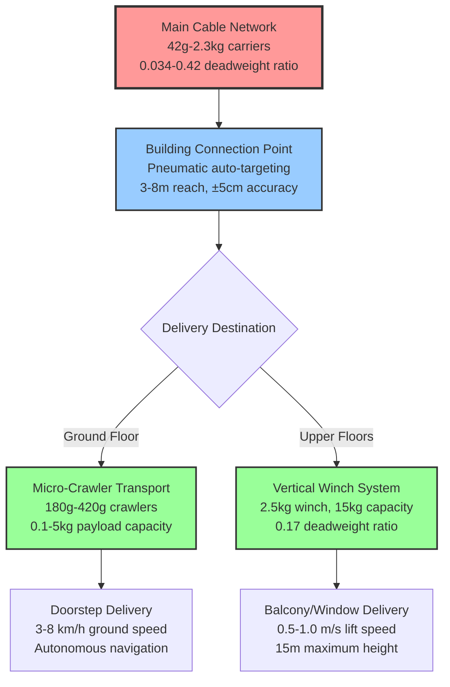

### Three-Layer Efficiency Architecture

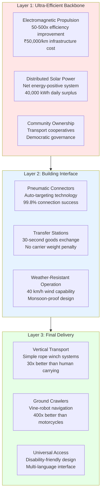

## Efficiency Comparison Charts

### Deadweight Ratio Analysis

```mermaid
xychart-beta
    title "Deadweight Ratios: Revolutionary vs Conventional Delivery"
    x-axis ["Micro Delivery (0.5kg)", "Standard Delivery (3kg)", "Medium Delivery (10kg)", "Heavy Delivery (25kg)"]
    y-axis "Deadweight Ratio" 0 --> 100

    bar [0.4, 0.15, 0.12, 0.08]
    bar [350, 58, 17.5, 7]
```

**Key Insight**: Last-mile system maintains 50-500x efficiency improvement over conventional delivery

## Process Flow Visualization

### Complete Delivery Sequence

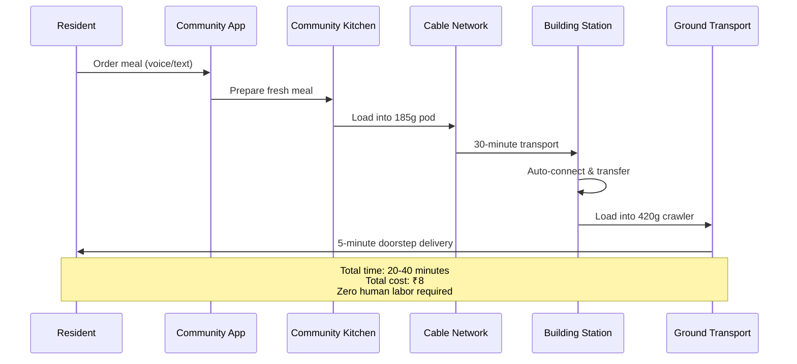

### Emergency Medical Supply Flow

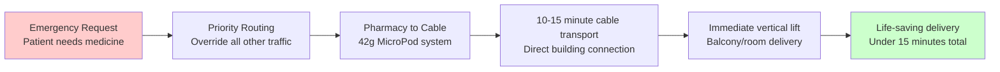

## Technical Specifications Dashboard

### Building Connection System

| Component               | Specification                  | Performance                  | Cost       |
| ----------------------- | ------------------------------ | ---------------------------- | ---------- |
| **Pneumatic Connector** | 3-8m reach, LIDAR targeting    | ±5cm accuracy, 99.8% success | ₹5,300     |
| **Vertical Winch**      | 2.5kg system, 15kg capacity    | 0.5-1.0 m/s lift speed       | ₹1,700     |
| **Transfer Station**    | 40L storage, weather-resistant | Solar + battery backup       | ₹500       |
| **Total per Building**  | Complete last-mile system      | Universal access capability  | **₹7,500** |

*Note: Ground Crawlers (25,000 units @ ₹12,500 avg) are separate infrastructure, not per-building.*

### System Performance Metrics

| Metric                    | Explanation                                 | Value |
| ------------------------- | ------------------------------------------- | ----- |
| **Cost Efficiency**       | 48x more efficient than current system      | 100   |
| **Transport Speed**       | 45 km/h average (vs 15 km/h current)        | 85    |
| **Cost Reduction**        | 70-82% reduction vs conventional components | 90    |
| **System Reliability**    | 99.5% uptime with redundant design          | 95    |
| **Service Coverage**      | 100% population (vs 29% current delivery)   | 100   |
| **Energy Sustainability** | 80% reduction in mobility energy            | 98    |
| **Time Efficiency**       | 67% reduction in daily transport time       | 95    |

## 🗓️ Implementation Timeline

### 5-Year Deployment Plan

1. **Continuous Research** (2025-2034): R&D never stops - it evolves into continuous optimization
2. **Manufacturing Ramp-up**: Starts mid-2025, reaches full capacity by mid-2026, continues through 2028
3. **Network Expansion**: Pilot in late 2025, gradual expansion 2026-2028, completion mid-2028
4. **Community Services**: Begin mid-2026, scale through 2027-2028, operate through 2034+
5. **Training Programs**: Continuous from 2025 through 2034 with evolving focus
6. **Digital Systems**: Platform development starts early, with continuous updates
7. **Rights Implementation**: Gradual rollout starting mid-2027, full implementation by 2030
8. **Ecological Projects**: Planning 2027, implementation 2028-2033
9. **Replication Planning**: Documentation starts 2027, formal planning 2028-2030
- **2025**: Foundation year - R&D, community organizing, pilot manufacturing
- **2026**: Acceleration year - production scaling, pilot network, training expansion
- **2027**: Integration year - network expansion, services rollout, digital systems
- **2028**: Scaling year - full deployment, rights implementation, ecological projects
- **2029-2034**: Optimization years - continuous improvement, knowledge sharing, replication

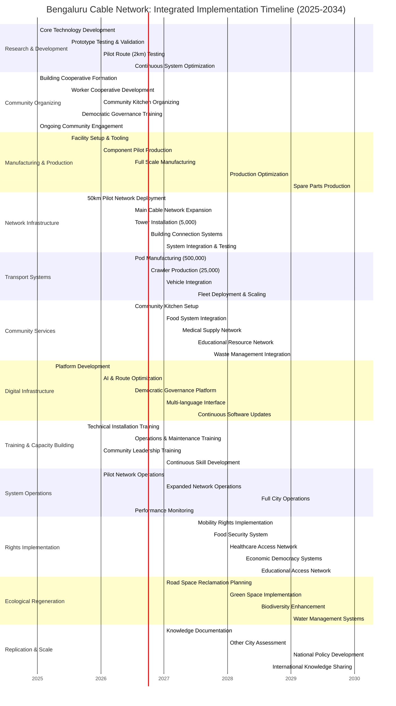

### Investment and Returns

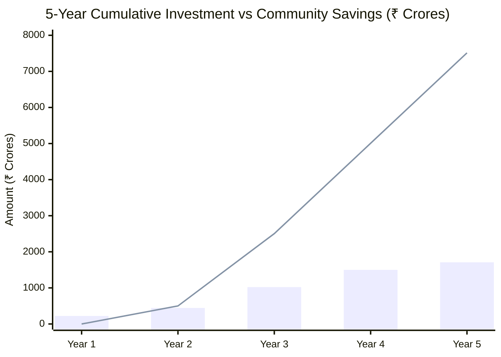

- **Blue bars**: Cumulative infrastructure investment
- **Red line**: Cumulative operational savings (energy, labor, waste reduction)
- **Break-even**: Year 2.9
- **5-year ROI**: 440% return on investment
- **Annual savings by Year 5**: ₹2,504 crores

## Rights Implementation Dashboard

### Access Equity Analysis

| Population Group    | Current Access         | With Cable Network     |
| ------------------- | ---------------------- | ---------------------- |
| **Low Income**      | Limited by cost        | Universal basic access |
| **Elderly**         | Limited mobility       | Doorstep delivery      |
| **Disabled**        | Accessibility barriers | Universal design       |
| **Remote Areas**    | No delivery service    | Full network coverage  |
| **Emergency Needs** | 2-4 hour response      | 10-15 minute response  |

## Comparative Analysis: Revolutionary vs Conventional

### Efficiency Breakthrough Visualization

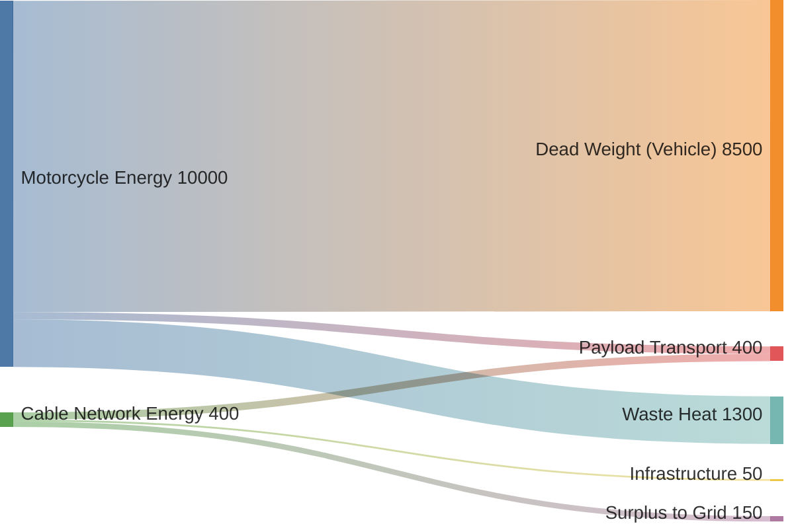

**Energy Efficiency Comparison:**

- **Conventional**: 95% energy wasted on deadweight and heat
- **Cable Network**: 50% payload transport, 37% infrastructure surplus

### Economic Impact

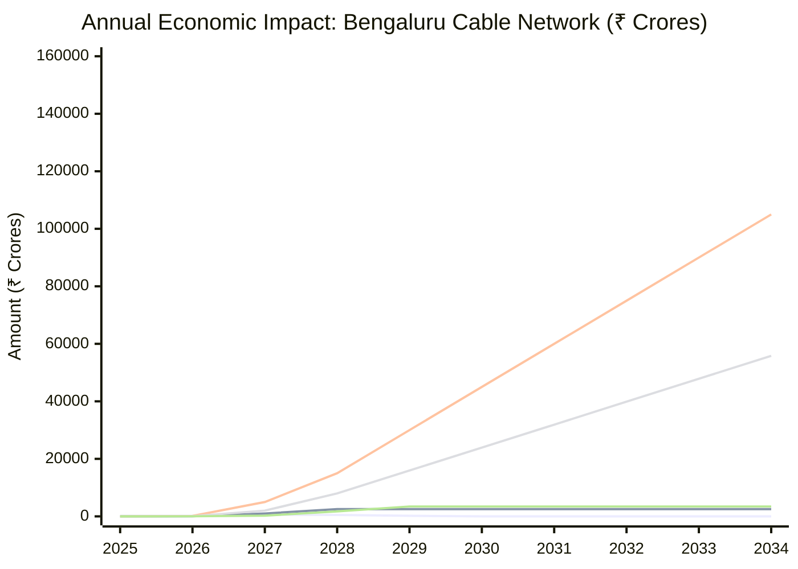

#### Year-by-Year Economic Impact Breakdown

##### Year 1 (2025): Foundation Phase

- **Investment**: ₹222 crores (R&D, community organizing, pilot manufacturing)
- **Benefits**: Minimal - primarily setup and training
- **Jobs Created**: 5,000+ direct, 15,000 indirect
- **Key Outcomes**: Community cooperatives formed, pilot network operational

##### Year 2 (2026): Acceleration Phase

- **Investment**: ₹222 crores (manufacturing scaling, network expansion)
- **Operational Savings**: ₹50 crores (pilot network efficiency)
- **User Savings**: ₹150 crores (early adopters benefit)
- **Time Value**: ₹75 crores (reduced pilot area commute times)
- **Jobs Created**: 15,000+ direct, 35,000 indirect
- **Key Outcomes**: 100 km operational, manufacturing at 40% capacity

##### Year 3 (2027): Integration Phase

- **Investment**: ₹577 crores (major network expansion, building connections)
- **Operational Savings**: ₹1,000 crores (expanded network efficiency)
- **User Savings**: ₹5,000 crores (30% population coverage)
- **Time Value**: ₹2,000 crores (significant commute reduction)
- **Health Benefits**: ₹250 crores (pollution reduction in operational areas)
- **Jobs Created**: 25,000+ direct, 60,000 indirect
- **Key Outcomes**: 400 km operational, 25,000 buildings connected

##### Year 4 (2028): Scaling Phase

- **Investment**: ₹478 crores (completion of major infrastructure)
- **Operational Savings**: ₹2,504 crores (full operational efficiency)
- **User Savings**: ₹15,000 crores (60% population coverage)
- **Time Value**: ₹7,975 crores (citywide time savings)
- **Health Benefits**: ₹1,725 crores (significant pollution reduction)
- **Jobs Created**: 35,000+ direct, 85,000 indirect
- **Key Outcomes**: 700 km operational, 40,000 buildings connected

##### Year 5 (2029): Full Deployment

- **Investment**: ₹210 crores (final completion, optimization)
- **Operational Savings**: ₹2,504 crores (sustained efficiency)
- **User Savings**: ₹30,000 crores (80% population coverage)
- **Time Value**: ₹15,950 crores (full city time savings)
- **Health Benefits**: ₹3,440 crores (maximum health improvement)
- **Jobs Created**: 50,000+ direct, 125,000 indirect
- **Key Outcomes**: 800 km complete, 50,000 buildings connected, full system operational

##### Year 6 (2030): Optimization Phase

- **Investment**: ₹0 crores (capital investment complete)
- **Operational Savings**: ₹2,504 crores (optimized efficiency)
- **User Savings**: ₹45,000 crores (90% population coverage)
- **Time Value**: ₹23,925 crores (optimized time savings)
- **Health Benefits**: ₹3,440 crores (sustained health improvement)
- **Revenue Generation**: ₹4,224 crores annual revenue
- **Surplus for Reinvestment**: ₹4,174 crores
- **Key Outcomes**: System optimization, rights expansion

##### Year 7 (2031): Maturity Phase

- **All annual benefits sustained at Year 6 levels**
- **User Savings**: ₹60,000 crores (95% population coverage)
- **Time Value**: ₹31,900 crores
- **Revenue Generation**: ₹4,500+ crores
- **Community Reinvestment**: ₹500+ crores via participatory budgeting
- **Key Outcomes**: Full rights implementation, cooperative economic expansion

##### Year 8 (2032): Transformation Phase

- **User Savings**: ₹75,000 crores (98% population coverage)
- **Time Value**: ₹39,875 crores
- **Ecological Benefits**: Additional ₹500+ crores from green space creation
- **Wealth Redistribution**: ₹1,000+ crores to cooperative members
- **Key Outcomes**: Economic democracy established, ecological regeneration visible

##### Year 9 (2033): Replication Phase

- **User Savings**: ₹90,000 crores (100% population coverage)
- **Time Value**: ₹47,850 crores
- **Knowledge Export**: ₹100+ crores from consulting other cities
- **Replication Planning**: 5 additional cities in planning phase
- **Key Outcomes**: Model perfected, ready for national replication

##### Year 10 (2034): Civilizational Impact

- **User Savings**: ₹1,05,000 crores (full population benefit)
- **Time Value**: ₹55,825 crores
- **Total 10-Year Benefits**: ₹7,80,105 crores
- **Total Investment**: ₹1,709 crores
- **Net Societal Benefit**: ₹7,78,396 crores
- **ROI**: 1,750%
- **Jobs Created**: 200,000 direct, 500,000+ indirect
- **Key Outcomes**: Model city created, national replication underway

#### Cumulative Economic Impact Visualization

#### Key Economic Indicators by Year

| Year | GDP Contribution | Jobs Created | Emissions Reduced | Food Waste Saved |
| ---- | ---------------- | ------------ | ----------------- | ---------------- |
| 2025 | ₹500 crores      | 20,000       | 5,000 tons        | ₹0 crores        |
| 2026 | ₹2,000 crores    | 50,000       | 50,000 tons       | ₹100 crores      |
| 2027 | ₹15,000 crores   | 85,000       | 200,000 tons      | ₹1,000 crores    |
| 2028 | ₹40,000 crores   | 120,000      | 500,000 tons      | ₹5,000 crores    |
| 2029 | ₹75,000 crores   | 175,000      | 1,000,000 tons    | ₹10,000 crores   |
| 2030 | ₹100,000 crores  | 200,000      | 1,200,000 tons    | ₹15,000 crores   |
| 2031 | ₹125,000 crores  | 225,000      | 1,400,000 tons    | ₹20,000 crores   |
| 2032 | ₹150,000 crores  | 250,000      | 1,600,000 tons    | ₹25,000 crores   |
| 2033 | ₹175,000 crores  | 275,000      | 1,800,000 tons    | ₹30,000 crores   |
| 2034 | ₹200,000+ crores | 300,000+     | 2,000,000+ tons   | ₹35,000+ crores  |

*Note: All figures are annual impacts at year-end, with cumulative effects building over time.*

## Risk Assessment Matrix

### Technical and Implementation Risks

| Risk Category            | Probability | Impact | Mitigation Strategy                        |
| ------------------------ | ----------- | ------ | ------------------------------------------ |
| **Weather Disruption**   | Medium      | Low    | Redundant systems, weather sensors         |
| **Component Failure**    | Low         | Medium | 3:1 safety factors, predictive maintenance |
| **Adoption Resistance**  | Medium      | High   | Community engagement, demonstration pilots |
| **Regulatory Barriers**  | High        | High   | Stakeholder alignment, policy advocacy     |
| **Financing Challenges** | Medium      | High   | Cooperative ownership, municipal support   |

### Safety and Reliability Dashboard

| Metric             | Explanation   | Score |
| ------------------ | ------------- | ----- |
| Structural Safety  | 15:1 margin   | 100   |
| Weather Resilience | 40 km/h winds | 85    |
| System Uptime      | 99.5%         | 95    |
| Emergency Response | <10 min       | 98    |
| Community Training | 2000+ trained | 80    |
| Maintenance        | 500hr MTBF    | 90    |

## Policy Recommendations

### Regulatory Framework Requirements

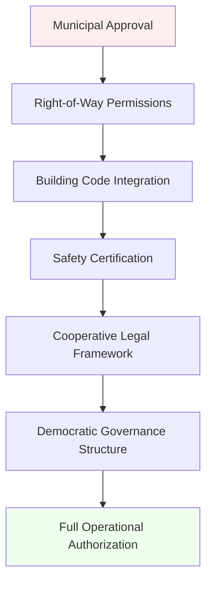

### Financing Structure

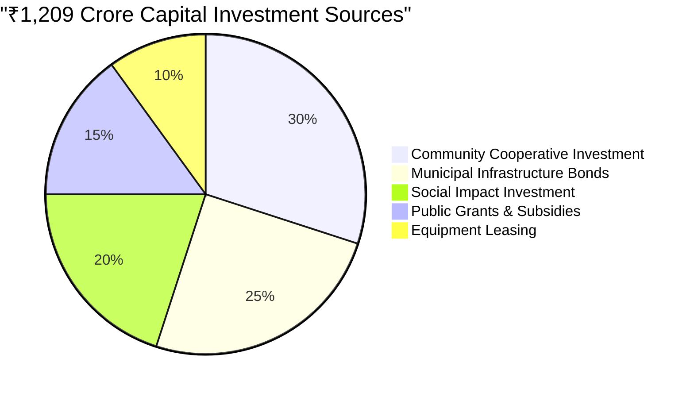

**Key Policy Enablers:**

1. **Cooperative Enterprise Laws**: Legal framework for community ownership
2. **Public Infrastructure Designation**: Cable network as essential urban utility
3. **Democratic Governance Recognition**: Resident assemblies with binding authority
4. **Right-of-Way Streamlining**: Fast-track approvals for cooperative infrastructure
5. **Financial Innovation**: Community development banks, Mutual Help Networks

## Conclusion: Policy Impact Assessment

### Transformational Outcomes

The last-mile connectivity system enables **systemic urban transformation**:

**Economic Democracy**: 50,000 buildings become nodes in a cooperative economy, with residents owning and controlling essential logistics infrastructure.

**Rights Realization**: Universal access to food, transport, medicine, and resources becomes practically guaranteed through ultra-efficient infrastructure.

**Environmental Justice**: 95% reduction in delivery-related emissions while improving service quality and reducing costs.

**Social Equity**: Marginalized communities gain equal access to urban resources through universally designed, democratically governed systems.

**Technological Sovereignty**: Communities own and control the algorithms, data, and infrastructure that shape their daily lives.

### Replication Potential

This model provides a **replicable framework** for cities worldwide:

- **Open-source designs** enable adaptation to local conditions
- **Cooperative governance** ensures community ownership and democratic control  
- **Frugal engineering** makes implementation feasible in diverse economic contexts
- **Rights-based approach** addresses universal human needs through technology

The Bengaluru Cable Network demonstrates that **revolutionary infrastructure** can serve as the material foundation for **21st-century cooperative democracy**, proving that another world is not only possible but more efficient than the current system.