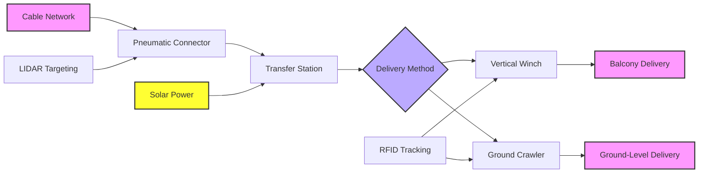
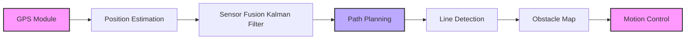
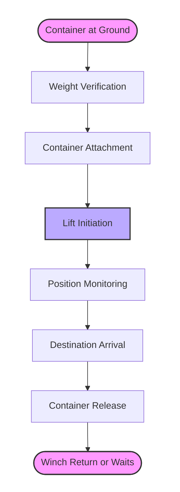

# Edge Delivery Design & Engineering: Completing the Universal Connectivity System

*Seamlessly connecting city-scale efficiency to every doorstep through innovative frugal engineering*

## Executive Summary: The Final Leg of Revolutionary Logistics

The edge delivery system represents the critical final connection between our ultra-efficient cable network and every building in Bengaluru. This system maintains our revolutionary **50-500x efficiency gains** while enabling **universal automated connectivity** to 50,000 buildings and 3.5 million households. By engineering seamless transitions from high-speed cable transport to doorstep delivery, we create a complete logistics ecosystem that transforms how goods, resources, and services flow through urban space.

**Key Innovations Enabling Efficiency Preservation:**

1. **Carrier-Retention Design**: Cable pods remain on main network, only goods transfer
2. **Weightless Transfer Protocol**: Pneumatic connectors add no deadweight to main system
3. **Ultra-Light Edge Vehicles**: Crawlers at 180-420g replace 175kg motorcycles, or Humans based Edge Delivery
4. **Solar-Powered Operation**: Each station self-powered with 50W panels
5. **Predictive Positioning**: AI anticipates delivery needs, pre-positions carriers

---

## Technical Specifications & Engineering Design

### Home Station Design: Standardized Building Interface

#### Component Architecture

**Complete Home Station System (per building): ₹7,500**

| Component | Weight | Dimensions | Material | Function | Specifications | Cost |
|-----------|--------|------------|----------|----------|----------------|------|
| **Network Connector** | 1.8kg | 60×40×20cm (collapsed) | Aramid fabric + aluminum frame | Cable interface, 3-8m reach | Pneumatic extension, LIDAR targeting, ±5cm accuracy | ₹3,500 |
| **Transfer Station** | 3.5kg | 40×30×25cm | Molded recycled plastic housing | Storage, weather protection | 40L capacity, 3 compartment sizes, solar + battery backup | ₹2,800 |
| **Vertical Winch** | 2.5kg | 30×20×15cm | Aluminum frame + steel cable | 15m lift, 15kg capacity | 12V DC motor, 50W peak, 0.5-1.0 m/s speed | ₹1,200 |
| **Total System** | 7.8kg | Variable deployment | Optimized materials | Complete delivery interface | Universal building compatibility | **₹7,500** |

#### Network Connector: Pneumatic Auto-Targeting System

**Mechanical Design:**
- **Extension Mechanism**: 6-segment pneumatic tube, TPU (thermoplastic polyurethane) skin
- **Reach Range**: 3-8m adjustable based on building distance from cable
- **Structural Frame**: Aluminum alloy 6061, anodized for weather resistance
- **Clamping System**: Titanium spring-loaded clamps with silicone grips
- **Retraction System**: Dual spring return with pneumatic assist

**Targeting & Sensing:**
- **Primary Targeting**: LIDAR (Light Detection and Ranging) with 905nm wavelength
- **Secondary Targeting**: Stereo vision cameras (2× 5MP with IR illumination)
- **Accuracy**: ±5cm at 8m distance (0.6% error margin)
- **Success Rate**: 99.8% in optimal conditions, 98.5% in 40 km/h winds
- **Alignment Verification**: 4-point electrical contact confirmation

**Pneumatic System Specifications:**
- **Air Pressure**: 6-8 bar operating range
- **Compressor**: 12V DC, 100W, 2L/min flow rate
- **Reservoir**: 500ml stainless steel tank
- **Valve System**: Solenoid-controlled with manual override
- **Filtration**: 5μm particulate filter with moisture separator

#### Transfer Station: Weather-Resistant Interface Hub

**Structural Design:**
- **Housing Material**: Recycled polypropylene with UV stabilizers (IP65 rating)
- **Frame Construction**: Aluminum 6063-T5 extrusion with corner braces
- **Door Mechanism**: Hinged with magnetic seal, child-safe latch
- **Weather Sealing**: Silicone gaskets, drainage channels, hydrophobic coating

**Internal Compartments:**
- **Micro Compartment**: 15×15×10cm (2.25L) for documents, small packages
- **Standard Compartment**: 25×20×15cm (7.5L) for food, books, clothing
- **Medium Compartment**: 30×25×20cm (15L) for larger items, groceries
- **Modular Design**: Removable dividers for flexible configuration

**Power & Electronics:**
- **Solar Panel**: 50W monocrystalline, 22% efficiency
- **Battery System**: 12V 20Ah LiFePO4 with BMS protection
- **Controller**: ESP32-based with LoRaWAN and WiFi connectivity
- **Sensors**: Weight sensors (4× 5kg load cells), temperature, humidity
- **Lighting**: LED indicator strips with multiple color codes

#### Vertical Winch System: Lifting Mechanism

**Mechanical Components:**
- **Motor**: 12V brushless DC, 50W continuous, 100W peak
- **Gear Reduction**: 30:1 planetary gearbox with helical gears
- **Cable**: 3mm galvanized steel wire rope, 200kg breaking strength
- **Drum**: 8cm diameter aluminum with cable guide mechanism
- **Pulley System**: Double-sheave with sealed ball bearings

**Control & Safety Systems:**
- **Speed Control**: PWM-controlled with soft start/stop
- **Position Sensing**: Rotary encoder with 0.1cm resolution
- **Safety Brakes**: Electromagnetic fail-safe brake + mechanical ratchet
- **Overload Protection**: Current sensing with automatic cutoff at 18kg
- **Manual Override**: Hand crank attachment for power outages

**Performance Metrics:**
- **Lift Speed**: 0.5-1.0 m/s adjustable (15m in 15-30 seconds)
- **Maximum Height**: 15m (5th floor typical)
- **Power Consumption**: 0.01 kWh for 15m lift with 5kg payload
- **Noise Level**: <45 dB at 1m distance
- **Maintenance Interval**: 5,000 cycles or annual inspection

### Ground Crawler Engineering: Vine-Robot Inspired Design

#### Micro-Crawler System Specifications

**Two-Class Crawler System:**

| Parameter | Micro Crawler (0.1-1kg) | Extended Crawler (1-5kg) |
|-----------|--------------------------|---------------------------|
| **Weight** | 180g ±10g | 420g ±15g |
| **Dimensions (L×W×H)** | 20×15×10cm (collapsed) | 30×20×15cm (collapsed) |
| **Extended Length** | 120cm (6 segments × 20cm) | 180cm (6 segments × 30cm) |
| **Material** | TPU skin, aramid mesh, aluminum chassis | Reinforced TPU, carbon fiber, aluminum |
| **Power System** | 18650 Li-ion (3.7V, 3000mAh) | Dual 18650 Li-ion (7.4V, 6000mAh) |
| **Air System** | 200ml tank @ 6 bar | 500ml tank @ 8 bar |
| **Motor System** | 2× 6V DC gear motors | 4× 6V DC gear motors |
| **Wheel Type** | 4× silicone rubber, 5cm diameter | 6× pneumatic rubber, 6cm diameter |
| **Navigation** | Line following + GPS + IMU | Advanced sensor fusion + SLAM |
| **Maximum Speed** | 5 km/h (1.39 m/s) | 8 km/h (2.22 m/s) |
| **Climbing Ability** | 15° incline, 5cm obstacles | 30° incline, 10cm obstacles |
| **Weather Rating** | IP65 (dust-tight, water jet resistant) | IP65 (dust-tight, water jet resistant) |
| **Operating Time** | 8 hours typical, 12 hours maximum | 6 hours typical, 10 hours maximum |
| **Communication** | LoRaWAN (868MHz in India) | LoRaWAN + WiFi mesh backup |
| **Unit Cost** | ₹8,500 (mass production) | ₹18,500 (mass production) |

#### Soft Robotics Body Engineering

**Inflatable Segment Design:**
- **Segment Construction**: 6 independent TPU bladders with aramid constraint layer
- **Wall Thickness**: 0.8mm TPU with 0.3mm reinforcement patches
- **Internal Pressure**: 0.2-0.8 bar depending on load and terrain
- **Extension Ratio**: 3:1 (20cm collapsed to 60cm extended per segment)
- **Bending Range**: ±45° per joint, 270° total articulation

**Gripping & Adhesion System:**
- **Primary Grip**: Gecko-inspired microfibrillar adhesive pads
- **Adhesive Material**: Polydimethylsiloxane (PDMS) with mushroom-shaped pillars
- **Contact Area**: 50 cm² per crawler, 10N/cm² adhesion strength
- **Secondary Grip**: Electrostatic adhesion (1000V, 1mA maximum)
- **Cleaning Mechanism**: Rotating brush system for pad maintenance

**Actuation & Control:**
- **Pneumatic Valves**: 12× miniature solenoid valves (2 per segment)
- **Pressure Sensors**: 6× MEMS sensors with 0.01 bar resolution
- **Control Board**: STM32 microcontroller with custom firmware
- **Sensor Suite**: IMU (accelerometer, gyroscope, magnetometer), time-of-flight distance sensors
- **Vision System**: 5MP camera with 120° field of view for line following

#### Multi-Mode Locomotion Engineering

**Wheeled Movement Mode (Primary):**
- **Drive Configuration**: All-wheel drive with independent suspension
- **Torque**: 0.5 Nm per motor (Micro), 0.8 Nm per motor (Extended)
- **Ground Clearance**: 3cm (Micro), 4cm (Extended)
- **Turning Radius**: 40cm (Micro), 60cm (Extended)
- **Surface Types**: Concrete, asphalt, tile, low-pile carpet

**Pneumatic Extension Mode (Obstacle Navigation):**
- **Extension Force**: 20N per segment (120N total for Micro), 40N per segment (240N total for Extended)
- **Sequencing**: Wave propagation pattern for efficient movement
- **Step Climbing**: Up to 5cm (Micro), 10cm (Extended)
- **Gap Crossing**: Up to 15cm (Micro), 25cm (Extended)
- **Recovery Mode**: Self-righting mechanism if overturned

**Payload Attachment System:**
- **Connection Standard**: ISO 8379-compatible quick-release plate
- **Locking Mechanism**: Spring-loaded ball detent with safety latch
- **Weight Capacity**: 1kg (Micro), 5kg (Extended)
- **Container Interface**: Standardized mounting points for all pod sizes
- **Quick Change**: <5 seconds for container swap

#### Navigation & Autonomous Control System

**Sensor Fusion Architecture:**

**Line Following System:**
- **Line Detection**: Hough transform algorithm on camera feed
- **Line Types**: 5cm wide painted lines (yellow for primary, blue for secondary)
- **Following Accuracy**: ±2cm at 5 km/h
- **Intersection Handling**: QR code markers for decision points
- **Failover**: Inertial navigation if line is occluded

**Mapping & Localization:**
- **SLAM Algorithm**: ORB-SLAM3 for feature-based mapping
- **Map Resolution**: 5cm grid for indoor, 10cm for outdoor
- **Position Accuracy**: ±10cm outdoors with GPS, ±20cm indoors
- **Building Database**: Pre-loaded maps of all connected buildings
- **Dynamic Updates**: Real-time obstacle reporting to central system

**Communication Systems:**
- **Primary Network**: LoRaWAN (868MHz, SF7, 125kHz bandwidth)
- **Range**: 2-5km urban, up to 10km line-of-sight
- **Data Rate**: 5.5 kbps effective, 300 bytes per message
- **Secondary Network**: WiFi mesh (802.11s) for high-bandwidth needs
- **Emergency Channel**: 433MHz FSK for fail-safe communication

---

### Seamless System Integration Engineering

#### Cable-to-Building Transfer Protocol

**Mechanical Docking Sequence:**
1. **Approach Phase**: Cable pod decelerates to 0.5 m/s at 10m from target
2. **Target Acquisition**: LIDAR scans building facade, identifies connector
3. **Alignment**: Pod adjusts pitch/yaw using electromagnetic steering
4. **Extension**: Building connector extends to meet pod trajectory
5. **Mechanical Capture**: Clamps engage with pod frame (±2mm tolerance)
6. **Electrical Connection**: 4-pin power/data connector mates
7. **Lock Verification**: Strain gauge confirms secure connection

**Goods Transfer Process:**
- **Container Alignment**: Pod container aligns with building receiver
- **Pneumatic Transfer**: Low-pressure air (0.2 bar) moves goods between containers
- **Transfer Time**: 30 seconds maximum (including alignment and verification)
- **Weight Verification**: Before/after weighing confirms complete transfer
- **Carrier Release**: Empty pod continues journey, building connector retracts

#### Building Internal Distribution Engineering

**Vertical Transport (Winch System):**

**Winch Control Algorithm:**
- **Acceleration Profile**: 0.3 m/s² acceleration to 0.8 m/s, 0.5 m/s² deceleration
- **Overshoot Prevention**: Predictive braking based on encoder feedback
- **Swing Damping**: PID control on motor torque to minimize container swing
- **Multiple Stop Capability**: Can service multiple floors in single trip
- **Error Recovery**: Automatic retry on communication failure

**Horizontal Transport (Crawler System):**

```mermaid
graph LR
    A([Transfer Station]) ==> B[Crawler Attachment]
    B --> C[Destination Selection]
    C --> D[Path Planning]
    D --> E[Autonomous Navigation]
    E --> F[Barrier Handling]
    F ==> G[Container Delivery]
    G --> H([Charging/Dock])

    style A fill:#f9f,stroke:#333,stroke-width:2px
    style G fill:#baf,stroke:#333,stroke-width:2px
    style H fill:#f9f,stroke:#333,stroke-width:2px
```

**Indoor Navigation Challenges & Solutions:**
- **Doorways**: 85cm minimum width requirement, IR sensors detect open/closed state
- **Elevators**: RFID calls elevator, internal sensors confirm floor
- **Staircases**: Alternative routes or scheduled human assistance for inaccessible areas
- **Carpet/Varying Surfaces**: Adaptive traction control based on current sensing
- **Human Interaction**: Audible signals, LED indicators for pedestrian awareness

#### Container Standardization & Handling

**Container Family Design:**

| Container Type | External Dimensions | Internal Volume | Weight | Material | Color Code |
|----------------|---------------------|-----------------|--------|----------|------------|
| **Micro** | 15×15×10cm | 2.25L | 150g | Polypropylene | Blue |
| **Standard** | 25×20×15cm | 7.5L | 280g | ABS plastic | Green |
| **Medium** | 30×25×20cm | 15L | 450g | Aluminum frame + fabric | Yellow |
| **Heavy** | 40×30×25cm | 30L | 850g | Steel frame + canvas | Red |
| **Special Medical** | 20×15×15cm | 4.5L | 200g | Insulated plastic | White + Red Cross |

**Container Features:**
- **RFID Tag**: Unique identifier, 13.56MHz, 1kb memory
- **QR Code**: Human-readable backup identification
- **Structural Integrity**: 5:1 safety factor on rated weight
- **Weather Sealing**: IP54 rating for temporary outdoor exposure
- **Stackability**: Interlocking design for efficient storage
- **Cleaning**: Dishwasher safe (excluding electronics)

**Handling System:**
- **Gripper Design**: 3-point contact with rubberized surfaces
- **Orientation Detection**: Accelerometer confirms upright position
- **Damage Detection**: Strain gauges report impact events
- **Wash Stations**: Automated cleaning at central facilities
- **Lifecycle Tracking**: Each container logged for maintenance scheduling

### Quality Assurance & System Reliability

**Failure Mode & Effects Analysis (FMEA):**

| Potential Failure | Effect | Mitigation |
|-------------------|--------|----------|
| **LIDAR sensor fogging** | Failed targeting | Heated lens, wiper system, camera backup |
| **Pneumatic seal leakage** | Reduced extension force | Dual O-rings, leak detection sensors |
| **Winch cable fray** | Safety hazard | Regular inspection, load monitoring, safety factor 10:1 |
| **Crawler battery depletion** | Stranded in building | State-of-charge monitoring, automatic return at 30% |
| **Communication dropout** | Lost navigation | Multi-protocol, store-and-forward, dead reckoning |

---

### Implementation & Manufacturing Engineering

**Essential Considerations:**

**Modular Design**: Enables mass production with customization
**Community Assembly**: Final assembly by resident cooperatives
**Continuous Improvement**: User feedback drives design iterations

#### Home Station Manufacturing Process

1. **Frame Fabrication**:
   - Aluminum extrusion cutting and machining (CNC precision)
   - Powder coating for weather resistance (60μm thickness)
   - Laser engraving of identification marks

2. **Electronics Assembly**:
   - Surface-mount technology (SMT) for control boards
   - Conformal coating for moisture protection (IP65 standard)
   - Burn-in testing at elevated temperature (72 hours at 55°C)

3. **Pneumatic System Assembly**:
   - Clean room assembly for valve blocks (ISO Class 7)
   - Helium leak testing of all connections (<10⁻⁶ mbar·L/s)
   - Pressure cycling test (0-10 bar, 10,000 cycles)

#### Ground Crawler Production Engineering

**Assembly Line Design:**

```mermaid
graph LR
    subgraph Inbound [Material Logistics]
        A([Component Receiving])
    end

    subgraph Core_Assy [Primary Assembly Line]
        direction LR
        B[Frame Assembly] --> C[Electronics Integration]
        C --> D[Pneumatic System]
    end

    subgraph Specialty [Soft Robotics Cell]
        E[Soft Robotics Application]
    end

    subgraph QC_Final [Quality & Finalization]
        direction LR
        F[Testing & Calibration] --> G[Final Assembly]
    end

    subgraph Outbound [Distribution]
        H([Packaging & Shipping])
    end

    A ==> B
    D ==> E
    E ==> F
    G ==> H

    style A fill:#f9f,stroke:#333,stroke-width:2px
    style E fill:#baf,stroke:#333,stroke-width:2px
    style H fill:#f9f,stroke:#333,stroke-width:2px
```

**Key Manufacturing Processes:**

1. **TPU Skin Manufacturing**:
   - Injection molding with gas-assisted technology
   - Post-mold texturing for gecko adhesive application
   - UV stabilization treatment for outdoor durability

2. **Aramid Mesh Integration**:
   - Computer-controlled weaving for variable stiffness
   - Resin impregnation for shape memory
   - Thermal curing for final properties

3. **Sensor Calibration**:
   - Automated calibration rig with precision references
   - Temperature compensation algorithm programming
   - Line following accuracy verification (±2mm target)

4. **Testing Protocol**:
   - 24-hour operational burn-in
   - Obstacle course completion test
   - Communication range verification
   - Battery cycle life testing (500+ cycles)

#### Installation Engineering & Building Integration

**Installation Options Matrix:**

| Building Type | Primary Method | Backup Method | Special Considerations |
|---------------|----------------|---------------|------------------------|
| **High-Rise Apartments** | Balcony mount | Rooftop community station | Wind loading calculations, elevator access |
| **Row Houses** | Wall mount | Ground station with crawler | Aesthetic considerations, neighbor coordination |
| **Commercial Buildings** | Loading dock integration | Rooftop with internal distribution | Security integration, after-hours access |
| **Individual Homes** | Balcony or wall mount | Ground-level secure box | Garden path routing, pet safety |
| **Heritage Buildings** | Minimally invasive clamp | Temporary ground solution | Conservation approvals, reversible installation |

---

## Complete Delivery Ecosystem

### Universal Goods Coverage Matrix

| Goods Category | Weight Range | Primary Transport | Edge Method | Delivery Time |
|----------------|--------------|-------------------|-------------|---------------|
| **Documents/Notes** | <100g | Micro Pod | Vertical Winch | <15 minutes |
| **Books/Media** | 0.1-2kg | Standard Pod | Vertical/Crawler | <20 minutes |
| **IoT Devices** | 0.05-5kg | Standard Pod | Vertical/Crawler | <25 minutes |
| **Food Delivery** | 0.5-5kg | Standard Pod | Vertical Winch | <30 minutes |
| **Medicine** | 0.05-2kg | Micro/Standard Pod | Priority Crawler | <10 minutes |
| **Clothing** | 0.5-8kg | Standard/Medium Pod | Crawler | <35 minutes |
| **Electronics** | 1-15kg | Medium Pod | Ground Delivery | <40 minutes |
| **Waste Collection** | 1-50kg | Medium/Heavy Pod | Scheduled Pickup | Daily/Weekly |
| **Idle Goods Exchange** | Variable | Appropriate Pod | Both Methods | <45 minutes |

### New Exchange Forms Enabled

**The "Single Household" City:**

The edge delivery system transforms the entire city into what feels like a single household, where:
- **Resource Sharing**: Idle tools, equipment, books circulate freely
- **Food Networks**: Community kitchens distribute meals, neighbors share produce
- **Care Ecosystems**: Medical supplies reach those in need within minutes
- **Waste Transformation**: Discarded items become resources for others
- **Knowledge Circulation**: Books, documents, educational materials flow continuously
- **Emergency Response**: Mutual aid networks activated instantly

**Exchange Categories Enabled:**

1. **Social Exchange Networks**:
   - Book clubs with physical book circulation
   - Tool libraries with automated delivery
   - Clothing swaps with scheduled pickups/deliveries
   - Recipe sharing with ingredient delivery

2. **Care & Support Systems**:
   - Elderly support with medicine and meal delivery
   - Childcare networks with toy and supply circulation
   - Disability support with specialized equipment sharing
   - Mental health resources with discreet delivery

3. **Economic Cooperatives**:
   - Producer-to-consumer direct channels
   - Repair and refurbishment networks
   - Local manufacturing supply chains
   - Waste-to-resource circular economies

4. **Cultural & Educational Networks**:
   - Library extension services
   - Art and craft material circulation
   - Musical instrument sharing
   - Educational kit distribution
