# Cable Network as Economic Veins: Expanding and Enabling New Rights

Here we present a philosophical analysis, a raison d'etre for the proposed physical infrastructure system, and a way to think about it. Although it is a digitally mediated system, we will only be calling it a physical network since the flow of electrons when just called a digital network, loses the physicality of the flow, renderring physical operators, maintainers, mine workers, cable laying workers, etc. less essential than the software engineers, obscured by the ethereal language of "digital platforms" and "software solutions.

## Logistics as Metabolism of Society

When every building becomes directly connected to a single (federated) network, the system transcends mere **transportation infrastructure** and becomes the **metabolic system of cooperative urban life**. This transformation represents a fundamental shift from isolated infrastructure to integrated urban organism.

### The Philosophical Imperative: From Exchange to Circulation

Market-based thinking reduces all human interaction to exchange—the transfer of ownership mediated by price. This model necessarily creates exclusion (those without money), waste (unsold goods), and alienation (goods as commodities rather than use-values). The edge delivery system, by contrast, enables circulation—the continuous flow of resources to where they're needed, based on use rather than ownership.

This distinction between exchange and circulation represents one of the great philosophical divides in how we conceive society. Exchange requires equivalence and compensation; circulation requires only need and availability. Exchange isolates individuals as buyers and sellers; circulation connects them as participants in shared systems. Exchange measures value by price; circulation measures value by utility and social benefit.

The vein-cappillary system actualizes Marx's materialist insight that technological evolution in the means of production can reconfigure social relations, but it does so by resolving a critical historical constraint he could not fully anticipate: *the scarcity of information*. ***In Marx's era, capitalism's markets functioned not merely as mechanisms of exchange but as indispensable, if brutal, information-processing systems — the invisible hand: crude algorithms that aggregated opaque signals about human need through price. Today, the internet has abolished that informational scarcity, enabling democratic societies to directly, transparently, and continuously discern collective needs without the distorting filter of purchasing power. The automated edge delivery network thus becomes the material embodiment of this cognitive shift—the physical infrastructure that translates democratically recognized needs into direct, need-based distribution, effectively replacing the market's informational role with conscious, collective coordination and rendering commodity exchange obsolete for essential goods.*** In doing so, it transforms the city from a space of capitalist accumulation into a cooperative social metabolism, where abundance is circulated according to need, fulfilling in practice the communist principle that remained abstract while information was scarce. As Marxist philosopher Henri Lefebvre would have argued, this system enables "the right to the city", not just access to urban space but participation in urban production. It transforms residents from passive consumers into active nodes in a cooperative network, what Italian autonomist thinkers termed "the social factory" where production and reproduction merge.

### The Economic Circulatory System

The cable network functions as a comprehensive vascular system for the urban economy:

| System Component | Economic Function | Social Analog |
|-----------------|------------------|---------------|
| **Arterial Network** | Primary hubs distribute resources from production centers | Circulatory system |
| **Venous System** | Return logistics bring waste/materials for processing | Waste removal |
| **Capillary Network** | Building-level connections reach every economic cell | Cellular nutrition |
| **Lymphatic Function** | Information and governance flows maintain system health | Immune system |

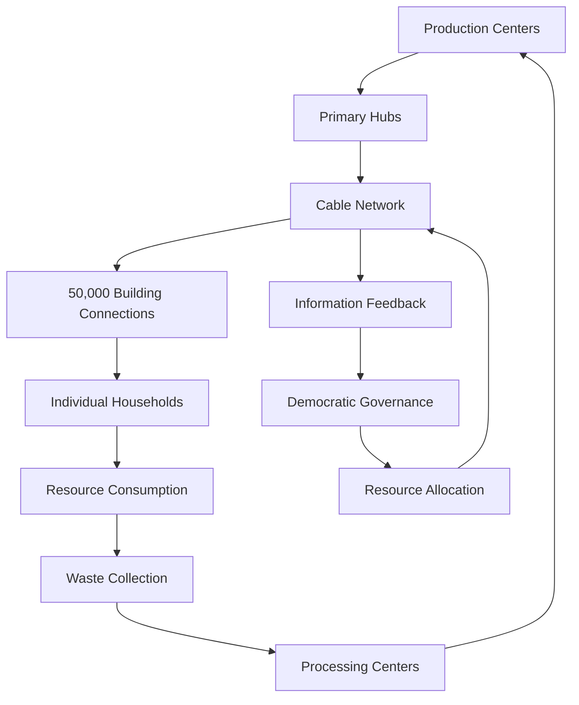

This integrated system enables what we term **social metabolism**—the conscious, democratic coordination of resource flows for collective wellbeing, replacing the unconscious, profit-driven circulation of commodities.

## New Rights Enabled by Universal Building Connectivity

### Right to Desired Meal

With this network as the fundamental infrastructure, in addition to constitutionally mandated Right to desired Meals (automated nutritious meals from community kitchens to your desired location), we also get multiple other options, such as sharing extra food we may have cooked, or out of passion and joy of cooking, we can share our extra food with others, and similarly recieve it from others as well in forming a mutual help system. In addition, any of your current favourite restaurants, eateries, cafes, etc. through access to this universal network, would be able to deliver you more delicious food at cheaper prices within quicker times without forcing poor people into drudgery ridden, high risk, traffic ridden delivery jobs, which forces them to be attentitive at all times, listening to all the traffic induced air-noise pollution. 

### Right to Universal Movement

With Pods and cable transport system providing universal access, no place is unreachable -- human fatigue doesn't dictate when, where, how far we can go.

### Right to Immediate Resource Access

**From Scarcity-Based Markets to Abundance-Based Commons**

With direct balcony level insfrasttucture and options for mutual exchange of goods and services, with cable transport system providing universal access, we move beyond artificial scarcity to **abundance-based resource distribution** where access to necessities becomes as natural as turning on a tap. This represents the material basis for post-scarcity economic relations.

> Emergency medicines, tools, books, notes, grocery, household goods delivered within 15 minutes to any building at true cost pricing.

**Key Dimensions of Resource Access Rights:**

| Resource Type | Current System (Market-Based) | Cable Network (Commons-Based) | Timeframe |
|---------------|-------------------------------|-------------------------------|-----------|
| **Fresh Food** | Market purchase with price barriers | Community provisioning via cooperative kitchens | < 15 minutes |
| **Tools & Equipment** | Individual ownership or rental | Library model with citywide circulation | < 30 minutes |
| **Emergency Resources** | Disorganized, charity-dependent | Systematic mutual aid networks | < 2 hours |
| **Medical Supplies** | Pharmacy visits, delivery fees | Direct delivery from cooperative pharmacies | < 10 minutes |

This transformation eliminates what economists call **artificial scarcity**—the deliberate restriction of supply to maintain prices—and replaces it with **abundance planning** based on actual human needs and democratic decision-making.

### Right to Participatory Production

**Buildings as Production Nodes in Cooperative Economy**

Universal building connectivity enables **distributed manufacturing** where every building can become a production site connected to citywide supply and distribution systems. This represents a fundamental democratization of production means.

**Production Network Transformation:**

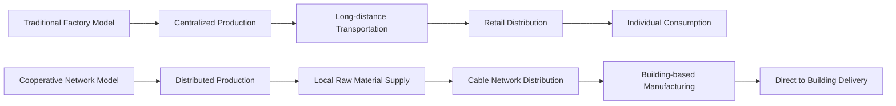

**Key Production Rights Enabled:**

1. **Home-Based Manufacturing**: Access to 3D printing filaments, fabrics, electronic components with finished goods directly entering distribution networks
2. **Cooperative Workshops**: Rooftop makerspaces and tool libraries connected across buildings
3. **Care Work Support**: Shared childcare supplies, eldercare equipment, and mutual aid coordination
4. **Democratic Production Planning**: Community assemblies coordinate production priorities based on actual needs rather than market signals

This system transforms residents from passive consumers into active producers, creating what Marx termed the **"associated producers"** who collectively control the means of production.

### Right to Circular Economy Participation

**Waste Elimination Through Systemic Resource Circulation**

Building-level connections enable true **circular economy** where nothing is waste—everything flows back into productive use through the cooperative network. This represents a fundamental break from the linear "extract-produce-discard" model of capitalist production. 

> Automated pickup of organic waste, Mutual Exchange of Idle resources and Goods, Sharing of Extra Food, electronics for refurbishment, clothing for reprocessing - all flowing seamlessly through the cooperative network.

**Circular Economy Transformation:**

| Linear Economy Problem | Circular Economy Solution | Cable Network Enablement |
|------------------------|---------------------------|---------------------------|
| Organic waste to landfill | Daily compost/biogas production | Daily organic waste collection |
| Electronics become e-waste | Systematic refurbishment | Automated pickup and repair circulation |
| Textile waste | Fabric recycling and upcycling | Return to production cycle |
| Construction waste | Material reclamation | Building waste becomes new construction input |

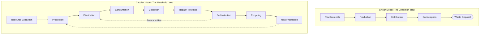

This system eliminates the concept of "waste" entirely, replacing it with the understanding that all materials are temporarily useful configurations that can be reconfigured for new purposes.

### Right to Economic Democracy and Workplace Self-Management

**Buildings as Democratic Economic Units**

Universal connectivity enables **workplace democracy** where building residents collectively own and manage economic activities, with the cable network facilitating democratic coordination at previously impossible scales.

**Democratic Economic Structure:**

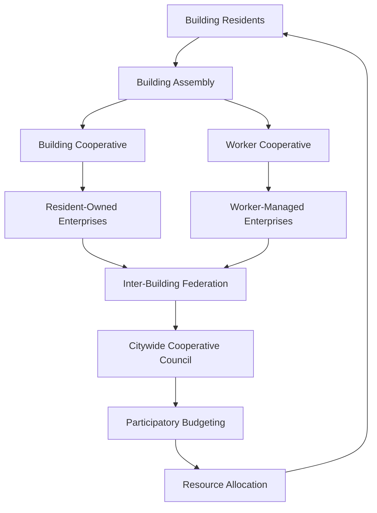

**Key Democratic Rights:**

1. **Building Cooperative Enterprises**: Residents collectively own and operate local businesses
2. **Democratic Management**: One-person-one-vote governance of all economic activities
3. **Inter-Building Cooperation**: Federations of cooperatives for larger-scale projects
4. **Participatory Planning**: Quadratic voting and deliberation for community investment priorities

This represents the realization of **economic democracy** -- the extension of democratic principles from the political sphere to the economic sphere, ensuring that those affected by economic decisions have a voice in making them.

### Right to Knowledge Commons and Innovation

**Distributed Innovation Networks Through Building Connectivity**

Universal building access enables **democratic innovation** where knowledge, designs, and creative works flow freely through cooperative networks, breaking down the artificial barriers of intellectual property.

**Knowledge Commons Ecosystem:**

| Traditional IP Model | Knowledge Commons Model | Economic Impact |
|----------------------|-------------------------|-----------------|
| Patent monopolies | Open-source innovation | Orders of magnitude faster innovation diffusion |
| Trade secrets | Shared knowledge pools | Collective problem-solving |
| Innovation hoarding | Democratic evaluation | Community-driven R&D |
| Creator isolation | Collaborative networks | Cross-pollination of ideas |

**Innovation Flow Process:**

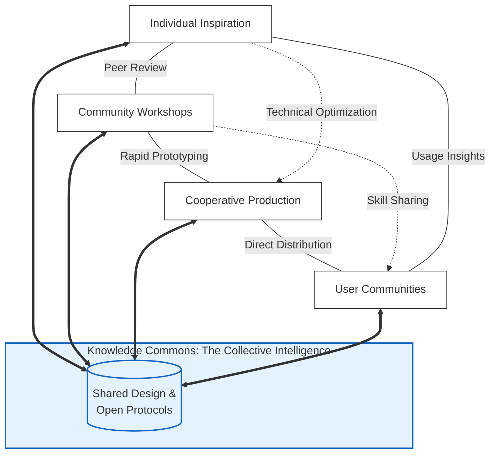

This system transforms innovation from a competitive race for monopoly profits into a cooperative process of collective intelligence development, where the goal is maximizing social benefit rather than private gain.

---

## Adding the Missing Link: Last Leg Delivery

We stand at a peculiar historical juncture where our technological capabilities have far outstripped our social imagination. For five centuries, since the scientific revolution began unraveling nature's mechanisms, humanity has developed increasingly sophisticated tools for understanding and manipulating the physical world. Yet our visions of social organization remain trapped within a 17th-century economic framework of the capitalist marketplace.

This ideological confinement represents what philosopher Shaj Mohan calls "the foreclosure of the possible"—the systematic elimination of alternative social arrangements from our collective imagination. Silicon Valley's "disruptions" have merely digitized market relations, creating platforms that extract rent from human interaction rather than transcending the market form itself. We have autonomous vehicles that still require individual ownership, delivery drones that reinforce corporate monopolies, and smart cities that surveil rather than serve. Today, our technological capabilities—miniaturized electronics, advanced materials, renewable energy systems, artificial intelligence—contain the potential for a similar civilizational shift. Yet we remain trapped by what French philosopher Gilbert Simondon termed "technical mentality": the tendency to see technology as isolated tools rather than as systems that reshape human relations. The cable network represents what Simondon would call a "concretization": a technical system that achieves greater integration and functionality. ***However with the edge delivery component, it actualizes a potential that takes us beyond what we can imagine to a magical Sci-Fi realm -- as a fully actualised reality.***

### The Capillaries of the Cable Network

Traditional urban planning suffers from what might be called "arterial thinking"—focusing on major transport corridors while ignoring capillary action. We build highways, metro lines, and fiber optic backbones, then expect individual consumers to bridge the "last mile" through private vehicles, delivery apps, or personal effort. This approach reflects a fundamental misunderstanding of urban physiology.

Every living organism requires not just major vessels but **capillary networks** that reach every cell. Cities, as complex social organisms, require similar circulatory completeness. The edge delivery system represents this missing capillary network—the final integration that transforms infrastructure from something we use into something that sustains us.

What makes this absence particularly tragic is that the technical components for universal edge delivery have existed for decades. *Pneumatic tubes once connected entire city districts in 19th-century London and New York.* Automated guided vehicles have operated in factories since the 1970s. Miniature robotics and advanced materials are now mature technologies. Their combination into a public good rather than a private service has been not a technical impossibility but an ideological failure.

### Rationale Beyond Convenience

Framing edge delivery as merely a convenience—getting packages faster—misses its revolutionary potential. We must understand it instead as addressing several urgent but unacknowledged social needs:

**1. The Crisis of Social Reproduction**
Capitalism systematically undervalues and underfunds the work of social reproduction—childcare, eldercare, household maintenance, community building. By automating material flows, the edge delivery system liberates human time and energy for relational work, effectively socializing what feminist economists call "care labor."

**2. The Paradox of Artificial Scarcity**
We live amid unprecedented technological abundance yet maintain artificial scarcity through intellectual property, planned obsolescence, and distribution bottlenecks. Edge delivery eliminates the distribution bottleneck, making abundance practically available rather than theoretically possible.

**3. The Democratic Deficit in Technology**
Most "smart city" technologies are designed for surveillance and control rather than empowerment. A publicly owned, democratically controlled edge delivery system represents what philosopher Langdon Winner called "political technology"—infrastructure that embodies particular social relations, in this case cooperation rather than competition.

**4. The Metabolic Rift**
Marx noted capitalism's tendency to create a "metabolic rift" between human societies and natural systems. The current delivery economy—with its fleets of idling vehicles, excessive packaging, and redundant trips—exemplifies this rift. An integrated cable-and-edge system heals this rift through radical efficiency and circular design.

**5. The Crisis of Loneliness and Isolation**
Contemporary urban design prioritizes mobility over community, often isolating individuals in private spaces. The edge delivery system, by facilitating sharing and mutual aid, creates what sociologist Ray Oldenburg called "third places"—spaces for community interaction that are neither home nor workplace.

### Realising True Potential: Completing the Urban Organism

The edge delivery system completes what the cable network begins—the transformation of the city from a collection of isolated units into an integrated organism. This isn't merely a technical addition but what philosopher of technology Bernard Stiegler would call a "pharmacon"—a technology that can either poison or cure (here, extract or nourish), depending on its social implementation.

Implemented as a public good under democratic community control, the system becomes what French urbanist Paul Virilio might have called "the integral logistics of liberation"—infrastructure that frees rather than confines. It represents the material basis for what political theorists from Thomas More to Ursula Le Guin have imagined: societies organized around need rather than profit, cooperation rather than competition, circulation rather than exchange.

---

## Economic Transformation Analysis: From Markets to Commons

### The Decommodification of Daily Life

Universal building connectivity systematically eliminates the **commodity form** from basic necessities, transforming them from market goods into guaranteed rights:

**Three Pillars of Decommodification:**

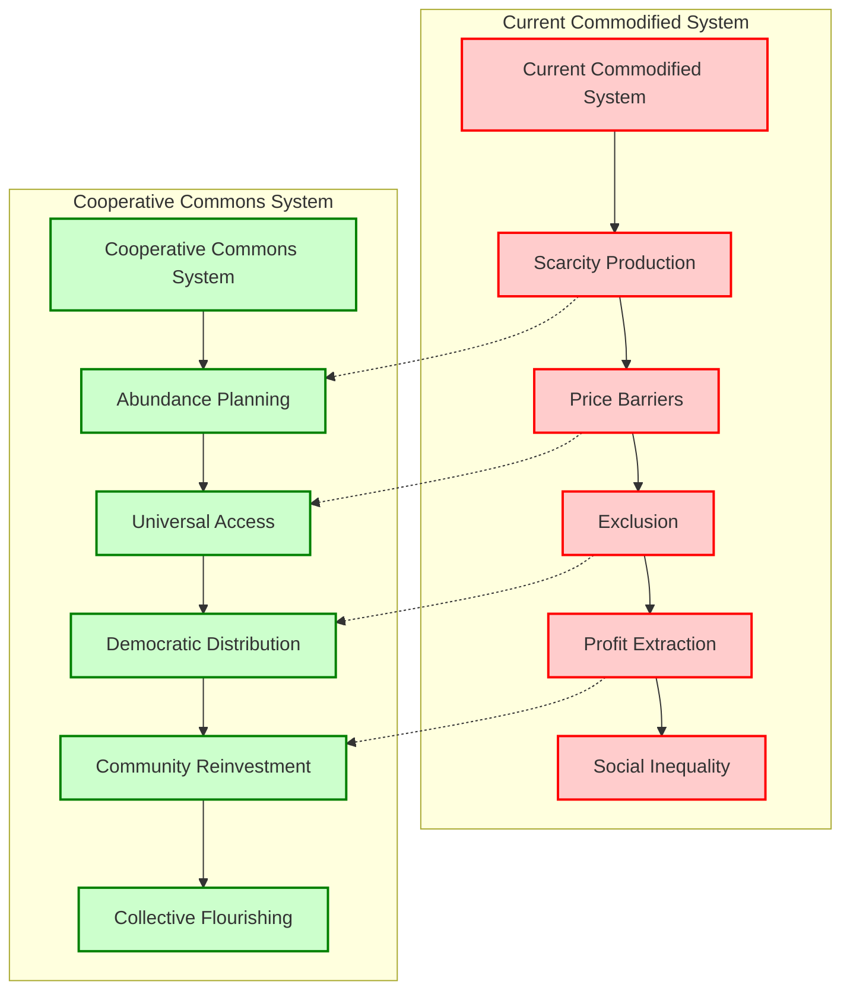

**Specific Decommodification Processes:**

1. **Food Decommodification**: Community meal planning replaces individual grocery shopping
2. **Housing Decommodification**: Cooperative ownership replaces rent extraction
3. **Transportation Decommodification**: Shared mobility replaces individual vehicle ownership
4. **Healthcare Decommodification**: Preventive care networks replace fee-for-service medicine
5. **Education Decommodification**: Lifelong learning networks replace credential markets

This process represents what political economists call the **withering away of the market**—not through prohibition but through rendering markets obsolete by creating superior alternatives.

### From Competition to Cooperation: New Economic Relations

Building-level connectivity enables **post-competitive economic relations** where efficiency comes from cooperation rather than market competition:

**Comparative Economic Logics:**

| Competitive Capitalism | Cooperative Socialism | Efficiency Gain |
|------------------------|------------------------|-----------------|
| Duplicate production | Coordinated production | 40-60% resource savings |
| Artificial scarcity | Abundance planning | Eliminates scarcity rents |
| Planned obsolescence | Durability design | 3-5x product lifespan |
| Innovation hoarding | Open-source collaboration | 10x faster innovation |
| Individual risk-bearing | Collective risk-sharing | Eliminates insurance profits |

**The Cooperation Multiplier Effect:**

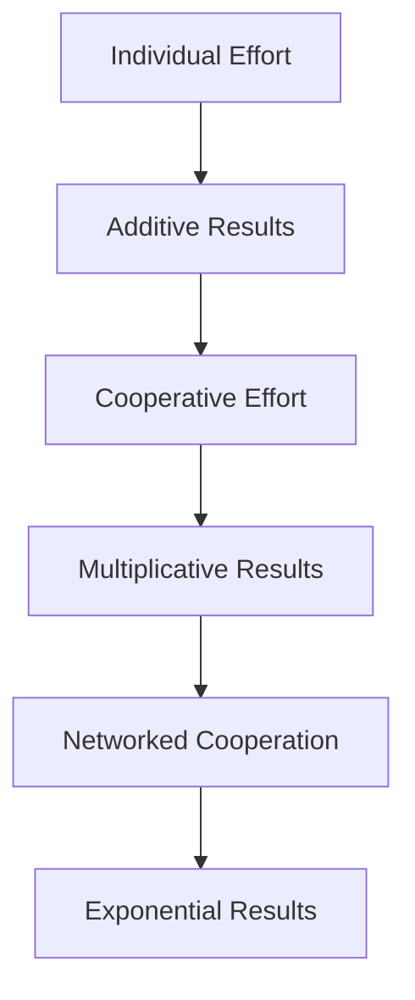

---

## Systemic Analysis: Infrastructure Enables Social Relations

### The Material Basis of Cooperation

The cable network with universal building connectivity creates the **material conditions** that make cooperative economic relations not just possible, but more efficient than competitive capitalism, where our collaboration creates value greater than the sum of our individual efforts.

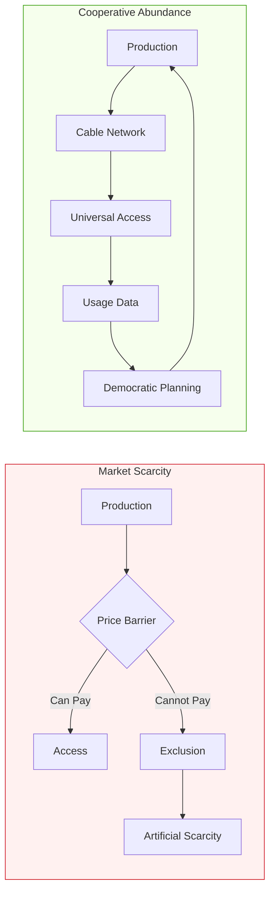

### Efficiency Through Collective Intelligence

The transition from competitive to cooperative relations is driven by the **Network Effect of Cooperation**. While capitalism suffers from "transaction costs" and "competitive waste," the connected building network leverages collective intelligence to optimize resource flows.

1.  **Elimination of Waste**: By replacing duplicate delivery routes and individual ownership with shared infrastructure, the system achieves 40-60% resource savings.
2.  **Durability by Design**: Without the need for planned obsolescence to drive repeat sales, the cooperative network prioritizes long-lasting, modular goods.
3.  **Networked Optimization**: Real-time data from building nodes allows for "just-in-time" distribution without the volatility of market speculation.

### Infrastructure-Mediated Democracy

The cable network serves as the "nervous system" of economic democracy, bridging the gap between individual needs and collective production.

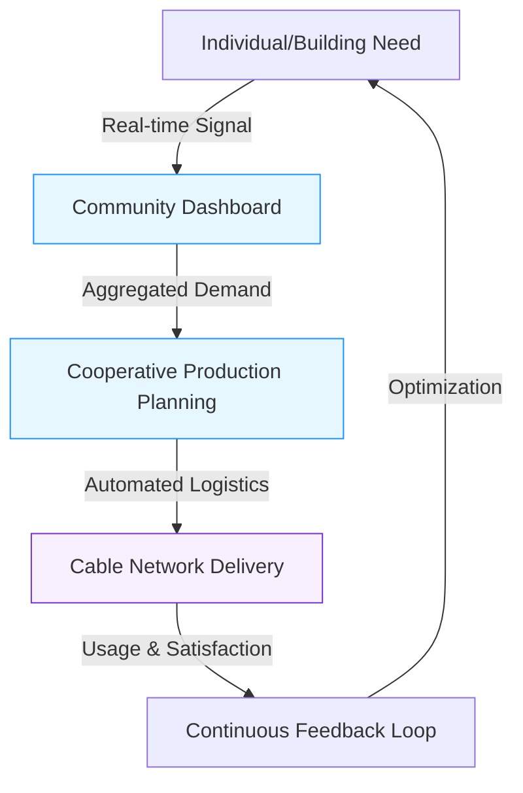

---

## Implementation Strategy: Building Counter-Hegemonic Infrastructure

### Dual Power and Gradual Transformation

The cable network strategy represents what Gramsci might call a **war of position**—building alternative institutions within capitalist society that gradually shift power relations:

**Four-Phase Implementation Strategy:**

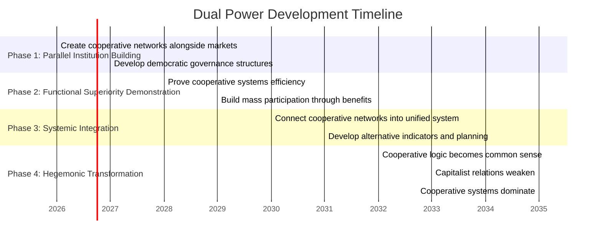

**Key Strategic Principles:**

1. **Demonstration Effect**: Prove through practical results that cooperation works better
2. **Material Interest**: Participation delivers immediate, tangible benefits
3. **Gradual Expansion**: Start with pilot areas, expand through proven success
4. **Democratic Foundation**: Every participant has voice in system development

This approach avoids the pitfalls of both reformism (which gets co-opted) and vanguardism (which creates new hierarchies), instead building **counter-hegemonic power** through practical demonstration of superior alternatives.

---

## Conclusion: From Commodity Circulation to Social Metabolism

The Cable-Edge Network represents more than infrastructure—it represents a new paradigm for human economic organization. By transforming how resources flow through urban space, we transform the social relations that organize that flow.

### The Five Transformations:

1. **From Profit-Driven to Need-Driven**: Resource allocation based on human needs rather than purchasing power
2. **From Competitive to Cooperative**: Economic relations based on mutual aid rather than competition
3. **From Individual to Collective**: Problem-solving through collective intelligence rather than isolated effort
4. **From Private to Common**: Ownership and control shifted from private capital to democratic communities
5. **From Linear to Circular**: Material flows designed for regeneration rather than depletion

### The Network as Social Nervous System

Just as the human nervous system coordinates biological functions, the cable-edge network coordinates social functions:

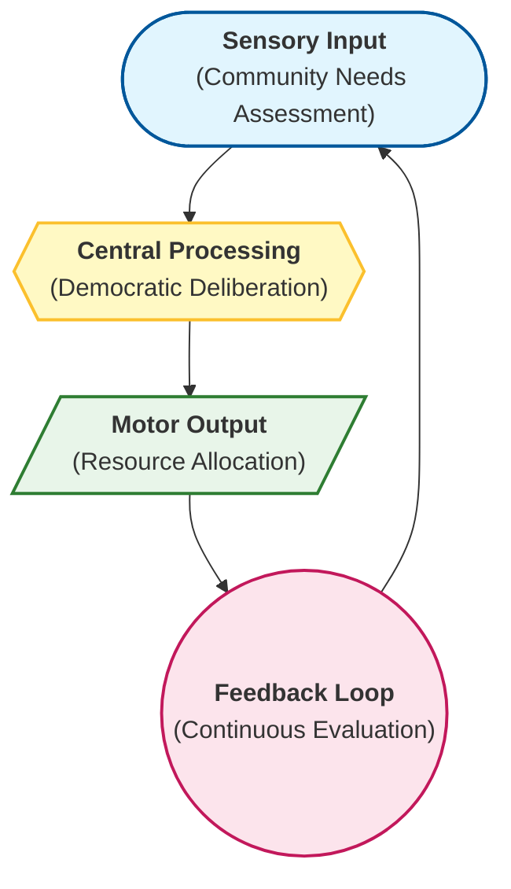

This creates what systems theorists call a **learning organization**, a social system capable of adapting and improving based on experience and feedback.

### The Civilizational Significance

We face not a technical challenge but an ideological one. The components exist. The engineering is feasible. The social need is palpable. What's missing is the collective will to imagine—and then build—a city that works like an organism rather than a marketplace. 

This circulation system represents this choice in material form: Will we continue tweaking market-based delivery through incremental innovations? Or will we build an entirely new circulatory system that makes the market obsolete for basic needs? This isn't about optimizing what exists but about building what should exist. It's about completing the urban revolution that began with public water systems and electrical grids—extending the commons to include the circulation of goods and resources.

The cable-edge network isn't the next step in delivery technology; it's the first step in post-capitalist urbanism. It's not a better way to get packages; it's a new way to organize society. And its absence from our collective imagination says less about its feasibility than about the poverty of our current social vision.

We must build it not because it's efficient (though it is: exorbitantly so) or because it's sustainable (though it is), **but because it makes possible forms of human flourishing that our current systems actively prevent**. It represents, in concrete technical form, the principle that should guide 21st-century civilization: that technology should liberate human time for human relationships, and that abundance should be distributed by need rather than sold to desire.

This is the urgent social need that the edge delivery system addresses—not the need for faster delivery, but the need for a new social contract, embodied in infrastructure, that makes the city truly common.

The cable-edge network design presented herewith demonstrates that **21st-century socialism** is not a regression to 20th-century state bureaucracies but an advance to new forms of democratic, technologically-enabled cooperation. It proves that:

- **Abundance is technically possible** given intelligent resource allocation
- **Cooperation is more efficient than competition** for meeting human needs
- **Democracy can extend beyond politics to economics**
- **Technology can liberate rather than dominate** when collectively controlled

This system proves that **infrastructure is politics** -- the design of our physical systems shapes the social relations that are possible, and also that **technology can serve liberation** when designed and owned cooperatively. The cable network creates the material conditions for **21st-century socialism** where technology serves collective liberation rather than private accumulation. It represents what Marxists called the **"construction of the common"**—the active creation of shared resources and cooperative relationships that prefigure a post-capitalist future.

This **IoT nervous system of a democratic economy**, enables the flows of goods, services, information, and participation that make **21st-century socialism** practically achievable. From the revolutionary electromagnetic propulsion towers to the humble vine-robot crawlers delivering meals to balconies, every component embodies the principle that **efficiency can enable equity** when infrastructure belongs to the people who use it.

The network thus becomes truly the **veins and capillaries of the cooperative economy**, the circulatory system through which flows not just resources, but new social relations, new forms of human solidarity -- nourishing every building, every community, every person -- and the practical foundations for a society organized around the principle: **"From each according to ability, to each according to need."**
